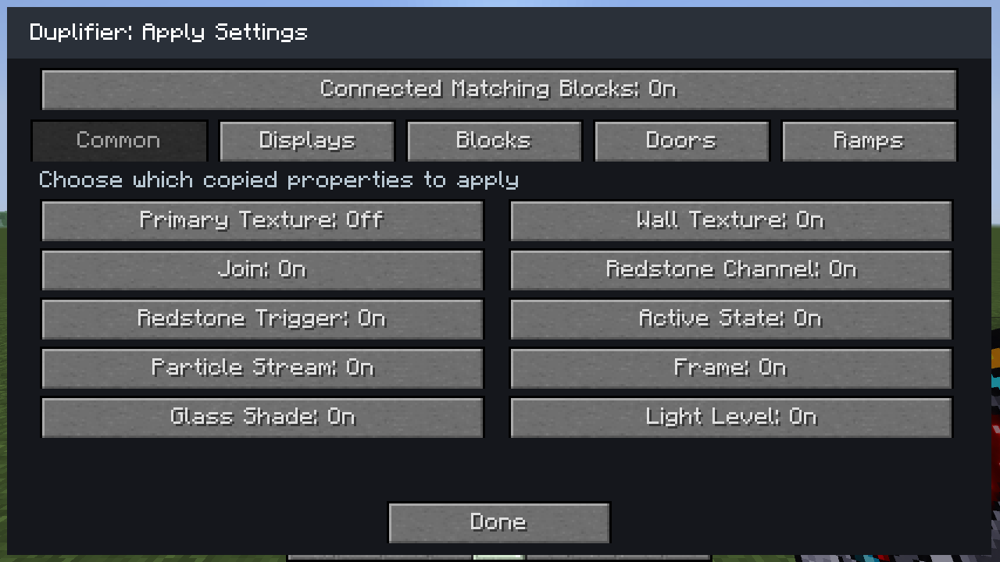

# Duplifier settings

Craft one with a Programmable Matter Ingot and two redstone in a crafting grid:

```text
 R
IR
```

Shift-right-click a configurable block to replace the settings stored in the
Duplifier. Its item name then includes the copied block's name. Right-click a
target block to apply each stored setting that the target supports. The tool
works from either half of a Programmable Door. The display on the item lights
up when it holds settings. Right-click in the air to open Apply Settings:
each On/Off switch controls one property of future applications. All switches
start On, and the choices stay on the item when you copy a different block.
Shift-right-click in the air to clear the copy and return its name and display
to the empty state; the Apply Settings choices remain in place.

**Connected Matching Blocks** starts Off. A tool holding copied settings uses
the multi-block icon when this mode is On; an empty tool keeps the off icon.
Turn it On in Apply Settings to apply the selected copied properties to the
clicked block and its entire matching group, following neighbors that share a face. A neighbor must have the same
block type and original configuration as the clicked block. Facing and
rotation are ignored when matching; other placement properties still match.
Slabs and full blocks never join the same group, even with identical settings.
Matching checks all other properties even when their copy switches are Off;
it also checks saved face choices when overrides are disabled.
The whole group is found before settings change, so a new texture does not stop
the search halfway through a wall. Diagonal contact does not connect groups.

The search uses loaded chunks and blocks you can edit. Door and seat halves and
Landing Gear parts are addressed through their settings root and applied once.
Groups larger than 4,096 occupied block cells are rejected without applying
settings. The mode stays on the tool when you copy or clear settings; crafting
still applies settings to the crafted item.



| Shared setting | Sources and targets |
| --- | --- |
| Wall Texture | Programmable block, slab, stairs, wall, porthole, display housing, light housing, trigger off finish, and propulsion side finish. All use the ordered `ScreenHousingTextures` list. |
| Redstone Channel | Every configured block that implements `RedstoneChannelMember`. |
| Join | Portholes, Programmable Glass, Programmable Light, connected propulsion blocks, and Luxury/Military Seats. |
| Trigger | Programmable Light and Door support Disabled, Redstone ON, and Redstone OFF. Displays support Disabled and Redstone ON. |
| Active | Manual light state, propulsion state, and switch or lever latch. |

Primary screen artwork transfers between displays. Light artwork transfers
between Programmable Lights. The two artwork catalogs are separate, so an
unrelated texture index is never applied across them. Display mode, animation
speed, framing, input panels, input size and wall position transfer between
displays. Light level transfers between lights. Porthole shape and glass shade,
slab side layout, propulsion shape and particles, glass size, trigger on finish,
chair style and height, door design and motion settings, and switch mount
rotation transfer only to targets that expose those settings. Framing and glass
shade also transfer across block types that share those controls.
Ramp controllers carry their offsets, tread size, speed, lift and extend modes,
direction, travel axis, texture matching, trigger polarity, and redstone channel. Applying ramp
geometry uses the controller's normal validation and reset path; an obstructed
platform can reject the change.

Landing Gear supports independent **Gear Size**, **Gear Extension**, and
**Gear Redstone Mode** switches, plus the shared redstone channel.

Placement facing, physical position, live redstone signal, current door motion,
and ownership are not stored. The item uses semantic setting keys rather than
copying tile NBT, so existing saved-world field names and placement behavior
remain intact.

## Face overrides and diagonal geometry (1.1)

Programmable Block, Slab and Stairs have a separate **Face Overrides** copy switch.
When the source has overrides enabled, it copies the six face choices and
turns them on. When the source has overrides disabled, it turns them off on
the target while preserving that target's stored face choices. The **Wall
Texture** switch controls the main texture independently. Each unassigned face
continues to use that main texture. Front/back/left/right follow block facing.

Diagonal width, half height and inside/outside fill transfer through the
**Diagonal Geometry** switch where the target supports them.

## Apply settings while crafting

Put a configured Duplifier and a programmable block item in any crafting grid.
The output receives compatible settings selected in Apply Settings. The tool
is returned unchanged. Shift-click the output to process a stack using normal
Minecraft crafting; each craft consumes one block. Existing target settings
that are not selected or supported remain intact.
