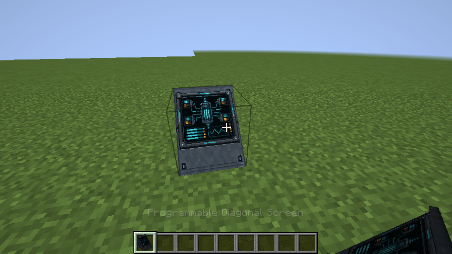

# Programmable Diagonal Screen inventory appearance

The old item JSON depicted a thin tilted panel over a flat base. The placed screen now has a full solid wedge housing, so the item silhouette no longer represented the block.

The baked inventory model now uses `ScreenHousingMesh.diagonal(false)`, the exact housing mesh used by the tile renderer, and `ScreenSurface` for its inset display. The original item transforms and static Engineering screen artwork are retained. A tiny normal offset prevents the display and housing surface from fighting for depth. The mesh is built once on model bake and regenerated on resource reload.

Runtime checks require the shared housing faces plus one display face and verify the full-height rear geometry. A live hotbar screenshot provides visual confirmation alongside the existing rising/descending block illustrations.

