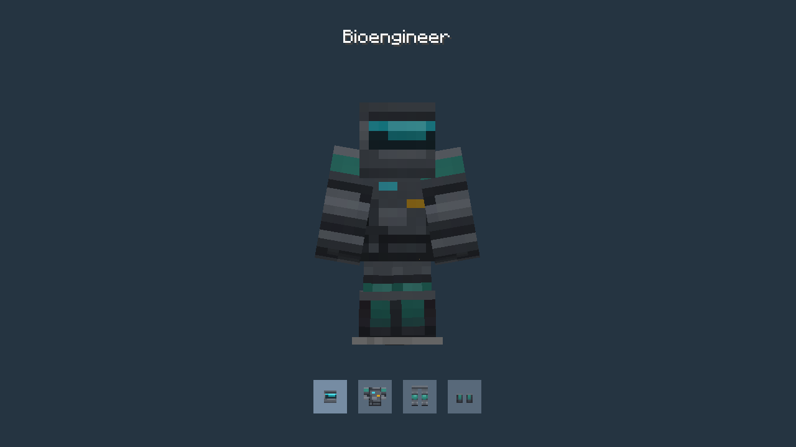
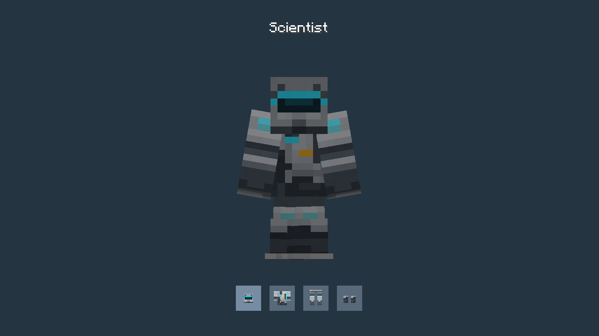
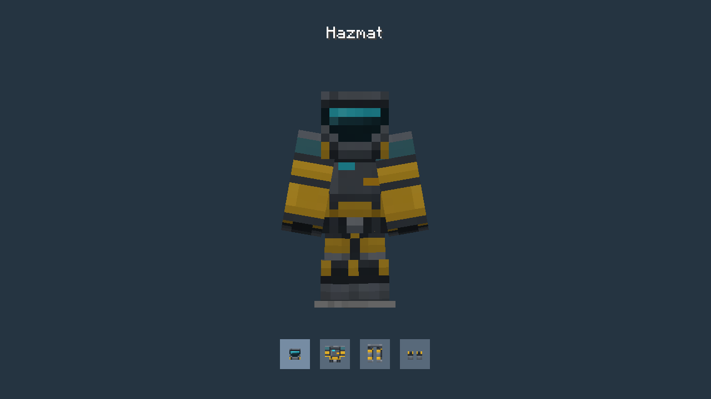
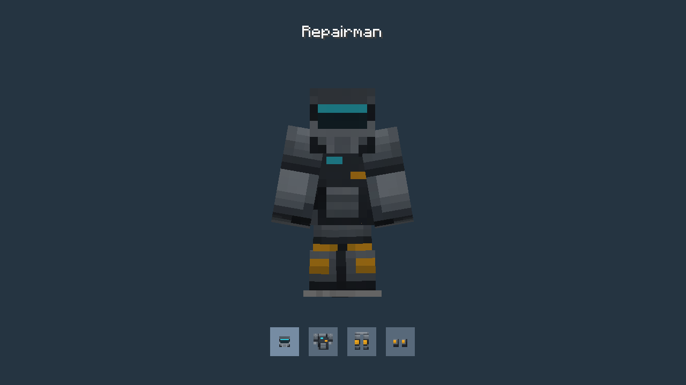
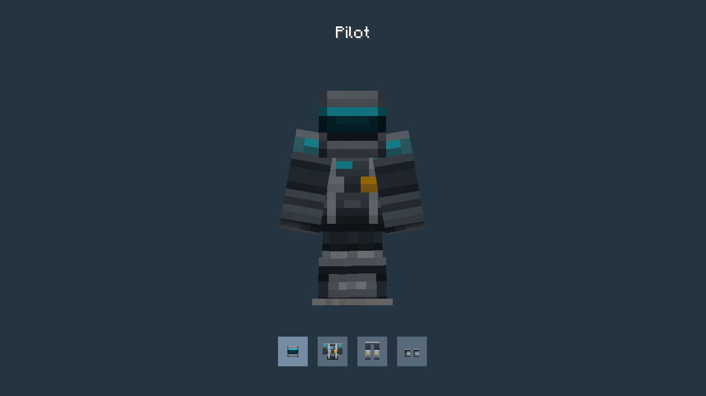
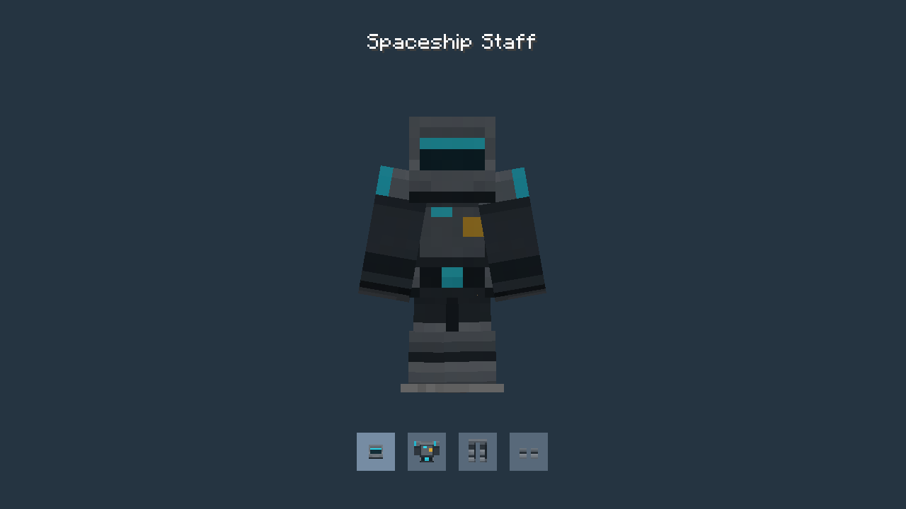
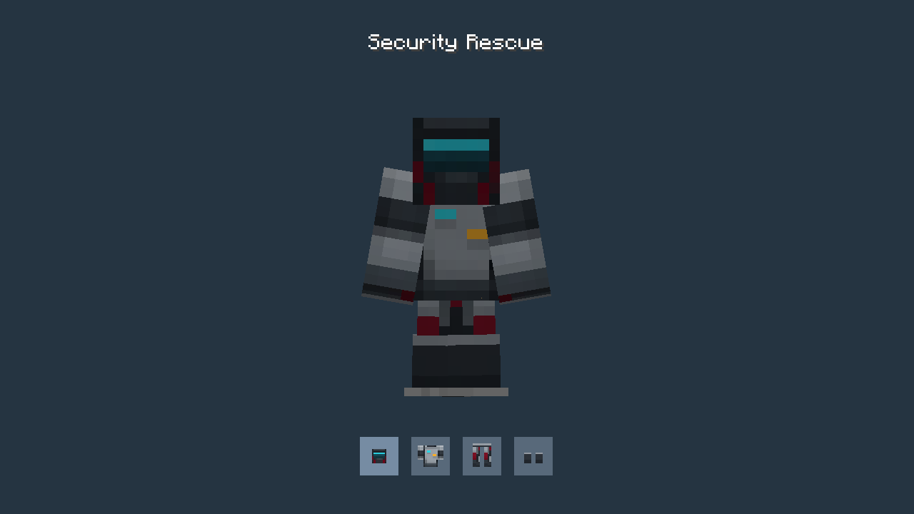

# Programmable armor

Each full set below is shown on an armor stand with arms enabled, alongside its matching inventory icons. All four pieces use diamond armor stats. New pieces default to **Civilian Staff**; each piece can keep an independent texture choice.

Hold a piece and shift-right-click while aiming into the air to configure it in creative mode. In survival, hold a Configurizer in the main hand and the armor in the offhand. The **Armor** category shows only designs for that piece. See the [programmable armor guide](../programmable-armor.md) for crafting and material options.

## Civilian Staff

## Bioengineer

## Scientist

## Hazmat

## Repairman

## Pilot

## Spaceship Staff

## Security Rescue

