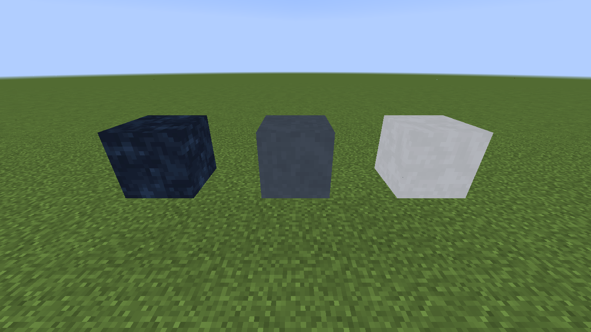
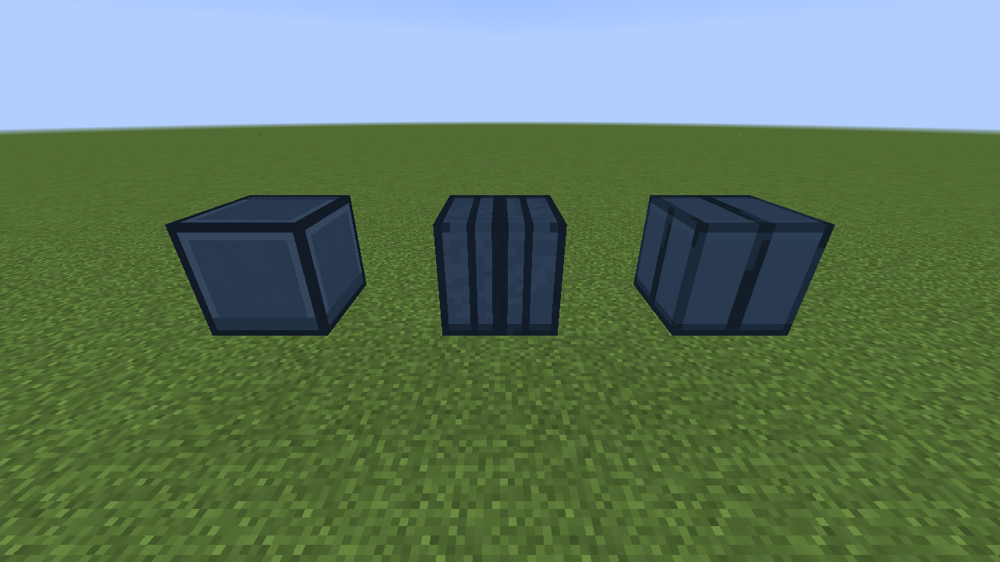
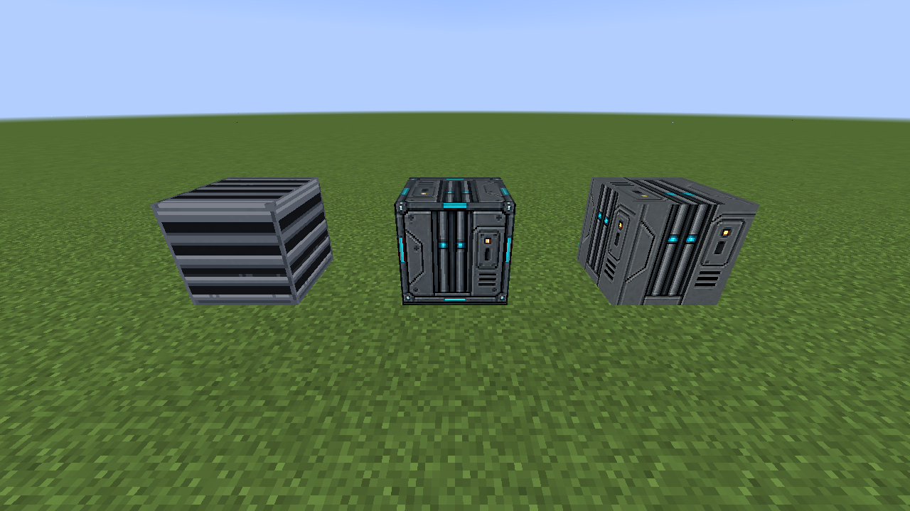
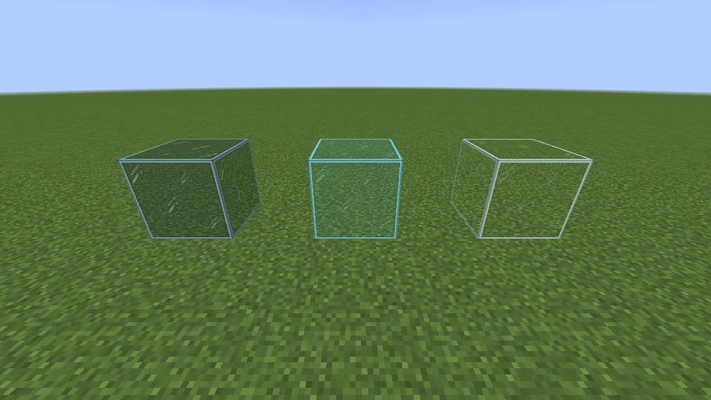
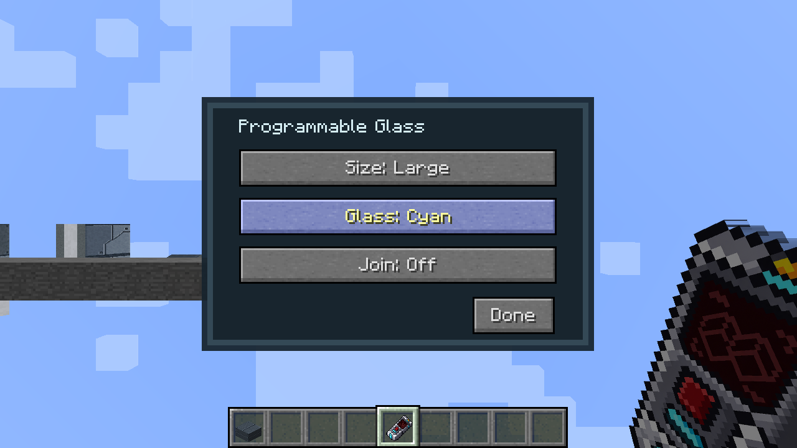

# Building blocks, finishes, and glass

Programmable Block, Wall, Slab, Ramp, and other compatible shapes use a shared finish list. Choose a material in the Creative-mode shift-right-click dialog. Some screen blocks use the same list for their wall or side texture while keeping a separate primary screen selection. The [Duplifier](../DUPLIFIER.md) can carry a compatible finish to another shape.

## Choose a form

| Form | Best use |
| --- | --- |
| Programmable Block | Full cube for hulls, floors, and solid trim. |
| Programmable Wall | Thin wall surface with a selectable finish. |
| Programmable Slab | Half-height floor or trim; six slabs craft from three Programmable Blocks. |
| Programmable Porthole Wall | Thin wall panel with a glass opening. |
| Programmable Porthole Block | Full-depth porthole for a thick hull. Its inside and side surfaces tile the selected finish. |

Portholes offer **Round**, **Hexagon**, **Octagon**, and **Square** openings, glass shade, and **Join**. Joining merges eligible neighboring portholes into a larger window. The wall form is thin; the block form fills the entire block depth.

| Finish group | Close-up |
| --- | --- |
| Hull |  |
| Padding |  |
| Wall pipes and vent |  |
| Cockpit glass |  |

Hull includes Light Alloy, Dark Gunmetal, and Midnight Satin. Padding includes Seamed, Ribbed, and Stitched. Wall Pipes and Framed Wall Pipes are finishes in the programmable selection rather than separate blocks. Choose them on a full block, slab, or another supported form.

Clear, Pale Cyan, and Smoked Cockpit Glass are separate transparent blocks. Their recipes use eight matching vanilla glass blocks and one Industrial Alloy Ingot to make nine blocks: ordinary glass for Clear, cyan stained glass for Pale Cyan, and gray stained glass for Smoked.

Programmable Glass provides selectable frame detail and glass shade in one block. Its texture detail can be Small, Medium, or Large, with the shade chosen independently for each size.

