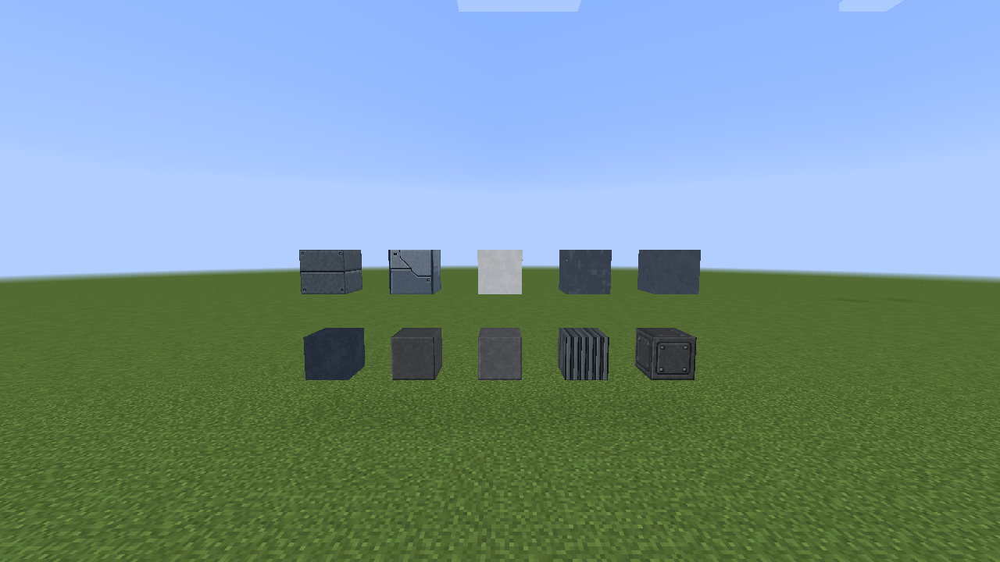
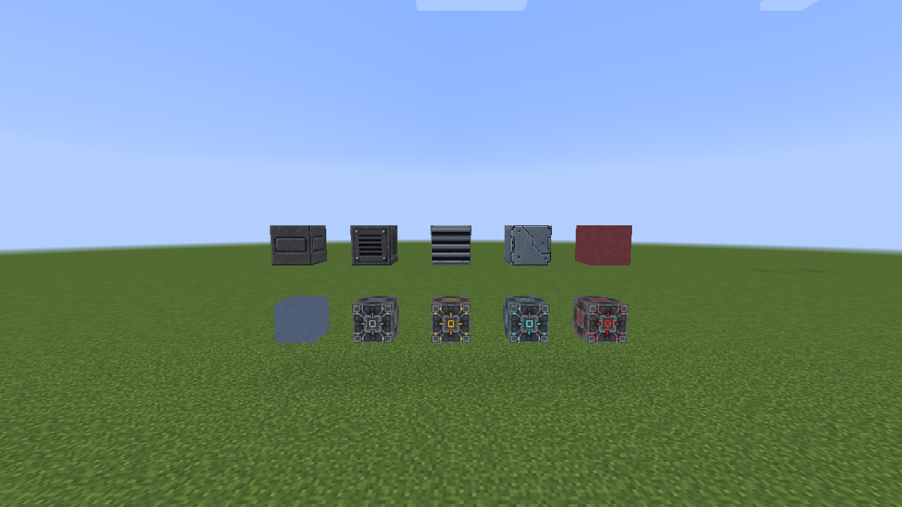
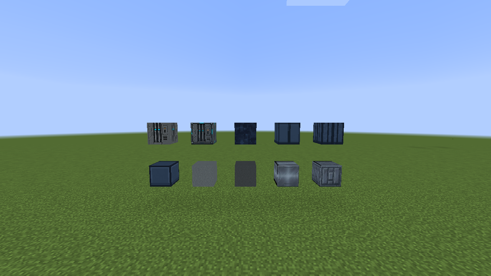
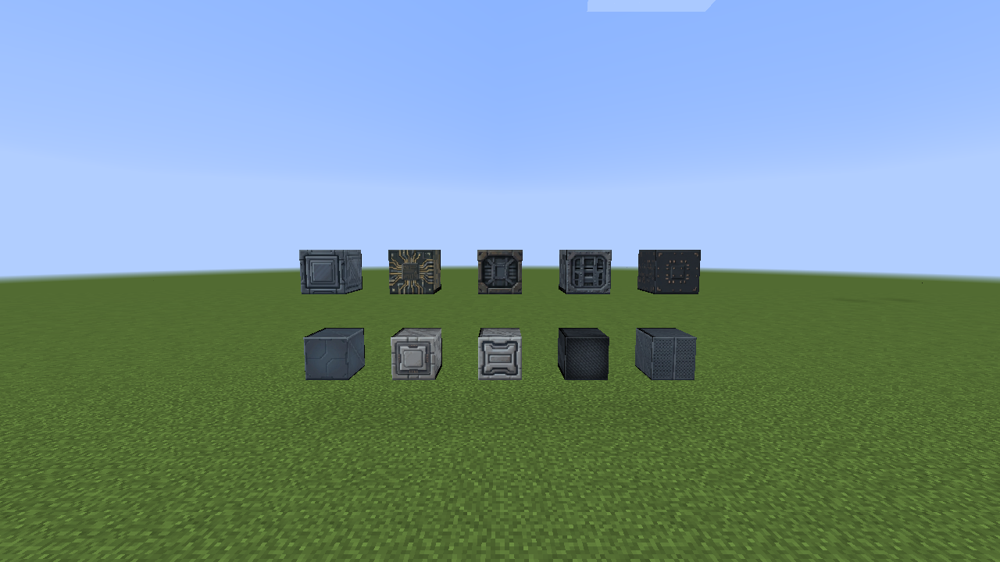
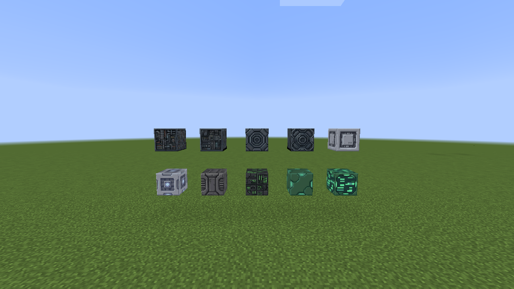
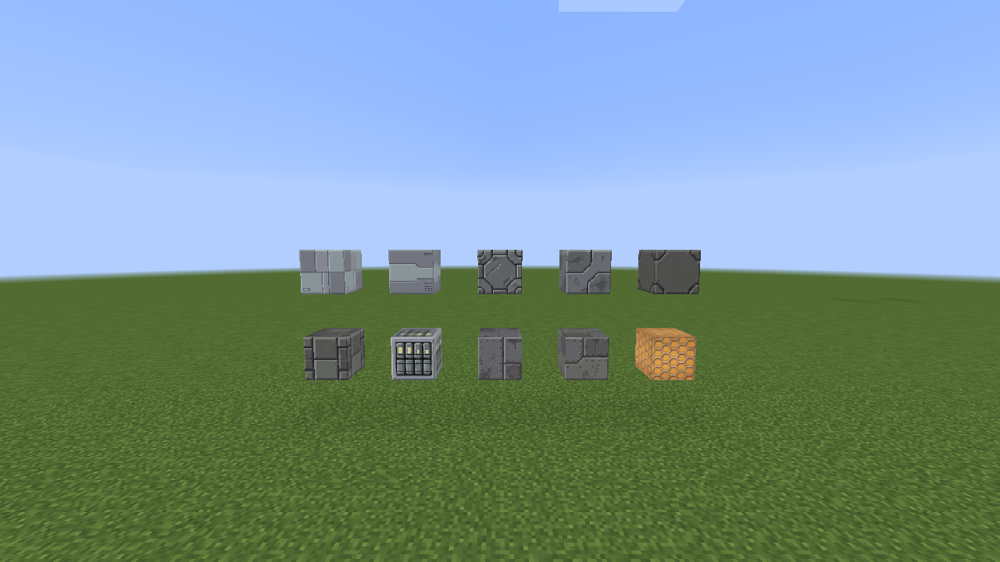
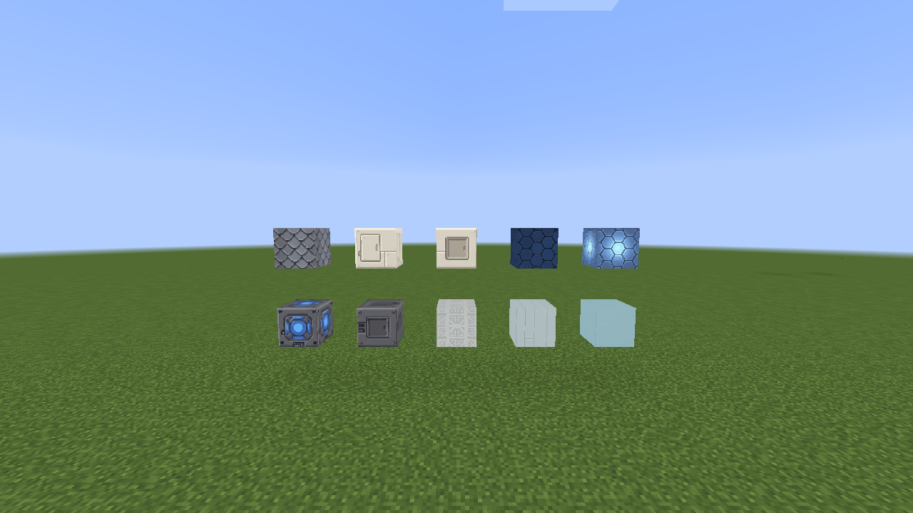

# Building blocks, finishes, and glass

For face texture overrides, diagonal portholes, half-height walls and fill
options, see [the 1.1 additions](version-1.1.md).

Programmable Block, Wall, Slab, Stairs, Ramp, and other compatible shapes use a shared finish list. Choose a material in the Creative-mode shift-right-click dialog. Some screen blocks use the same list for their wall or side texture while keeping a separate primary screen selection. The [Duplifier](../DUPLIFIER.md) can carry a compatible finish to another shape.

## Choose a form

| Form | Best use |
| --- | --- |
| Programmable Block | Full cube for hulls, floors, and solid trim. |
| Programmable Wall | Thin wall surface with a selectable finish. |
| Programmable Slab | Half-height floor or trim; matching stacked slabs combine into a Programmable Block. |
| Programmable Stairs | Vanilla stair placement and corners, with main and optional per-face textures. |
| Programmable Diagonal Wall | Half/full width, half height, slope direction, and Inside/Outside fill. |
| Programmable Diagonal Porthole | The same proportions with configurable joined openings. |
| Programmable Porthole Wall | Thin wall panel with a glass opening. |
| Programmable Porthole Block | Full-depth porthole for a thick hull. Selected main finish with metal trim around the opening. |

Block, Slab and Stairs have optional per-face texture overrides, disabled by default. Unassigned faces use the main finish.

## Programmable Block finishes

The original 78 saved finishes are shown below on full Programmable Blocks.
These reference images also include retired finishes retained for existing
builds: Wall Vent, the three Padding choices and Hull Plating are hidden from
new selections. Blue/Amber Hex now belong to Programmable Light. For the
current categories and additional choices, see [unified materials](../unified-materials.md). Each image shows up to ten finishes, with the top row followed by the bottom row. Names run left to right in each row.

### Finishes 1–10

| Row | 1 | 2 | 3 | 4 | 5 |
| --- | --- | --- | --- | --- | --- |
| Top | Dark Wall Panel | Light Wall Panel | Light Alloy Hull | Metal Floor | Dark Gunmetal Hull |
| Bottom | Midnight Matte Hull | Dark Industrial Panel | Light Industrial Panel | Ribbed Wall | Industrial Block |

### Finishes 11–20

| Row | 1 | 2 | 3 | 4 | 5 |
| --- | --- | --- | --- | --- | --- |
| Top | Industrial Trim | Industrial Grate | Wall Vent | Bolted Wall Plate | Burgundy |
| Bottom | Bluegray | Matter | Matter - Amber | Matter - Cyan | Matter - Red |

### Finishes 21–30

| Row | 1 | 2 | 3 | 4 | 5 |
| --- | --- | --- | --- | --- | --- |
| Top | Wall Pipes | Framed Wall Pipes | Midnight Satin Hull | Seamed Padding | Ribbed Padding |
| Bottom | Stitched Padding | Glass Frame Interior | Door Interior (Dark) | Metal Floor | Composite Wall 1 |

### Finishes 31–40

| Row | 1 | 2 | 3 | 4 | 5 |
| --- | --- | --- | --- | --- | --- |
| Top | Composite Wall 2 | Circuit Panel | Heavy Bulkhead 1 | Heavy Bulkhead 2 | Data Cores |
| Bottom | Gravity Floor | Thermal Shield 1 | Thermal Shield 2 | Nano-Fiber Hull | Perforated Deck |

### Finishes 41–50

| Row | 1 | 2 | 3 | 4 | 5 |
| --- | --- | --- | --- | --- | --- |
| Top | Greebled Panel 1 | Greebled Panel 2 | Biomech Block 1 | Biomech Block 2 | Microchip |
| Bottom | Blue Node | Braced Hull | Green Console | Green Panel | Green Core |

### Finishes 51–60

| Row | 1 | 2 | 3 | 4 | 5 |
| --- | --- | --- | --- | --- | --- |
| Top | Gray Panel 1 | Gray Panel 2 | Industrial Frame | Worn Bulkhead | Octagon Plate |
| Bottom | Twin Panels | Switch Bank | Weathered Hull 1 | Weathered Hull 2 | Amber Hex Off |

### Finishes 61–70

| Row | 1 | 2 | 3 | 4 | 5 |
| --- | --- | --- | --- | --- | --- |
| Top | Scaled Armor | Ivory Hatch 1 | Ivory Hatch 2 | Blue Hex Off | Blue Hex On |
| Bottom | Blue Socket | Dark Socket | Hull Plating 1 | Hull Plating 2 | Hull Plating 3 |

### Finishes 71–78

| Row | 1 | 2 | 3 | 4 | 5 |
| --- | --- | --- | --- | --- | --- |
| Top | Hull Plating 4 | Hull Plating 5 | Hull Plating 6 | Hull Plating 7 | Hull Plating 8 |
| Bottom | Hull Plating 9 | Hull Plating 10 | Hull Plating 11 |  |  |

## Selected close-ups and glass

Portholes offer **Round**, **Hexagon**, **Octagon**, and **Square** openings, glass shade, and **Join**. Joining merges eligible neighboring portholes into a larger window. The wall form is thin; the block form fills the entire block depth.

| Finish group | Close-up |
| --- | --- |
| Hull |  |
| Padding |  |
| Wall pipes and vent |  |
| Cockpit glass |  |

Hull includes Light Alloy, Dark Gunmetal, and Midnight Satin. Padding includes Seamed, Ribbed, and Stitched. Wall Pipes and Framed Wall Pipes are finishes in the programmable selection rather than separate blocks. Choose them on a full block, slab, or another supported form.

Clear, Pale Cyan, and Smoked Cockpit Glass are separate transparent blocks. Their recipes use eight matching vanilla glass blocks and one Industrial Alloy Ingot to make nine blocks: ordinary glass for Clear, cyan stained glass for Pale Cyan, and gray stained glass for Smoked.

Programmable Glass provides selectable frame detail and glass shade in one block. Its texture detail can be Small, Medium, or Large, with the shade chosen independently for each size.

Diagonal placement follows the clicked edge; the dialog can reverse the slope.
See [placement, joining and recipes](version-1.1.md#diagonal-building-blocks).
