# Building blocks, finishes, and glass

For face texture overrides, diagonal portholes, half-height walls and fill
options, see [the 1.1 additions](version-1.1.md).

Programmable Block, Wall, Slab, Stairs, Ramp, and other compatible shapes use a shared finish list. Choose a material with shift-right-click in Creative mode, or use the [Configurizer](../CONFIGURIZER.md) in survival. Some screen blocks use the same list for their wall or side texture while keeping a separate primary screen selection. The [Duplifier](../DUPLIFIER.md) can carry a compatible finish to another shape.

## Choose a form

| Form | Best use |
| --- | --- |
| Programmable Block | Full cube for hulls, floors, and solid trim. |
| Programmable Wall | Thin wall surface with a selectable finish. |
| Programmable Slab | Half-height floor or trim; matching stacked slabs combine into a Programmable Block. |
| Programmable Stairs | Vanilla stair placement and corners, with main and optional per-face textures. |
| Programmable Diagonal Wall | Half/full width, half height, slope direction, and Inside/Outside fill. |
| Programmable Diagonal Porthole | The same proportions with configurable joined openings. |
| Programmable Porthole Wall | Thin wall panel with a glass opening. |
| Programmable Porthole Block | Full-depth porthole for a thick hull. Selected main finish with metal trim around the opening. |

Block, Slab and Stairs have optional per-face texture overrides, disabled by default. Unassigned faces use the main finish.

## Programmable Block finishes

The images below show all **114 currently selectable bundled block materials**, grouped and sorted like the texture picker. Retired materials are omitted. Each image has up to ten blocks; names run left to right across the top row, then the bottom row. The [shared material guide](../unified-materials.md) explains categories, face overrides, Custom choices and filesystem imports.

Storage materials use their front artwork on ordinary blocks; [Programmable Storage](../programmable-storage.md) uses matching top, side and front artwork. Dedicated screen, light and door menus retain their own artwork lists. [Programmable armor](armor.md) offers these block materials alongside eight matching role designs and can sample a displayed world face directly.

### Materials 1–10

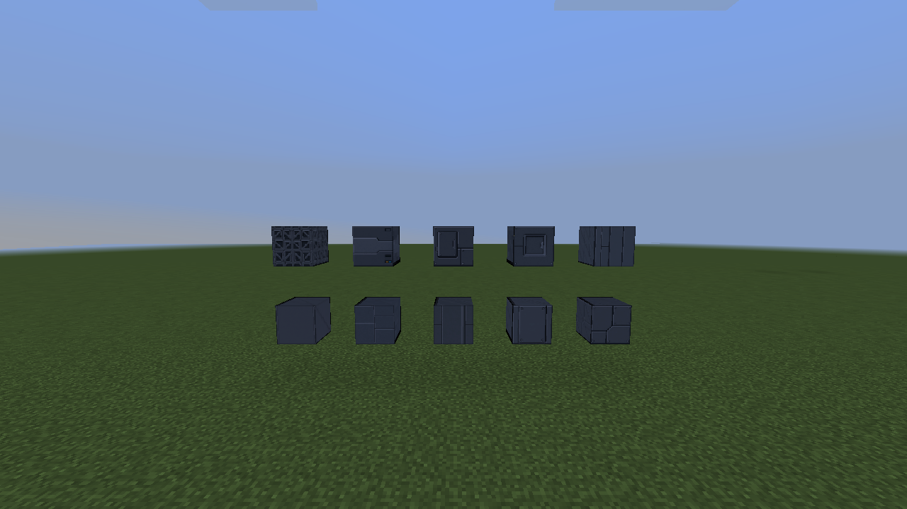

| Row | 1 | 2 | 3 | 4 | 5 |
| --- | --- | --- | --- | --- | --- |
| Top | Dark Hull 1 (Hull) | Dark Hull 10 (Hull) | Dark Hull 11 (Hull) | Dark Hull 12 (Hull) | Dark Hull 2 (Hull) |
| Bottom | Dark Hull 3 (Hull) | Dark Hull 4 (Hull) | Dark Hull 5 (Hull) | Dark Hull 6 (Hull) | Dark Hull 7 (Hull) |

### Materials 11–20

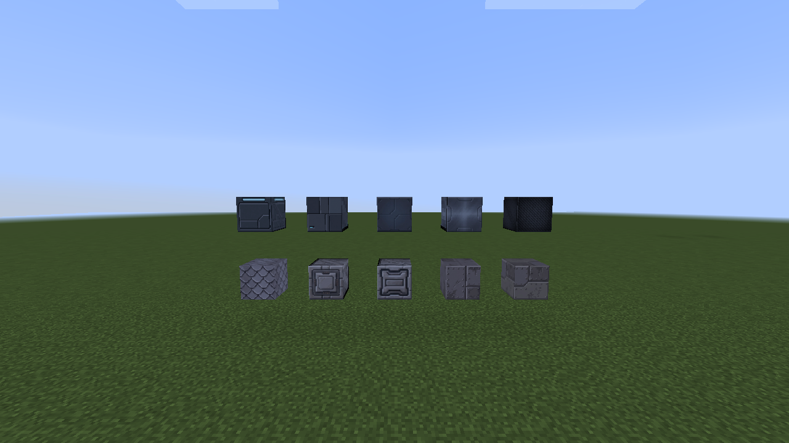

| Row | 1 | 2 | 3 | 4 | 5 |
| --- | --- | --- | --- | --- | --- |
| Top | Dark Hull 8 (Hull) | Dark Hull 9 (Hull) | Gravity Floor (Hull) | Metal Floor (Hull) | Nano-Fiber Hull (Hull) |
| Bottom | Scaled Armor (Hull) | Thermal Shield 1 (Hull) | Thermal Shield 2 (Hull) | Weathered Hull 1 (Hull) | Weathered Hull 2 (Hull) |

### Materials 21–30

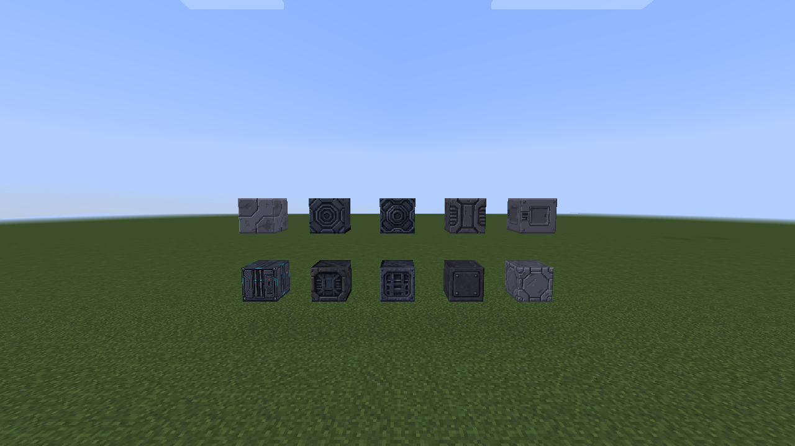

| Row | 1 | 2 | 3 | 4 | 5 |
| --- | --- | --- | --- | --- | --- |
| Top | Worn Bulkhead (Hull) | Biomech Block 1 (Industrial) | Biomech Block 2 (Industrial) | Braced Hull (Industrial) | Dark Socket (Industrial) |
| Bottom | Framed Wall Pipes (Industrial) | Heavy Bulkhead 1 (Industrial) | Heavy Bulkhead 2 (Industrial) | Industrial Block (Industrial) | Industrial Frame (Industrial) |

### Materials 31–40

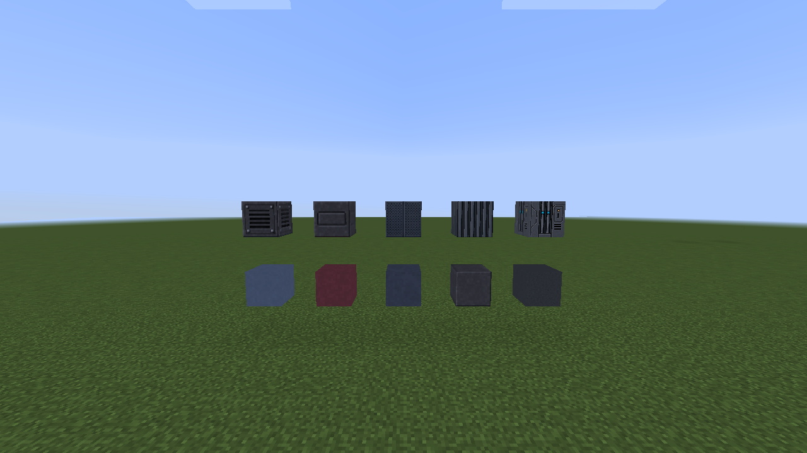

| Row | 1 | 2 | 3 | 4 | 5 |
| --- | --- | --- | --- | --- | --- |
| Top | Industrial Grate (Industrial) | Industrial Trim (Industrial) | Perforated Deck (Industrial) | Ribbed Wall (Industrial) | Wall Pipes (Industrial) |
| Bottom | Bluegray (Materials) | Burgundy (Materials) | Dark Gunmetal Hull (Materials) | Dark Industrial Panel (Materials) | Door Interior (Dark) (Materials) |

### Materials 41–50

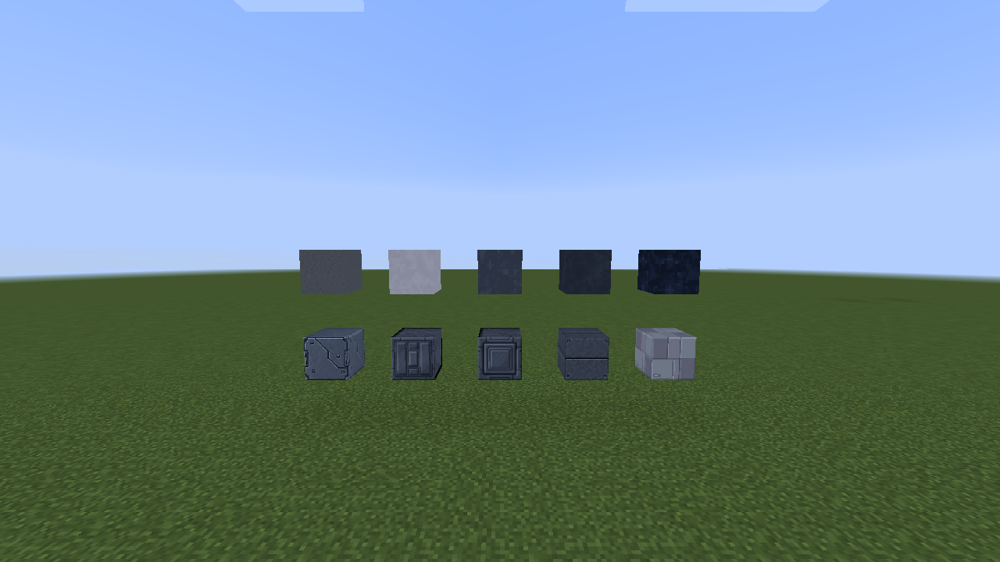

| Row | 1 | 2 | 3 | 4 | 5 |
| --- | --- | --- | --- | --- | --- |
| Top | Glass Frame Interior (Materials) | Light Alloy Hull (Materials) | Metal Floor (Materials) | Midnight Matte Hull (Materials) | Midnight Satin Hull (Materials) |
| Bottom | Bolted Wall Plate (Panels) | Composite Wall 1 (Panels) | Composite Wall 2 (Panels) | Dark Wall Panel (Panels) | Gray Panel 1 (Panels) |

### Materials 51–60

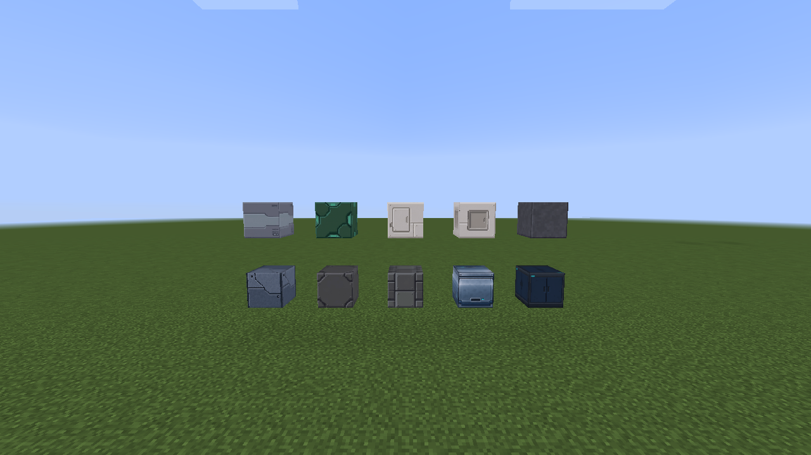

| Row | 1 | 2 | 3 | 4 | 5 |
| --- | --- | --- | --- | --- | --- |
| Top | Gray Panel 2 (Panels) | Green Panel (Panels) | Ivory Hatch 1 (Panels) | Ivory Hatch 2 (Panels) | Light Industrial Panel (Panels) |
| Bottom | Light Wall Panel (Panels) | Octagon Plate (Panels) | Twin Panels (Panels) | Blue-Gray Overhead Bin (Storage) | Cabinet (Storage) |

### Materials 61–70

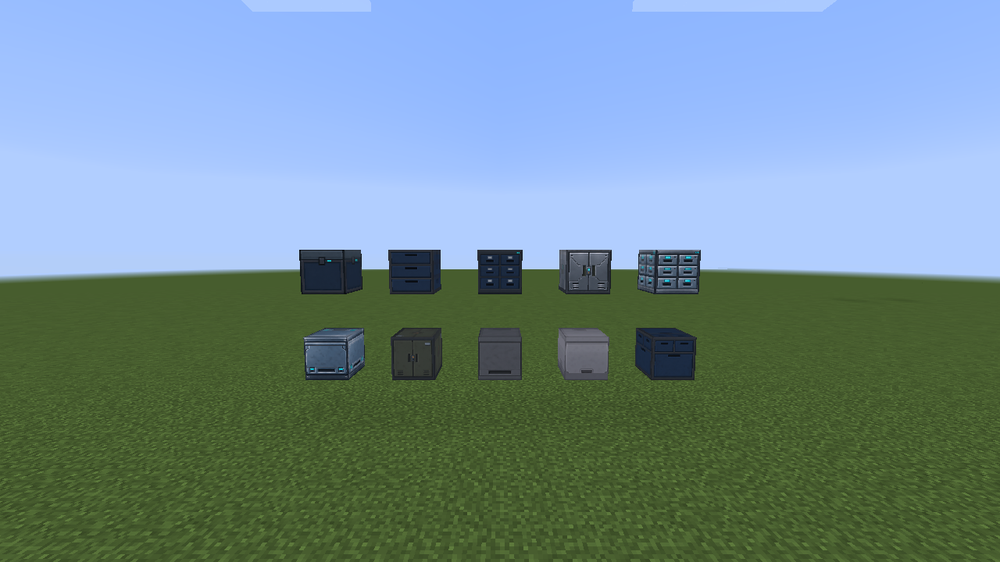

| Row | 1 | 2 | 3 | 4 | 5 |
| --- | --- | --- | --- | --- | --- |
| Top | Chest (Storage) | Drawers (Storage) | Lab Drawer (Storage) | Metal Cabinet (Storage) | Metal Drawers (Storage) |
| Bottom | Metal Overhead Bin (Storage) | Military Cabinet (Storage) | Square Charcoal Overhead Bin (Storage) | Square Matte Overhead Bin (Storage) | Storage Atlas (Storage) |

### Materials 71–80

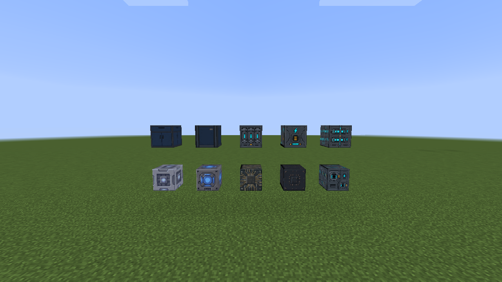

| Row | 1 | 2 | 3 | 4 | 5 |
| --- | --- | --- | --- | --- | --- |
| Top | Storage Cabinet (Storage) | Storage Crate (Storage) | Battery Cell Bank (Tech) | Battery Charging Dock (Tech) | Battery Power Buffer (Tech) |
| Bottom | Blue Node (Tech) | Blue Socket (Tech) | Circuit Panel (Tech) | Data Cores (Tech) | Fuel Port Dual (Tech) |

### Materials 81–90

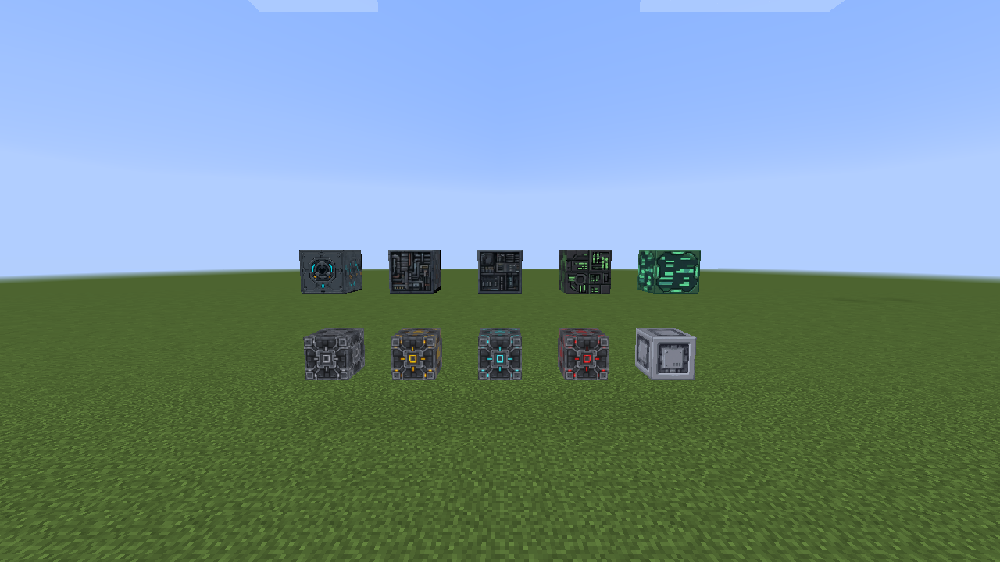

| Row | 1 | 2 | 3 | 4 | 5 |
| --- | --- | --- | --- | --- | --- |
| Top | Fuel Port Round (Tech) | Greebled Panel 1 (Tech) | Greebled Panel 2 (Tech) | Green Console (Tech) | Green Core (Tech) |
| Bottom | Matter (Tech) | Matter - Amber (Tech) | Matter - Cyan (Tech) | Matter - Red (Tech) | Microchip (Tech) |

### Materials 91–100

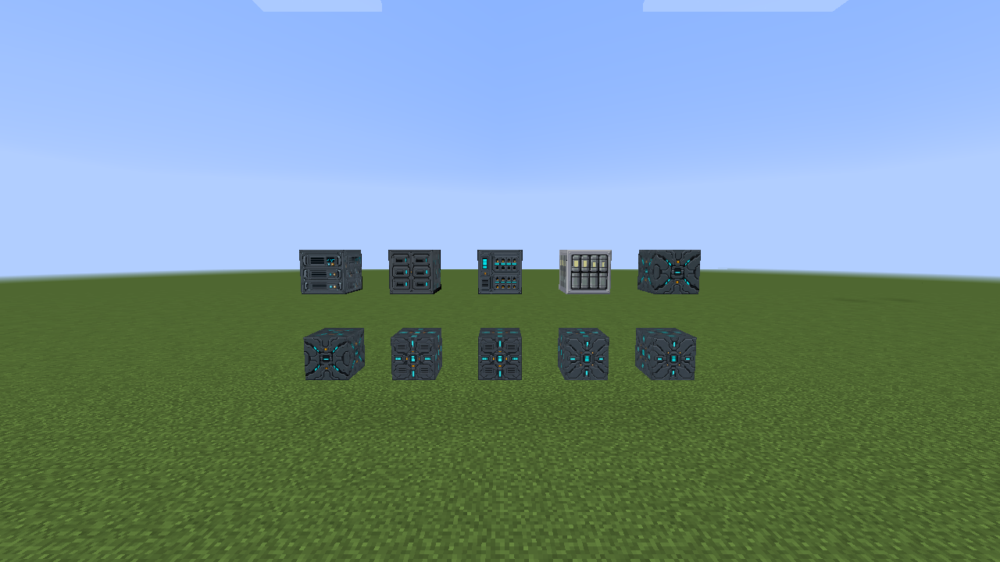

| Row | 1 | 2 | 3 | 4 | 5 |
| --- | --- | --- | --- | --- | --- |
| Top | Server Compute Rack (Tech) | Server Data Storage (Tech) | Server Network Core (Tech) | Switch Bank (Tech) | Armored Hatch Large (Trapdoors) |
| Bottom | Armored Hatch Small (Trapdoors) | Industrial Hatch Large (Trapdoors) | Industrial Hatch Small (Trapdoors) | Reinforced Hatch Large (Trapdoors) | Reinforced Hatch Small (Trapdoors) |

### Materials 101–110

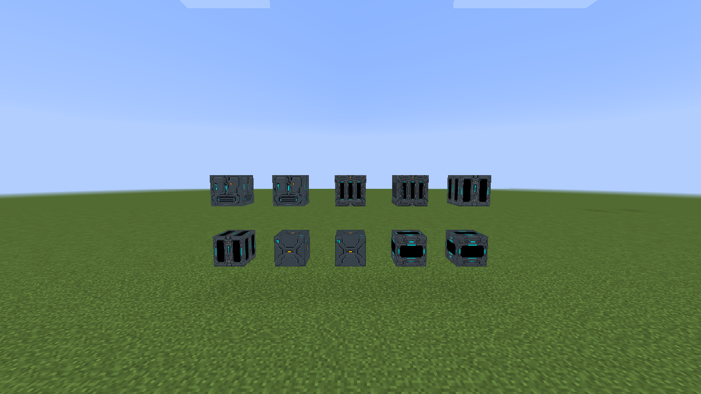

| Row | 1 | 2 | 3 | 4 | 5 |
| --- | --- | --- | --- | --- | --- |
| Top | Service Hatch Large (Trapdoors) | Service Hatch Small (Trapdoors) | Slit Hatch Large (Trapdoors) | Slit Hatch Small (Trapdoors) | Twin-Window Hatch Large (Trapdoors) |
| Bottom | Twin-Window Hatch Small (Trapdoors) | Utility Hatch Large (Trapdoors) | Utility Hatch Small (Trapdoors) | Viewport Hatch Large (Trapdoors) | Viewport Hatch Small (Trapdoors) |

### Materials 111–114

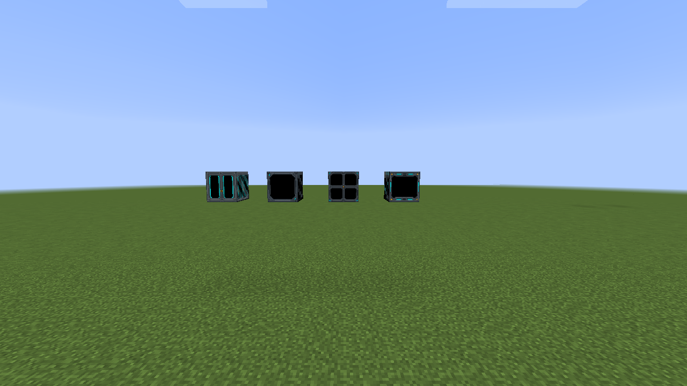

| Row | 1 | 2 | 3 | 4 | 5 |
| --- | --- | --- | --- | --- | --- |
| Top | Window Armored Slit (Windows) | Window Clear Frame (Windows) | Window Cross Brace (Windows) | Window Observation (Windows) |  |

## Selected close-ups and glass

Portholes offer **Round**, **Hexagon**, **Octagon**, and **Square** openings, glass shade, and **Join**. Joining merges eligible neighboring portholes into a larger window. The wall form is thin; the block form fills the entire block depth.

| Finish group | Close-up |
| --- | --- |
| Hull |  |
| Padding |  |
| Wall pipes and vent |  |
| Cockpit glass |  |

Hull includes Light Alloy, Dark Gunmetal, and Midnight Satin. Padding includes Seamed, Ribbed, and Stitched. Wall Pipes and Framed Wall Pipes are finishes in the programmable selection rather than separate blocks. Choose them on a full block, slab, or another supported form.

Clear, Pale Cyan, and Smoked Cockpit Glass are separate transparent blocks. Their recipes use eight matching vanilla glass blocks and one Industrial Alloy Ingot to make nine blocks: ordinary glass for Clear, cyan stained glass for Pale Cyan, and gray stained glass for Smoked.

Programmable Glass provides selectable frame detail and glass shade in one block. Its texture detail can be Small, Medium, or Large, with the shade chosen independently for each size.

Diagonal placement follows the clicked edge; the dialog can reverse the slope.
See [placement, joining and recipes](version-1.1.md#diagonal-building-blocks).
