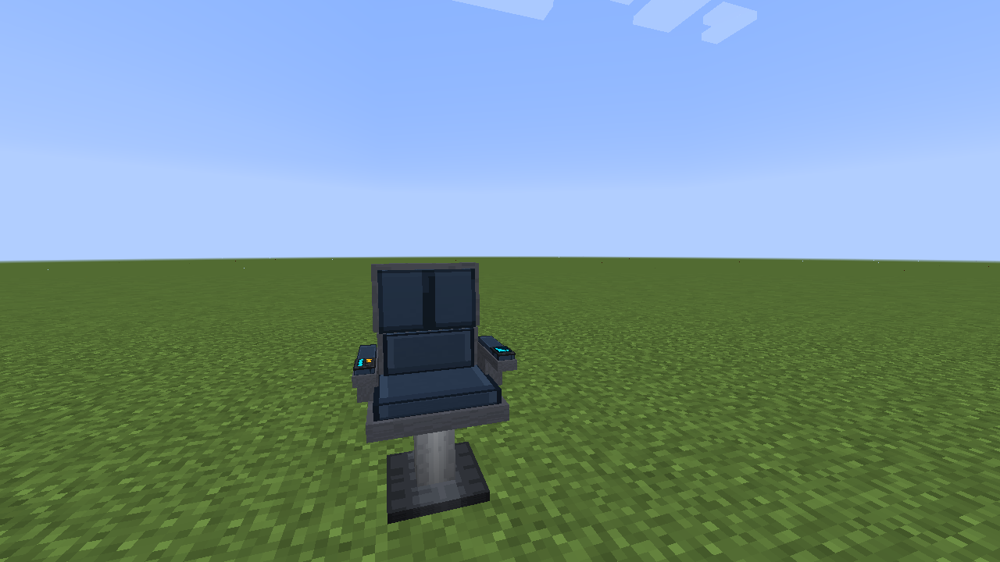
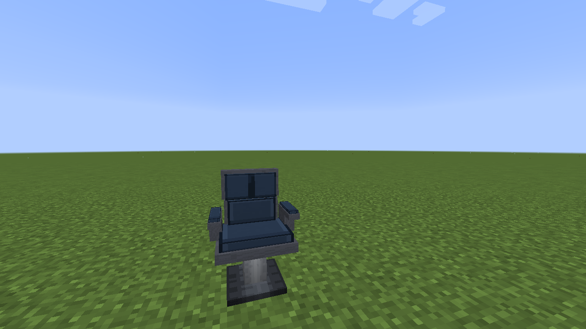
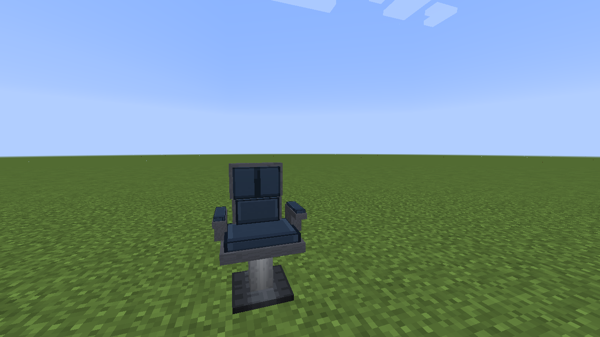
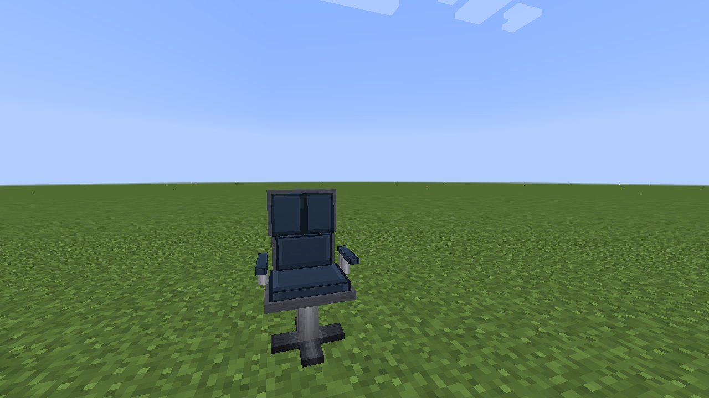
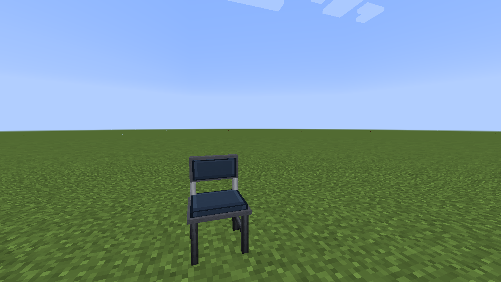

# Chairs

Vandor Labs includes five sittable chair designs. Right-click a chair to sit; sneak to get up. Choose the appearance that fits the room: command and operator seats for workstations, or companion, conference, and mess hall seats for shared spaces.

| Chair | Close-up |
| --- | --- |
| Command |  |
| Companion |  |
| Operator |  |
| Conference |  |
| Mess Hall |  |

The chair is a normal placed block; sitting uses a temporary seat entity that is removed when the rider dismounts or the chair breaks.
