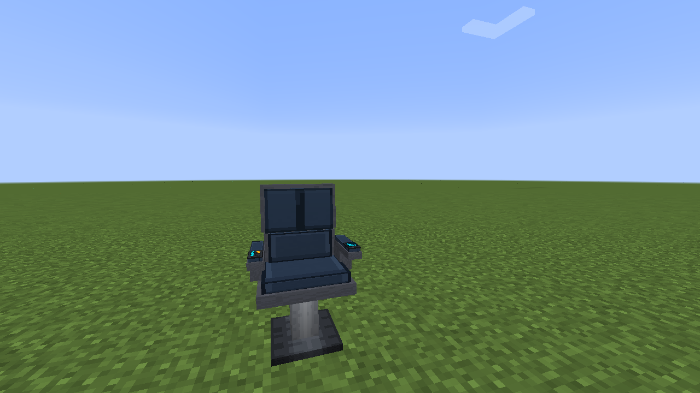
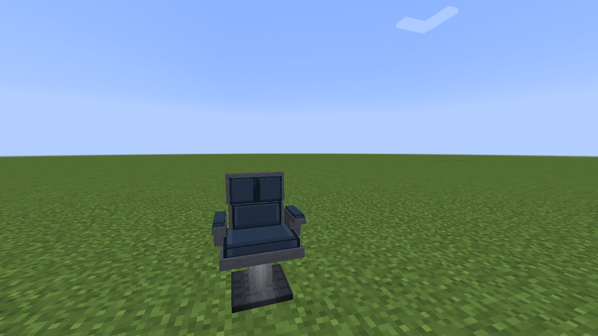
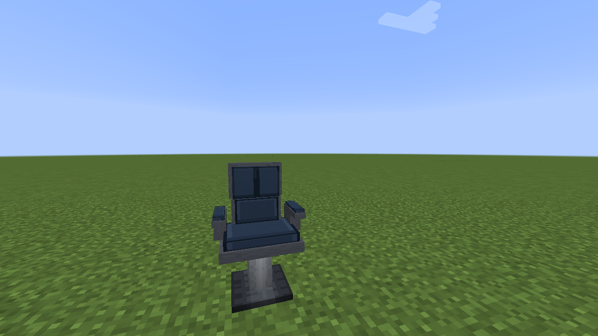
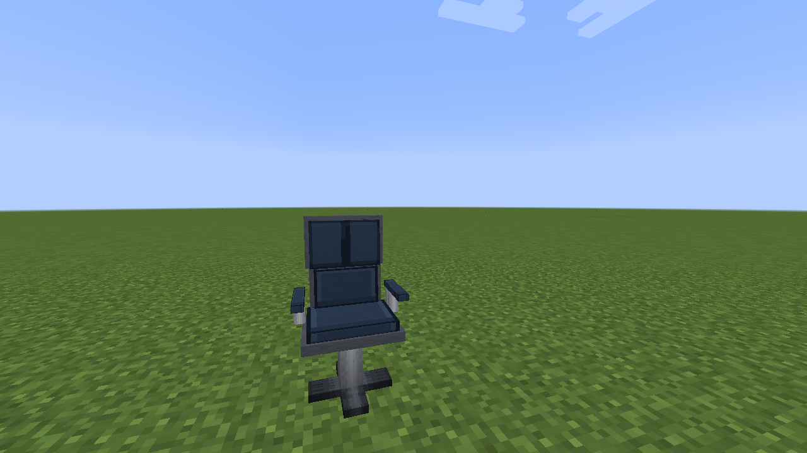
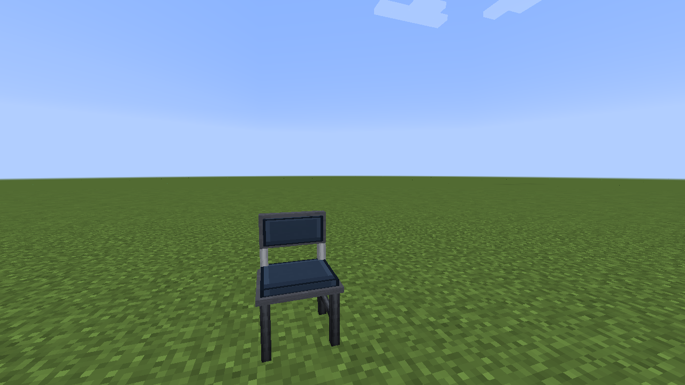

# Chairs

Luxury and military seats now join into benches. See
[connected seating in 1.2](version-1.2.md#connected-seating).

Programmable Chair includes five sittable designs. Right-click a chair to sit; sneak to get up. Choose the appearance that fits the room: command and operator seats for workstations, or companion, conference, and mess hall seats for shared spaces.

| Chair | Close-up |
| --- | --- |
| Command |  |
| Companion |  |
| Operator |  |
| Conference |  |
| Mess Hall |  |

The chair is a normal placed block; sitting uses a temporary seat entity that is removed when the rider dismounts or the chair breaks.

## Luxury and Military Seats

Both seats can join into benches. Creative shift-right-click offers **Join** and
three heights: default, two pixels lower, or two pixels higher. The default legs
are one pixel taller than the original models. Each recipe uses five Industrial
Alloy Ingots and matching blue (Luxury) or green (Military) wool.

