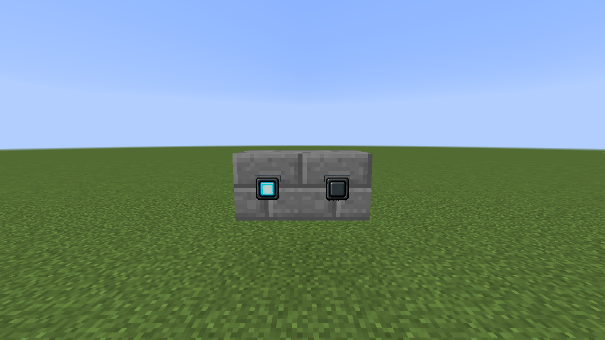
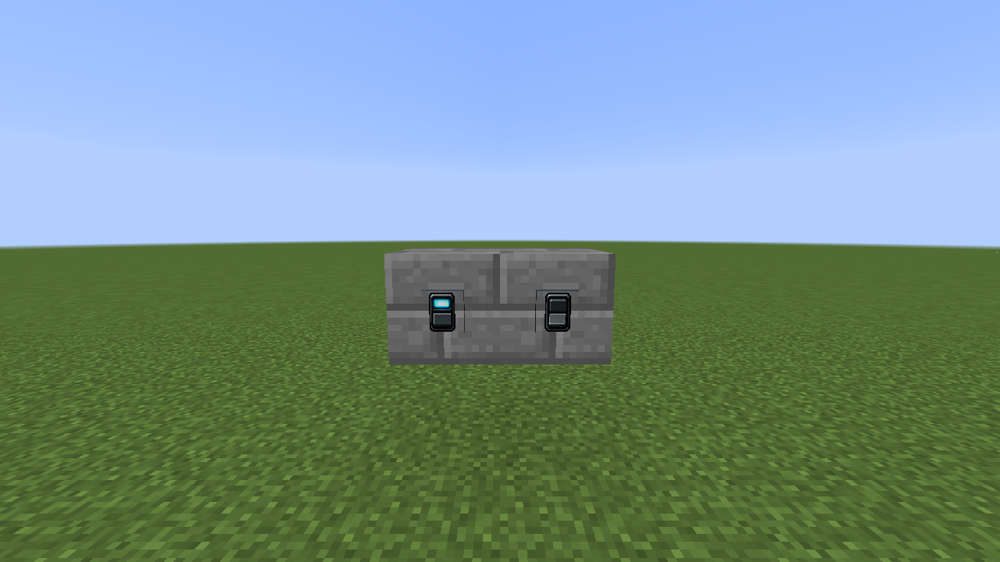
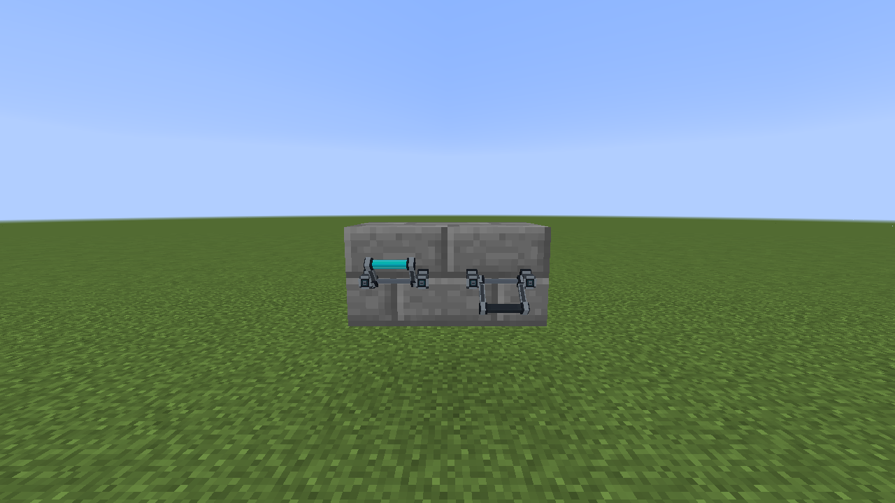
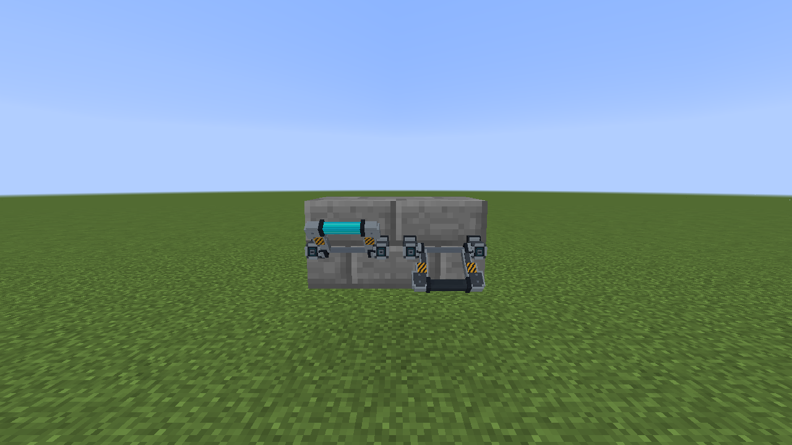

# Buttons, switches, and levers

These controls generate local redstone power and can participate in virtual redstone channels. Each image shows the off and on positions side by side. Place the control on the intended face, then right-click to operate it. In Creative mode, shift-right-click for supported channel settings.

| Control | States | Use |
| --- | --- | --- |
| Push Button |  | Momentary input for doors and circuits. |
| Rocker Switch |  | Persistent on/off input. |
| Compact Power Lever |  | Small lever control. |
| Industrial Power Lever |  | Larger lever control. |

The compact and industrial levers have separate recipes based on a vanilla lever plus Industrial Alloy Ingots. The button and rocker switch likewise use Industrial Alloy Ingots. See the in-game recipe book for the arrangements.
