# Buttons, switches, and levers

Version 1.6 adds [signal-level controls and live demonstrations](version-1.6.md).

These controls generate local redstone power and can participate in virtual redstone channels. Each image shows the off and on positions side by side. Place the control on the intended face, then right-click to operate it. In Creative mode, shift-right-click for supported channel settings.

| Control | States | Use |
| --- | --- | --- |
| Push Button | 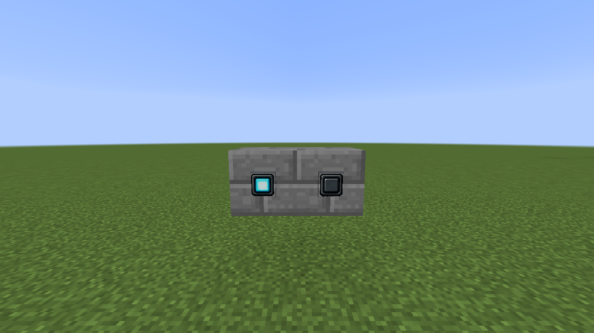 | Momentary input for doors and circuits. |
| Rocker Switch | 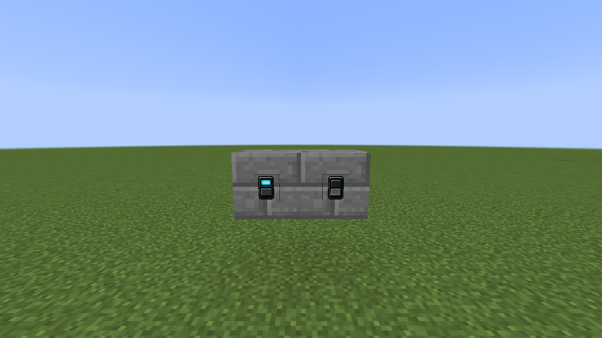 | Persistent on/off input. |
| Compact Power Lever | 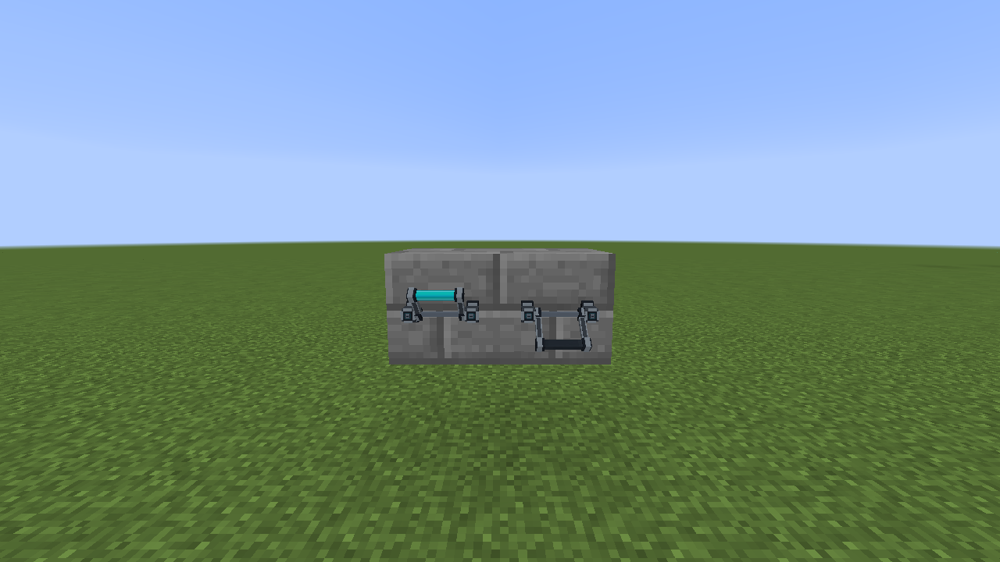 | Small lever control. |
| Industrial Power Lever | 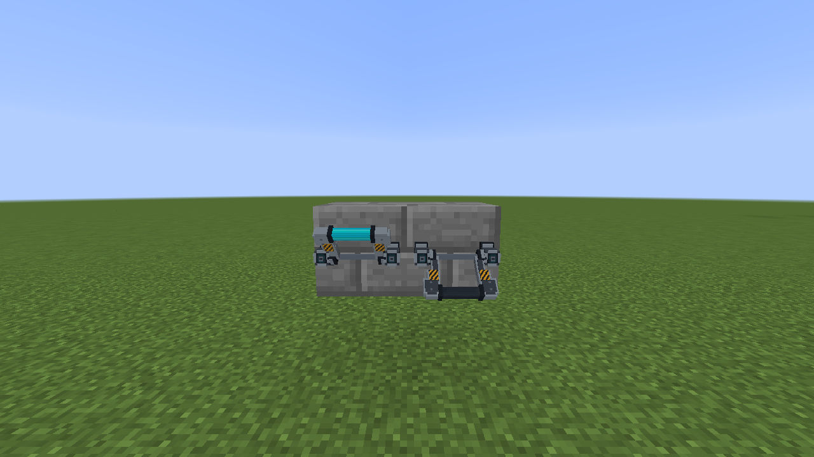 | Larger lever control. |

The compact and industrial levers have separate recipes based on a vanilla lever plus Industrial Alloy Ingots. The button and rocker switch likewise use Industrial Alloy Ingots. See the in-game recipe book for the arrangements.

## Signal-level controls

Thruster Lever, Wall Slider, Airliner Throttle and Fighter Throttle have four
positions: Off, Low, Medium and High. Normal right-click cycles their levels;
Creative-mode shift-right-click configures channels and low/high limits. Defaults
are 0, 5, 10 and 15. Their numeric outputs drive physical redstone and shared
channels, including interactive screen sliders and Programmable Trigger blocks.

All four detailed models mount on walls, floors and ceilings. The floor-mounted
Wall Slider puts Off nearest the placing player. Airliner handles move together;
Fighter buttons are decorative. See the [signal-level guide and GIF examples](version-1.6.md)
for lighting, propulsion and screen settings.

## Throttle base height and tilt

Thruster Lever, Airliner Throttle and Fighter Throttle have configurable bases.
Shift-right-click a placed control, or right-click it with the Configurizer in
survival, to open its channel/settings dialog. Set **Base height** to **Standard**
(the original minimum), **+2 px** or **+4 px**. The solid mounting plate extends;
the panel and handles above it move together.

Set **Tilt** to **Flat**, **5 deg**, **10 deg** or **15 deg**, then select
**Forward**, **Right**, **Backward** or **Left** relative to the mounted control.
The entire base, panel and handles tilt together. This works on walls, floors
and ceilings, and the selection outline follows the transformed control.
Click **Done** to apply. Right-click a setting button to cycle backward.

Existing controls remain Standard/Flat. Height and tilt survive saving,
breaking and replacing a configured control, and pick-block. The Duplifier’s
**Signal Levels** option copies these settings along with the control’s limits.
The Wall Slider retains its existing mounting geometry.

The pictures show different signal detents as well as the mounting settings.

| Control | Standard | +2 px | +4 px | Tilted 15 degrees |
| --- | --- | --- | --- | --- |
| Thruster Lever | 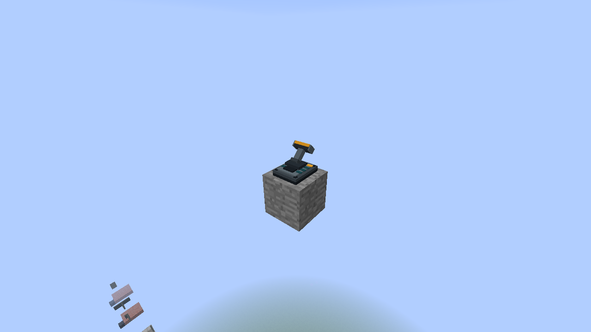 | 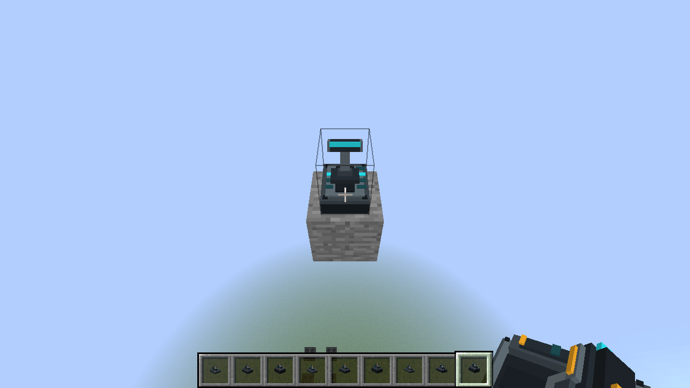 | 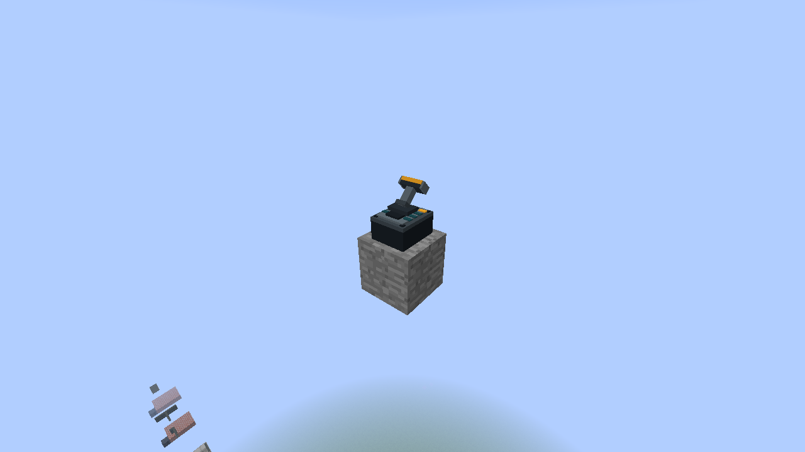 |  |
| Airliner Throttle |  | 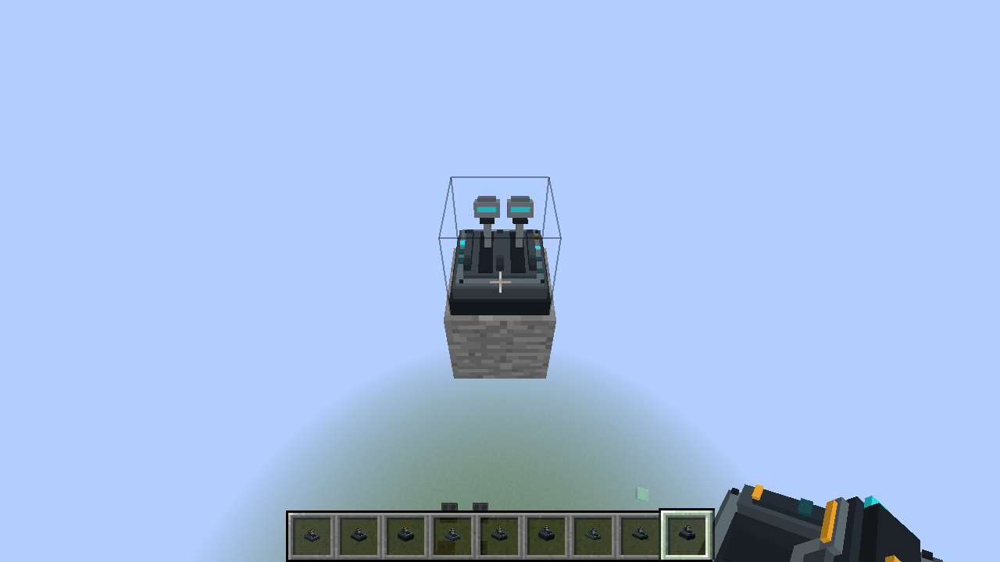 | 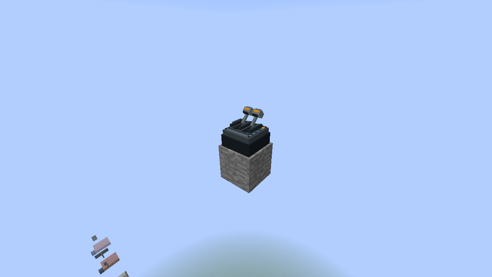 |  |
| Fighter Throttle |  | 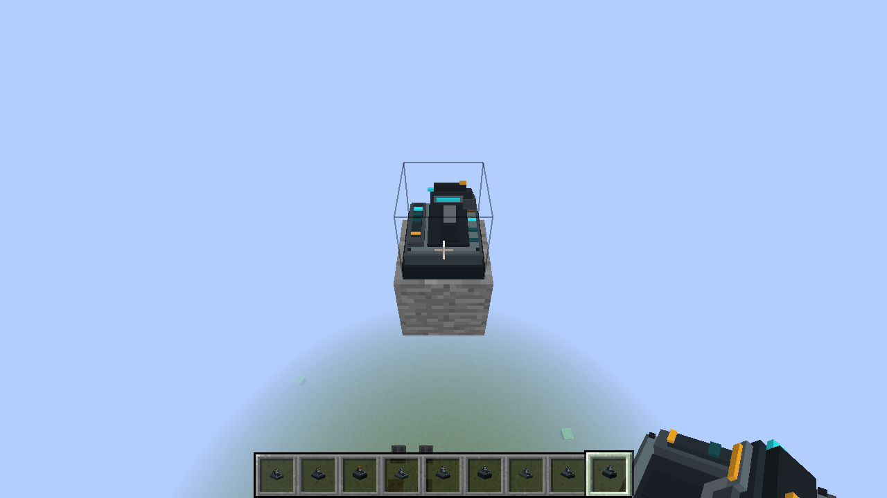 |  | 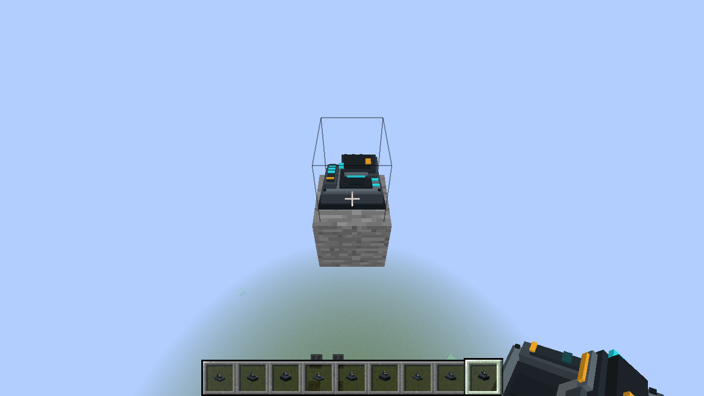 |
