# Buttons, switches, and levers

Version 1.6 adds [signal-level controls and live demonstrations](version-1.6.md).

These controls generate local redstone power and can participate in virtual redstone channels. Each image shows the off and on positions side by side. Place the control on the intended face, then right-click to operate it. In Creative mode, shift-right-click for supported channel settings.

| Control | States | Use |
| --- | --- | --- |
| Push Button |  | Momentary input for doors and circuits. |
| Rocker Switch |  | Persistent on/off input. |
| Toggle Switch | 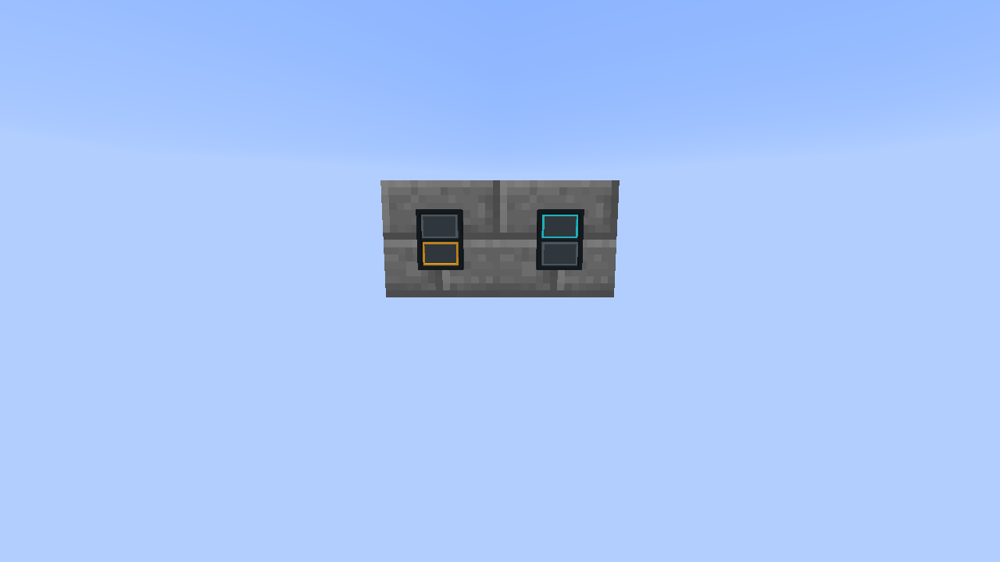 | Split rocker with an illuminated border on the pressed half. |
| Compact Power Lever |  | Small lever control. |
| Industrial Power Lever |  | Larger lever control. |
| Power Lever: Small | 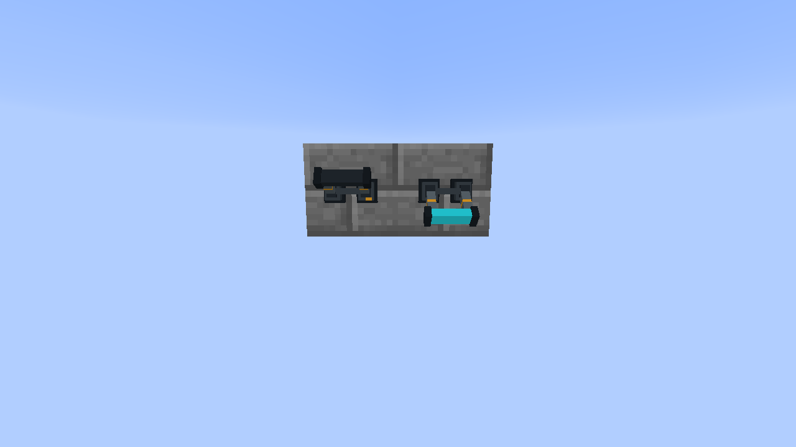 | Twin arms and shared grip; 67.5-degree throw. |
| Power Lever: Large | 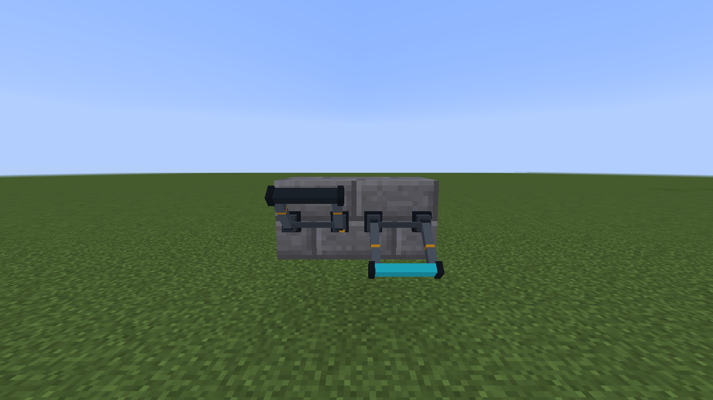 | Longer twin arms and shared grip; 90-degree throw. |

The compact and industrial levers have separate recipes based on a vanilla lever plus Industrial Alloy Ingots. The button and rocker switch likewise use Industrial Alloy Ingots. See the in-game recipe book for the arrangements.

Power Lever mounts on walls or floors and toggles
between Off and On with a normal right-click. The joined arms and grip move
together; the grip turns cyan while On. Small’s Off angle is 22.5 degrees and
its On angle is 45 degrees. Large keeps its 45-degree angles in both states,
with arms shortened by 2 pixels. Small’s arm is one pixel shorter than its original design. Moving arms sit slightly inside the pivot
caps to avoid overlapping surfaces at the base. They provide 0 or 15 redstone power
and use the same channel settings and linked switching as Industrial Power
Lever. Use the Configurizer to configure channels in survival. Like the
Industrial Power Lever, these controls do not obstruct movement.

Craft one Power Lever with **two vanilla levers** and **one Industrial Alloy
Ingot**, in any arrangement. In its configuration dialog, click **Size: Small**
or **Size: Large** and then **Done**. Size survives saving, pick-block and
breaking/replacing; the Duplifier’s **Signal Levels** option copies it. Existing
Large Power Levers retain their original size.

## Toggle Switch

Toggle Switch uses a compact **6 × 8 pixel** plate with a recessed, split
rocker in the newer levers’ solid-color palette. **Off** presses the bottom
half with an amber border; **On** presses the top half with a cyan border.
Only the active half has a colored border. Normal right-click toggles it and
outputs 0 or 15 redstone power.

Mount it on a wall, floor or ceiling. Floor and ceiling orientation follows
placement. It uses the Rocker Switch’s channel configuration and linked latch
behavior, including the Configurizer in survival and channel-preserving
pick-block. Like the Rocker Switch, it does not obstruct movement.

Craft one Toggle Switch from **one stick**, **one Industrial Alloy Ingot** and
**one redstone dust**, in any arrangement.

## Signal-level controls

Thruster Lever, Wall Slider, Airliner Throttle and Fighter Throttle have four
positions: Off, Low, Medium and High. Normal right-click cycles their levels;
Creative-mode shift-right-click configures channels and low/high limits. Defaults
are 0, 5, 10 and 15. Their numeric outputs drive physical redstone and shared
channels, including interactive screen sliders and Programmable Trigger blocks.

All four detailed models mount on walls, floors and ceilings. The floor-mounted
Wall Slider puts Off nearest the placing player. Airliner handles move together;
Fighter buttons are decorative. See the [signal-level guide and GIF examples](version-1.6.md)
for lighting, propulsion and screen settings.

## Throttle base height and tilt

Thruster Lever has three selectable types: **Thruster**, **Airliner** and
**Fighter**. Open its configuration dialog and click **Type** to cycle them.
All types share the same recipe and settings. Existing Airliner and Fighter
controls keep their appearance. Type is preserved when saving, pick-block and
breaking/replacing; the Duplifier’s **Signal Levels** option copies it.

All three types have configurable bases.
Shift-right-click a placed control, or right-click it with the Configurizer in
survival, to open its channel/settings dialog. Set **Base height** to **Standard**
(the original minimum), **+2 px**, **+4 px** or **+6 px**. The solid mounting plate extends;
the panel and handles above it move together.

Set **Tilt** to **Flat**, **15 deg**, **30 deg** or **45 deg**, then select
**Forward**, **Right**, **Backward** or **Left** relative to the mounted control.
The control tilts on top of a straight height extension, perpendicular to the
support face. Increasing height raises the tilted assembly without shifting it
sideways. A solid wedge fills underneath the tilt. This works on walls, floors and ceilings.
The controls have solid collision for their base, panel and handles, with a stepped
collision surface along the wedge. The selection outline follows the control.
Click **Done** to apply. Right-click a setting button to cycle backward.

Existing controls remain Standard/Flat. Height and tilt survive saving,
breaking and replacing a configured control, and pick-block. The Duplifier’s
**Signal Levels** option copies these settings along with the control’s limits.
The Wall Slider retains its existing mounting geometry.

All pictures below use the Off detent so the mounting settings can be compared directly.

| Control | Standard | +2 px | +4 px | +6 px |
| --- | --- | --- | --- | --- |
| Thruster Lever |  |  |  | 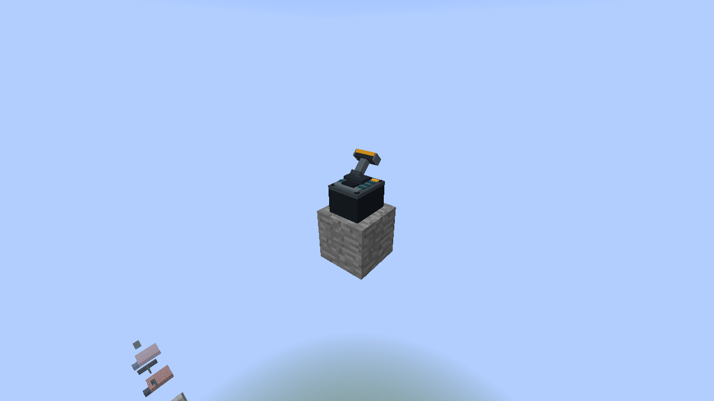 |
| Airliner Throttle |  |  |  | 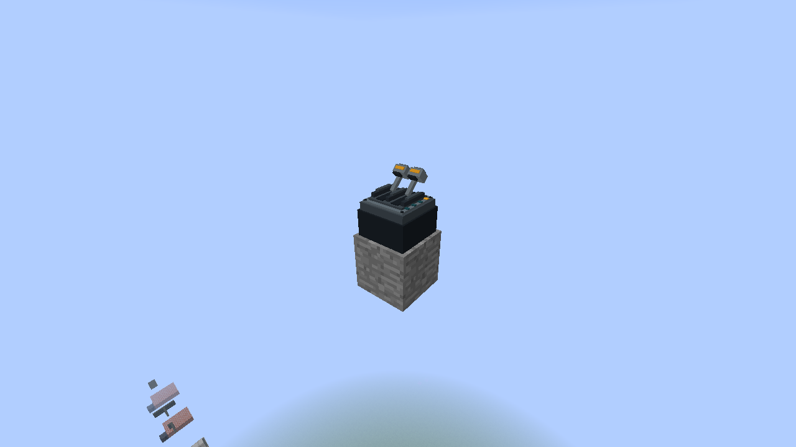 |
| Fighter Throttle |  |  |  | 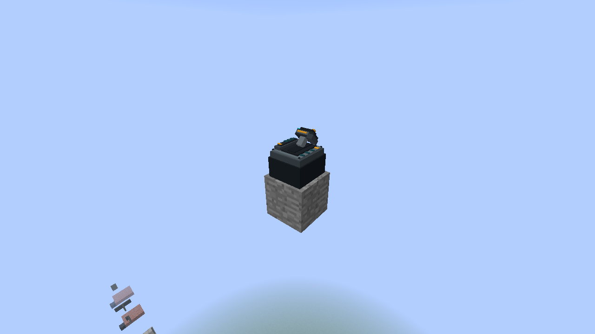 |

| Control | 15 degrees | 30 degrees | 45 degrees |
| --- | --- | --- | --- |
| Thruster Lever |  | 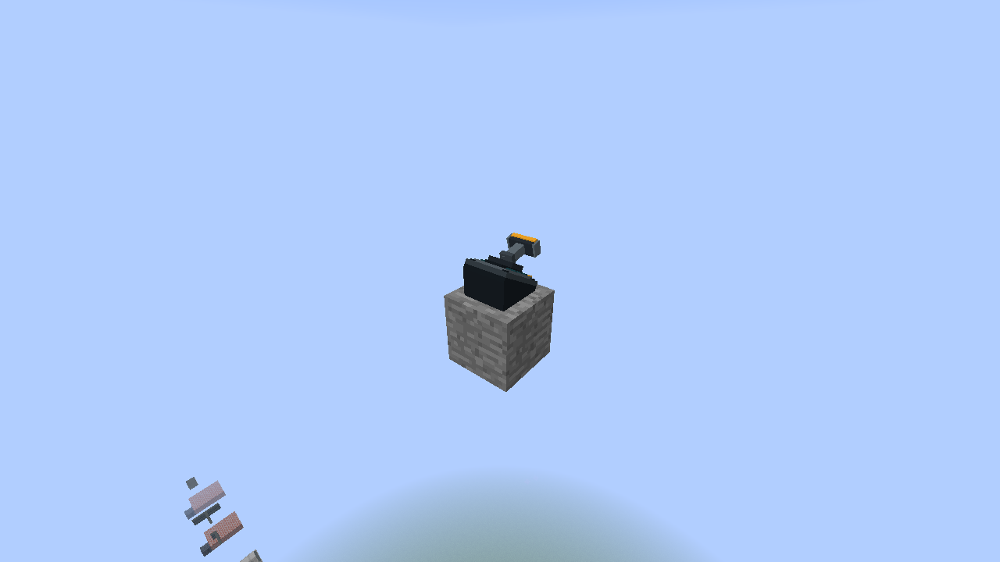 |  |
| Airliner Throttle | 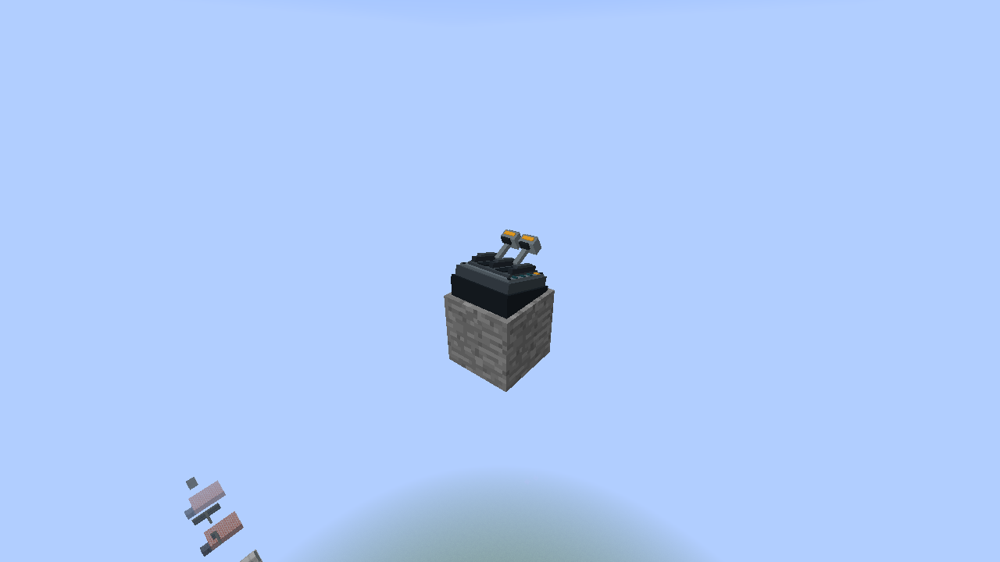 | 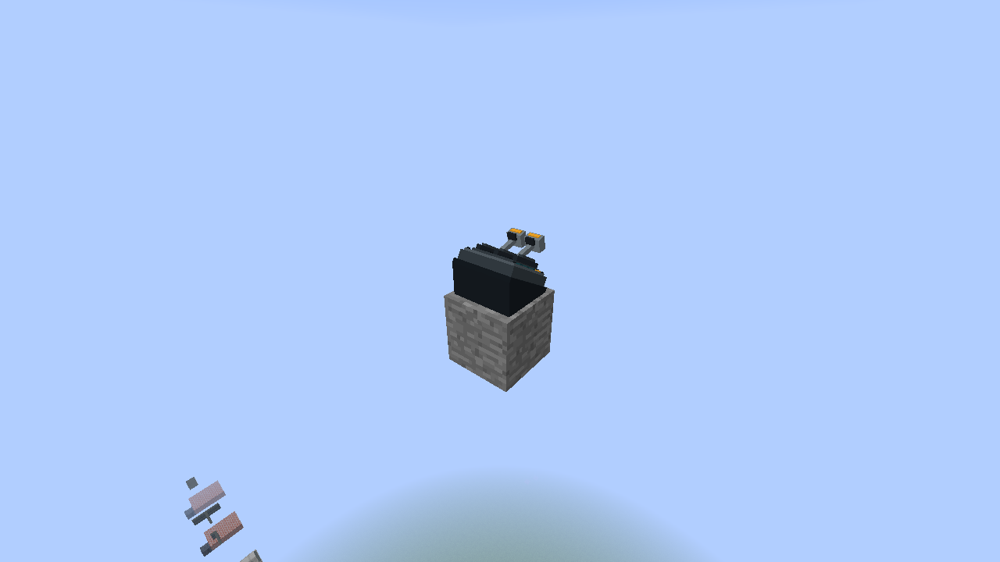 | 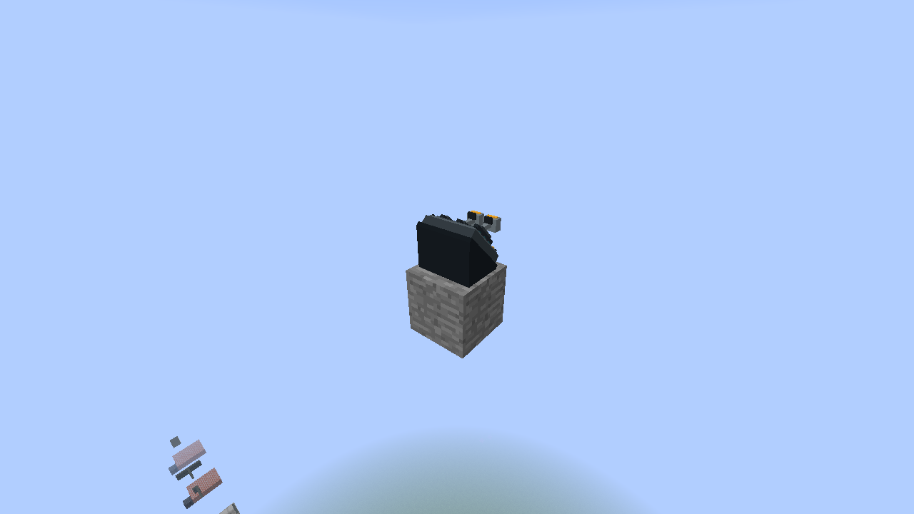 |
| Fighter Throttle |  | 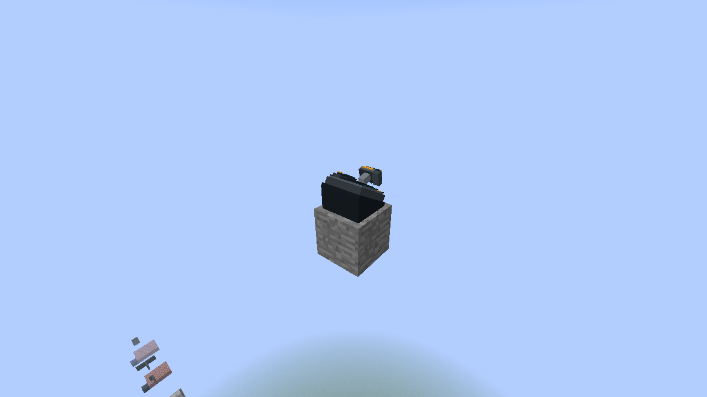 | 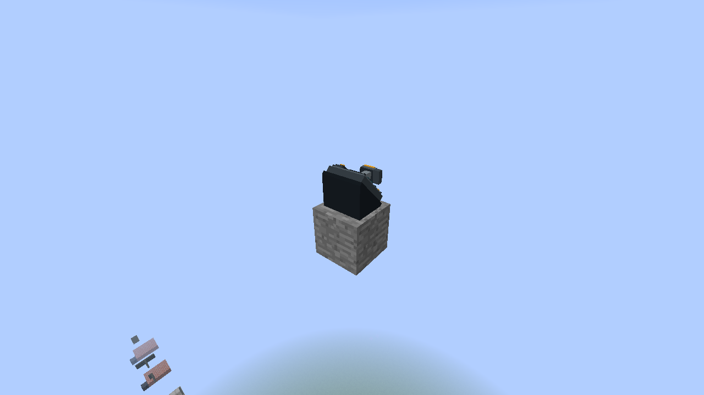 |

Existing 15-degree mounts keep that angle. Earlier 5-degree and 10-degree mounts use 15 degrees when loaded.

Height and tilt can be combined. These examples use **+6 px** and **45 degrees**:

| Thruster Lever | Airliner Throttle | Fighter Throttle |
| --- | --- | --- |
| 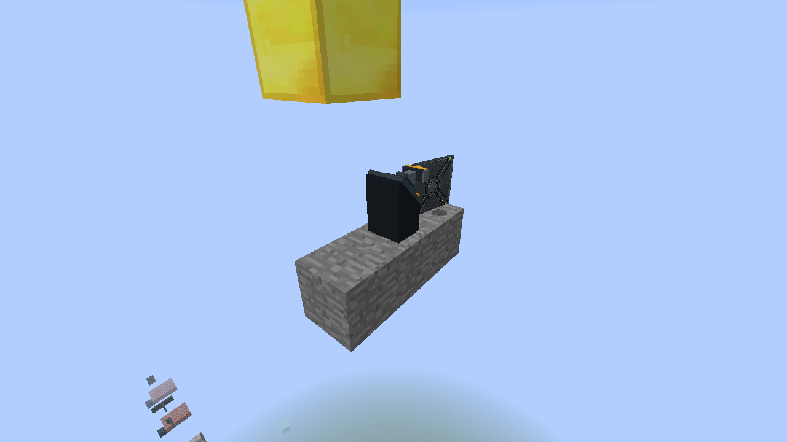 |  | 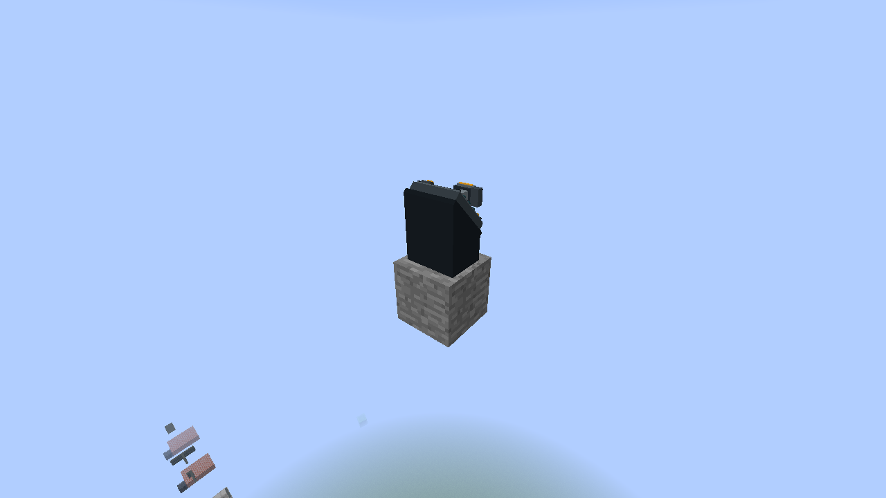 |
