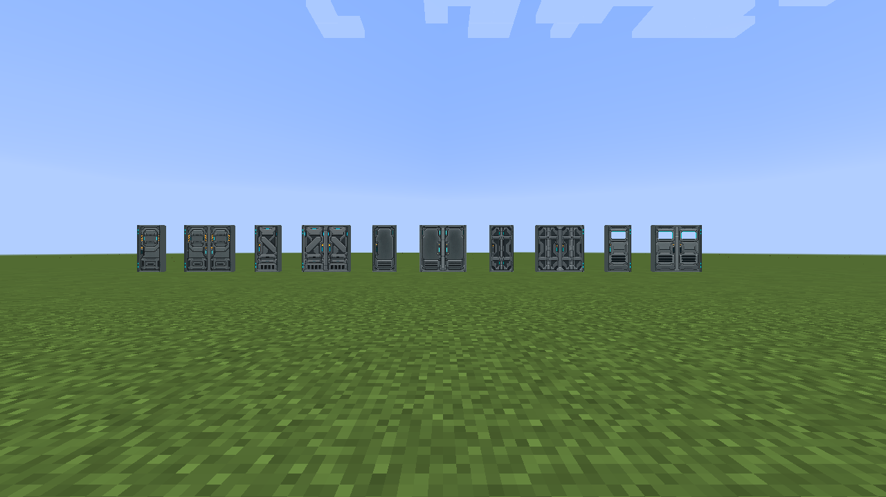
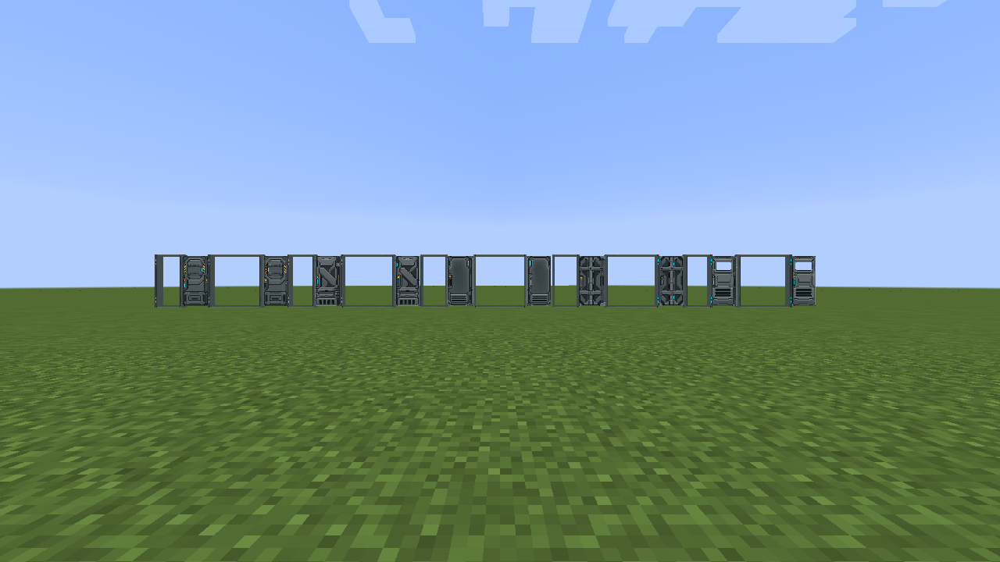
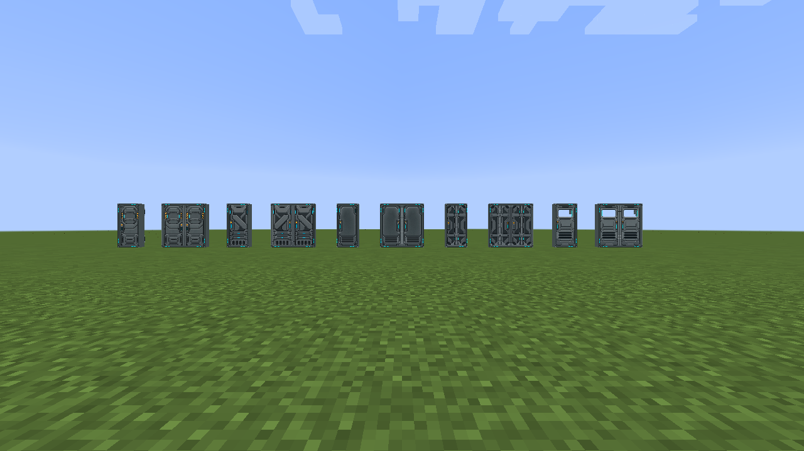
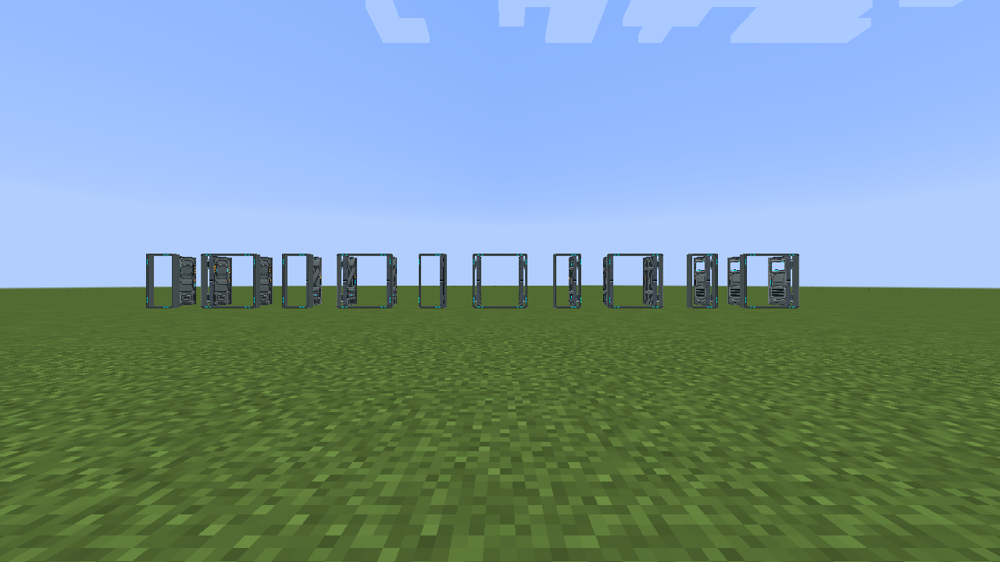

# Programmable Door

Programmable Door supports sliding or rotating movement, configurable designs, frames,
hinges, and an optional control panel. Adjacent doors pair automatically.
Shift-right-click or click the control panel to configure the door.

Set Trigger to Disabled for manual operation, or On/Off for redstone-controlled
operation. Physical redstone and virtual redstone channels are supported.

| Movement | Closed | Open |
| --- | --- | --- |
| Sliding |  |  |
| Rotating |  |  |

The old Airlock, Security, and Detailed Engineering/Observation/Split door blocks
have been removed. Existing instances of those blocks are discarded when an old
world loads; they are not converted to Programmable Door.
