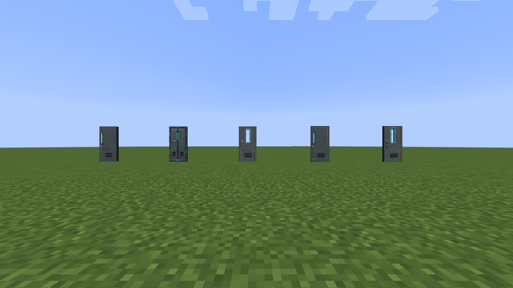
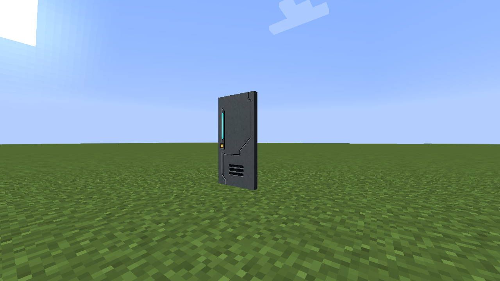
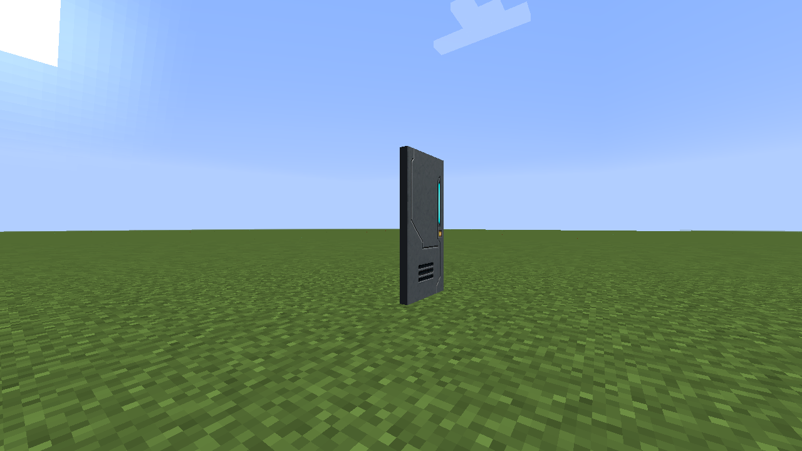
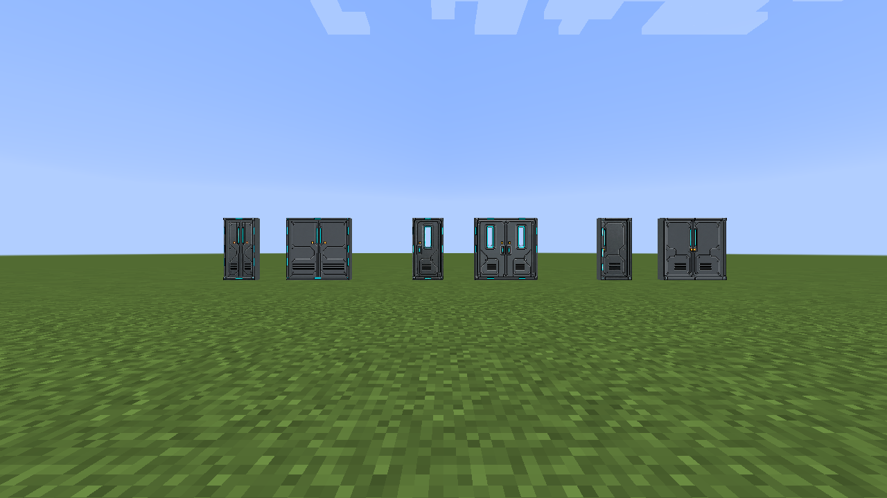
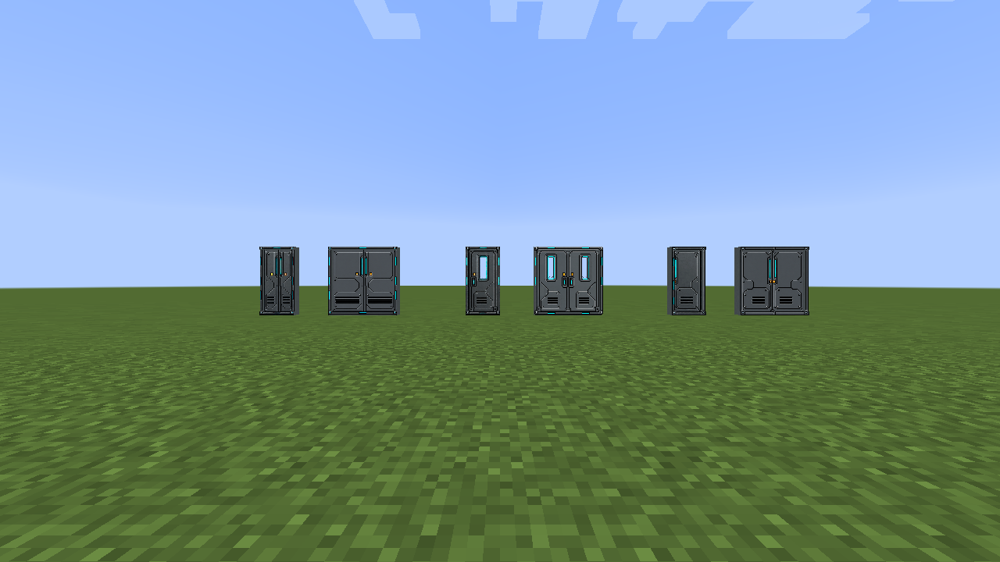

# Doors

Doors support click operation, physical redstone, virtual redstone channels,
paired hinges, and animated opening where applicable. Glass pairs preserve a
continuous texture orientation.

## Standard doors

The standard catalog includes the hinged glass airlock and security door plus
glass-airlock, hangar, and security sliding doors.

| Closed | Open |
| --- | --- |
|  |  |

## Detailed doors

Engineering, Observation, and Split designs each have rotating and sliding,
single and paired-double registrations—all twelve detailed door blocks.

The one-block Split design animates two independent leaves; paired-double
registrations coordinate their adjacent leaves as one doorway.
