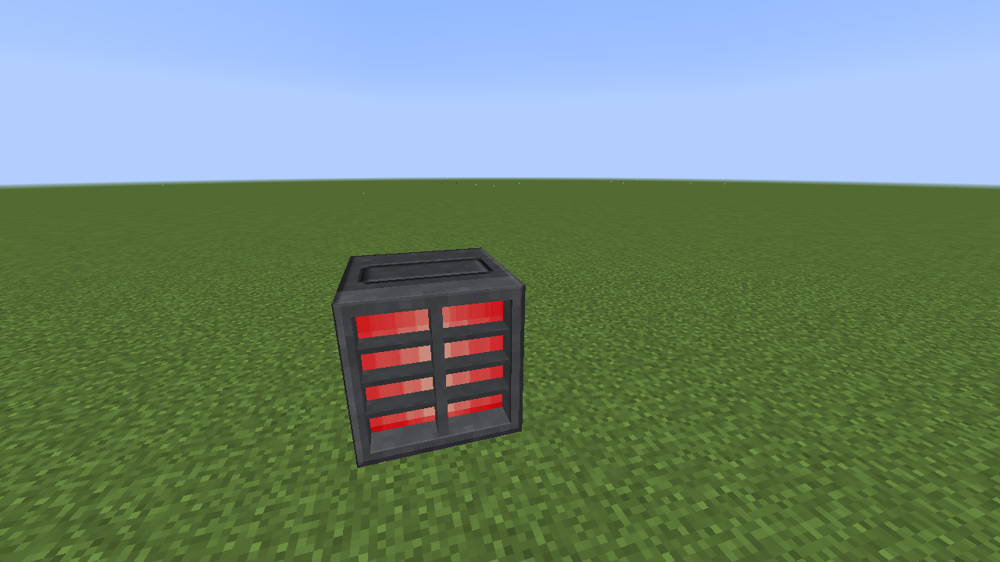
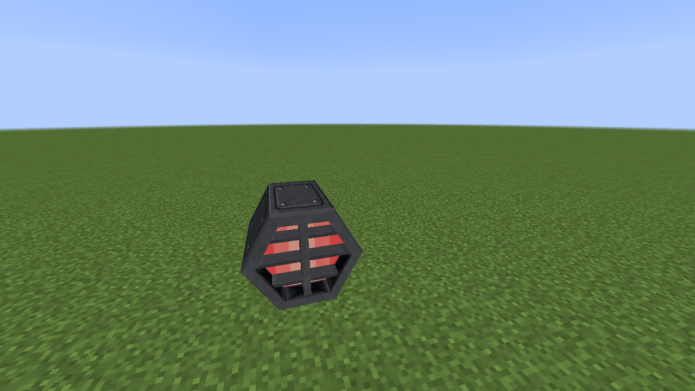
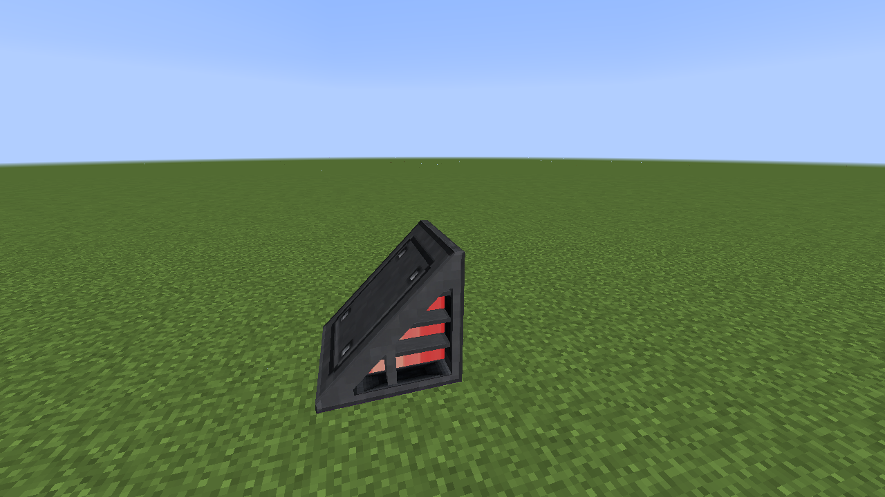

# Programmable Impulse Engine

The Impulse Engine provides the impulse-family emitter texture, light, and particle stream. Choose its shape in the settings dialog after placing it; the facing comes from placement and a wedge uses the clicked corner.

| Shape | Close-up |
| --- | --- |
| Block |  |
| Hexagon |  |
| Wedge |  |

Normal right-click cycles its manual state through Off, On, and On + Particle Stream. Shift-right-click in Creative mode configures Shape, Join, redstone behavior, and channel. See [propulsion settings and connected blocks](propulsion.md).
