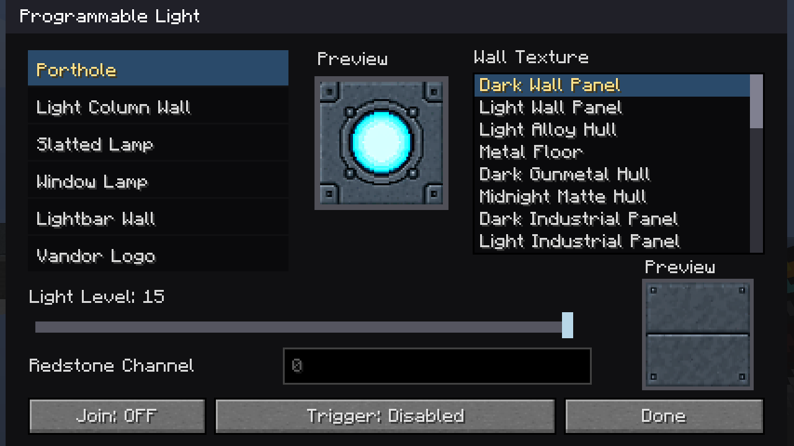
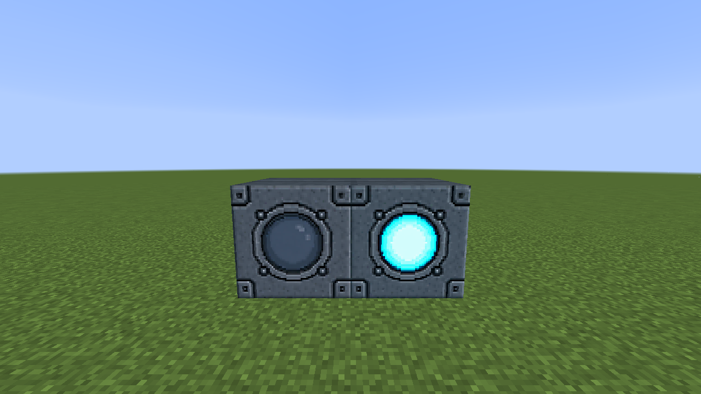
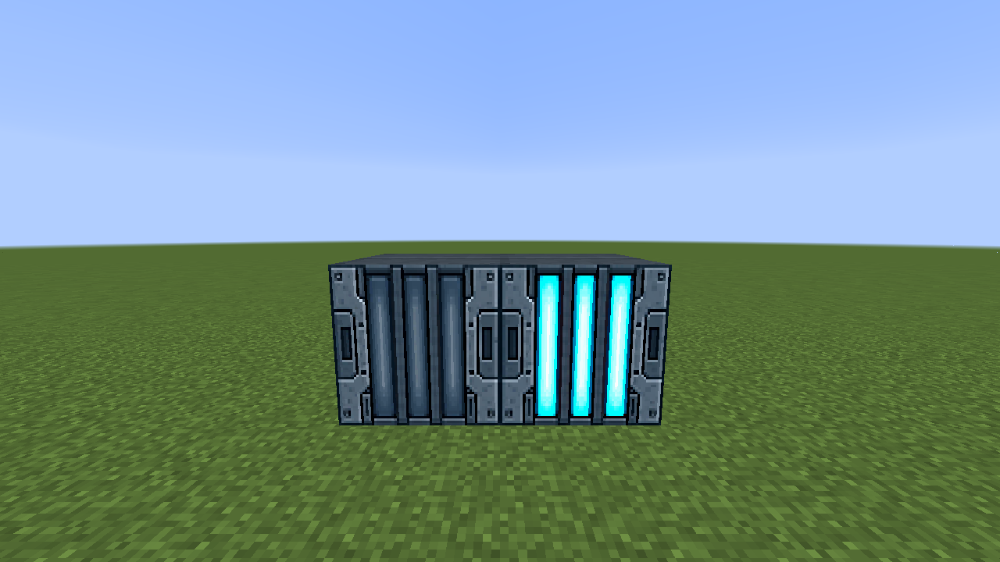
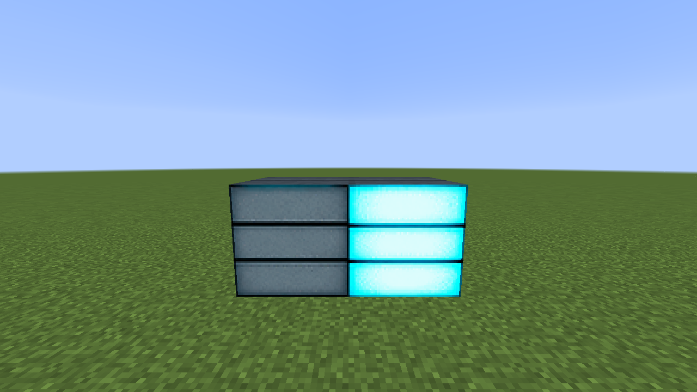
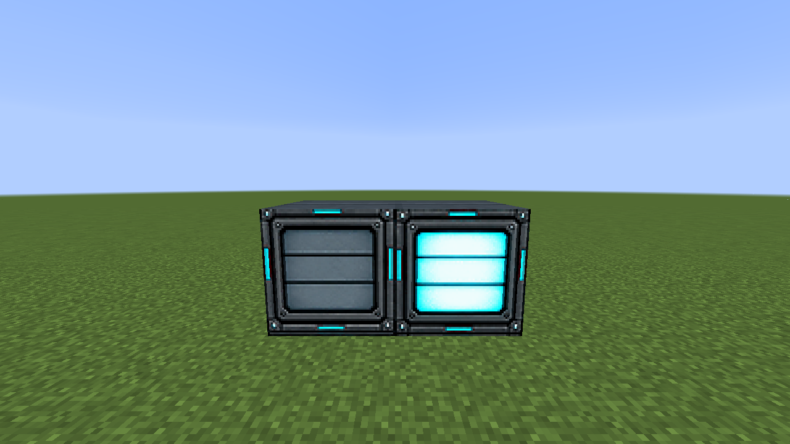
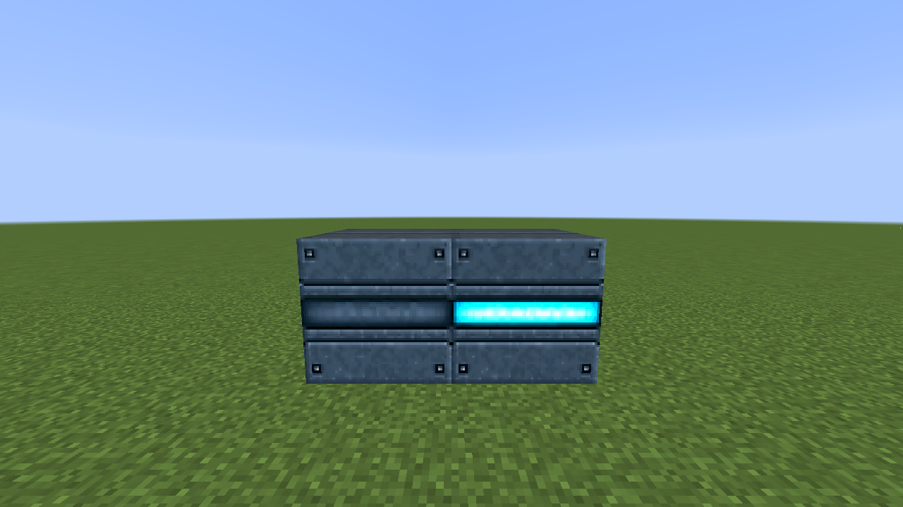
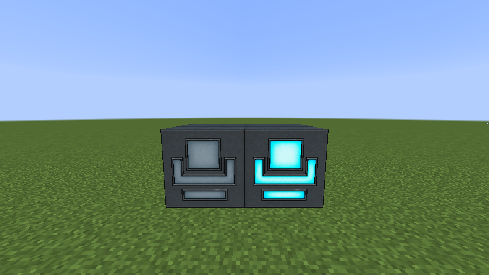

# Lights

Programmable Light provides six selectable appearances. Each has an unlit and lit texture; the close-ups place those states side by side. In Creative mode, shift-right-click to choose the appearance, wall finish, redstone behavior, channel, and Join setting. Normal right-click changes its manual state. A joined group can respond together to a signal received by one member.

| Appearance | Off and on close-up |
| --- | --- |
| Porthole |  |
| Light Column |  |
| Slatted Lamp |  |
| Window Lamp |  |
| Lightbar |  |
| Logo |  |

Use redstone **On** to light while powered or **Off** to light while unpowered. A virtual channel carries the same activation across loaded blocks in the dimension. Configure the block from its own menu, or copy compatible settings with the [Duplifier](../DUPLIFIER.md).
