# Programmable Diagonal Trapdoor

Default, configured and Custom-finish inventory icons use a reduced scale to fit the hotbar slot; see the [hotbar comparison](../images/gallery/tasks/diagonal-trapdoor-hotbar.png).

A movable panel aligned with Programmable Diagonal Walls. New panels use **Armored Hatch** from the Trapdoors category by default. Choose the shared categorized
material catalog and redstone settings as [Programmable Trapdoor](programmable-trapdoor.md),
with rotating, sliding and splitting movement and no frame or hinge hardware.

## Geometry and placement

The three shape modes match the diagonal walls:

| Menu option | Wall shape | Leaf clearance |
| --- | --- | --- |
| Half width / tall | Half-width, full-height | 1px on each surface |
| Full width / tall | Full-width, full-height | 1px on each surface |
| Full width / shallow | Full-width, half-height | 1px on each surface |

The walls are 4px thick in their depth coordinate; the inset leaf is 2px thick.
Plain items adopt the clicked diagonal wall or diagonal trapdoor's geometry.
Configured items retain their geometry. Facing, clicked edge and ceiling
placement follow the existing wall rules, including upper shallow panels.

Shift-right-click in creative mode, or right-click with the Configurizer, to
select texture, width, height, movement, slope/band inversion, trigger and channel. Width and height have separate controls: switching Half/Full width on a tall combined group updates every member together. Half-height geometry is always full width.
Geometry copies between diagonal walls and trapdoors through the Duplifier's
**Diagonal Geometry** switch. Fill settings do not apply to trapdoors.

## Motion and groups

Left-click settings buttons to cycle forward, or right-click to cycle backward.

**Slide Left**, **Slide Right**, **Split Horizontal**, **Split Vertical** and **Split X** are also available. Left/right moves the entire opening across its width. Joined straight and bent groups use one sideways direction and their full opening width, even when upper rows face the opposite way. Horizontal splits divide the whole group at one shared width midpoint; vertical splits move length halves apart along the slope. X splits retract four triangular panels toward the four edges. All travel stays in the panel’s plane and shares the selected artwork, collision and selection geometry. Leave space around the opening; these modes do not include the lifting stage of Slide over wall.

Coplanar groups share their complete opening’s center and dimensions. Bent groups, including opposite-slope V assemblies, use each leaf’s own plane for the new split modes. Existing saved rotating and wall-slide choices are preserved. New modes synchronize across loaded groups, persist in configured items and copy with **Door / Trapdoor Movement**.

**Slide over wall** preserves the existing sliding motion: it first lifts the leaf clear of a solid continuation wall, then slides along the surface's width, leaving roughly one pixel visible in its original block. Tall leaves lift in their depth coordinate; shallow leaves lift vertically. Joined tall rows clear the group’s common outside face (the convex side for an opposite-slope bend) before separating sideways, including opposite slopes and reversed-facing continuations. **Slide into wall** instead moves sideways from the start, without lifting, so the leaf retracts into the neighboring wall/block like an ordinary sliding door. Both sliding choices work in all three shape modes and share the group’s sideways travel. Existing saved sliders retain Slide over wall. The choice is saved in configured items and copied by **Door / Trapdoor Movement**. Rendered vertices, selection and collision use the same motion. Rotating leaves retain the same one-pixel clearance at the side edge. Rotating swings 90 degrees around a sloping side edge. Adjacent
compatible leaves pair and open toward opposite sides without reversing their
closed surface. Compatible leaves have the same shape and matching orientation, opposite slopes in neighboring rows (V-shaped assemblies), or the reversed
facing/inversion that continues the same wall plane.

A complete 2×2 surface group opens together in every placement order. Tall
groups span two blocks across and two vertically; shallow groups span two
across and two along their footprint. The two columns open outward. Groups
retain their links on save/reload, and rebuilding a broken square restores the
four-leaf group. Complete rectangular surfaces through 8×8 open together, including 5×2. All three modes also connect across a one-block vertical plus one-block depth offset along their slope. Tall rows step up and toward the facing’s opposite direction for a normal slope, or toward its facing for an inverted slope. Shallow rows step along the facing’s opposite direction and up for a normal slope, or down for an inverted slope. Complete staggered rectangles through 8×8 share movement and settings and retain their links on save/reload. Larger rotating halves share their outer hinge. Individual tall panels prefer upward opening for either slope. Both rows of an opposite-slope V assembly open toward the convex outside of the bend. Reversed coplanar rows share the same outside face. Their inset and hinge animation is retained; rows may rotate upward or downward as needed to stay outside the bend.

Half-width tall and full-width half-height leaves also join connected partial patches across face, edge or corner neighbors. A three-leaf corner, including cells at `(X,Y,Z)`, `(X,Y,Z+1)` and `(X+1,Y,Z+1)`, opens as one group rather than whichever pair formed first. Ordinary and staggered neighbors can belong to the same patch; a complete rectangle is not required. Compatible shape/orientation, edit permissions, loaded chunks, at most 64 members and eight-cell bounds still apply. Existing ordinary pairs and complete 2×2 squares retain their paired layout. Older pair-plus-single patches reconnect when their loaded tiles initialize or when you use a member, without requiring replacement blocks.

Right-click any member to toggle the loaded group. Physical or virtual redstone
at any member controls the whole group. Configuration and copying update the
group together, subject to edit permission on every member. Switching between
tall and shallow geometry removes the previous links; place members in the new
layout to form the new group. No unloaded chunk is forced to load.

## Watch the movements

Each clip opens and closes the same connected surface. The half-width tall 5×2 example makes the lifting stage easy to compare with direct sliding.

| Movement | Half-width / tall rectangle |
| --- | --- |
| Rotating | 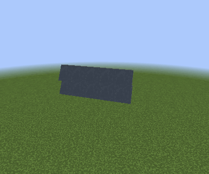 |
| Slide over wall |  |
| Slide into wall |  |

All three shape modes also work on staggered surfaces:

| Shape | Rotating | Slide over wall | Slide into wall |
| --- | --- | --- | --- |
| Full width / tall | 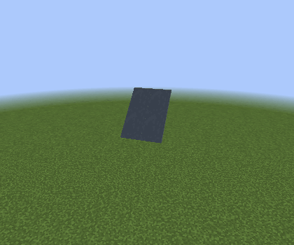 |  | 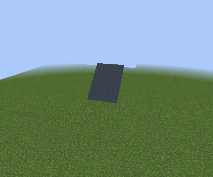 |
| Half width / tall | 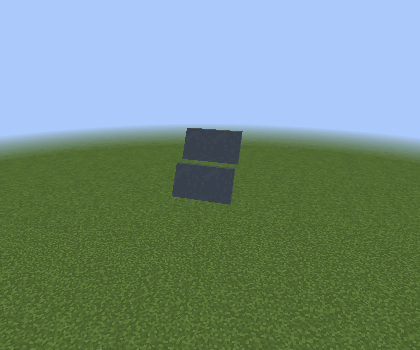 | 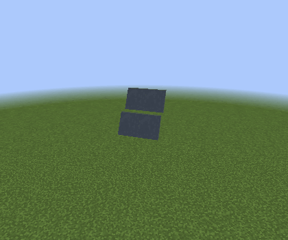 | 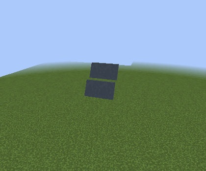 |
| Full width / shallow | 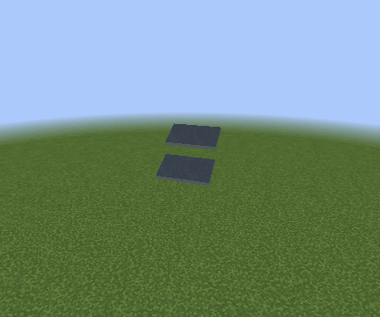 | 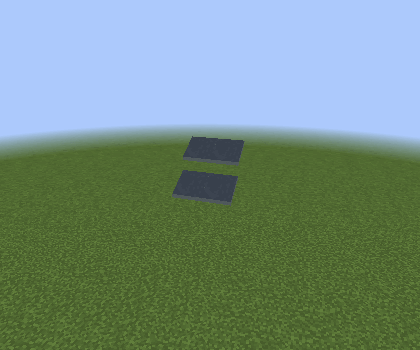 | 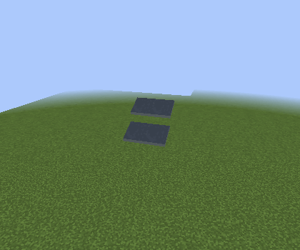 |

Partial patches open together in each movement. Horizontal and staggered examples use the same three-leaf corner:

| Patch | Rotating | Slide over wall | Slide into wall |
| --- | --- | --- | --- |
| Half-width horizontal |  | 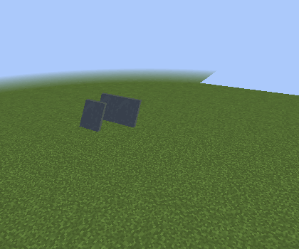 |  |
| Half-width staggered |  |  | 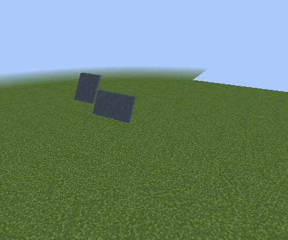 |
| Shallow horizontal | 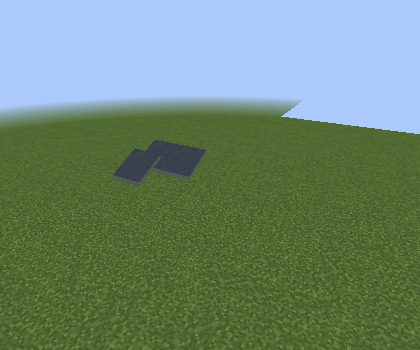 |  | 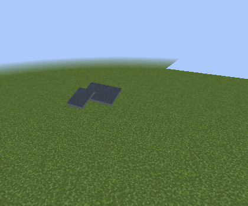 |
| Shallow staggered |  |  | 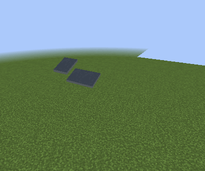 |

| Joined orientation | Rotating | Slide over wall |
| --- | --- | --- |
| 2×2 V assembly | 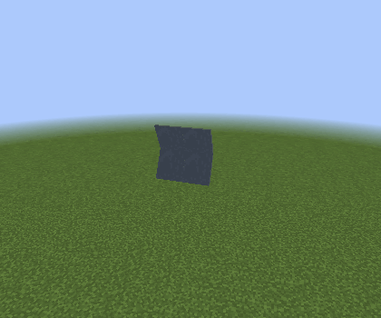 | 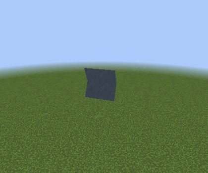 |
| Opposite slopes | 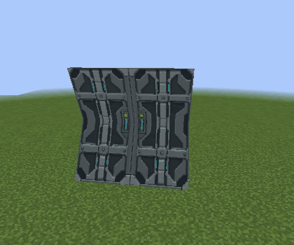 | 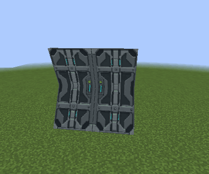 |
| Reversed coplanar rows |  | 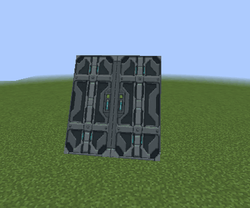 |

## Texture layout

**Texture: Tile / mirror** uses one-block-wide, two-block-high door art on tall surfaces and two-block-long door art on shallow surfaces. Alternating columns mirror left/right, so a 2×2 surface shows two doors rather than one image stretched across both columns. This works with built-in door artwork and Custom vanilla/mod `BlockDoor` items, retaining separate upper/lower sprites. **Texture: Fit** stretches one complete image over the connected group. Ordinary block art tiles once per cell. The four thin edges always use the standard programmable door’s metal side artwork. Layout is saved in worlds, configured items and Duplifier settings.

## Crafting and validation

Combine a Programmable Trapdoor with an Industrial Alloy Ingot, in any crafting
grid, to make one Programmable Diagonal Trapdoor. Drops and pick-block retain
settings; opening-side and group links stay in the world.

Non-rendering checks cover wall placement alignment, one-pixel insets, rigid
motion, mesh normals/UVs/lightmaps, all square placement orders, persistence,
redstone, copying and recipe matching. Live Forge checks cover repeated combined
width edits, material preservation, upper/lower door sprites, thin-edge artwork
and sliding clearance; see the [illustrated examples](task-improvements.md).
These regression captures use software rendering. Hardware gameplay and
Complementary Unbound 5.6.1 shader appearance still need verification.
