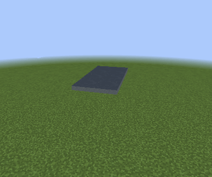
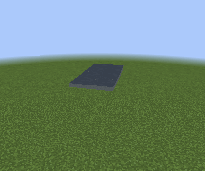
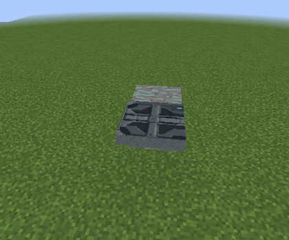
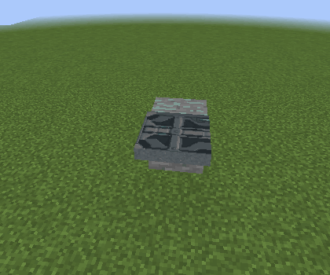
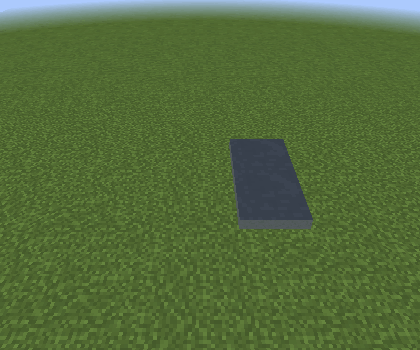

# Programmable Trapdoor

Programmable Trapdoors use the shared categorized material catalog, including door artwork and Custom block/door textures. New trapdoors default to **Armored Hatch** in the Trapdoors category.
Right-click to open or close. Shift-right-click in creative mode, or right-click
with the Configurizer in either game mode, to choose the finish, movement,
height, redstone trigger, and channel.

**Rotating** swings the leaf 90 degrees around its facing edge. **Sliding**
moves it 15 pixels sideways, leaving one pixel visible in its own block. Side placement hinges toward the clicked supporting block; floor and ceiling placement uses your horizontal facing. This legacy Sliding choice stays horizontal. Open rotating leaves align with vanilla trapdoors at the mounting edge, with only a tiny perimeter inset to avoid coplanar neighboring faces. Click the lower, middle, or upper third of a wall face to place a plain trapdoor at Bottom, Middle, or Top; floor and ceiling clicks choose Bottom and Top. Configured items retain their saved position. The model has no frame or hinge hardware.

The leaf is 3px thick. **Bottom** spans approximately 0–3px above the block’s base,
**Middle** spans 6.5–9.5px, and **Top** spans approximately 13–16px. Floor and ceiling mounts use only a 1/1024-block inset (1/64 of a texture pixel) to prevent coplanar faces, so closed leaves sit flush visually. Rotating panels move inward during opening to retain clearance from their support; sliding leaves keep their selected height.

## Movement, next-block placement and texture layout

The **Movement** button cycles **Rotating**, **Sliding**, **Slide over surface**, **Rotate into next block**, and **Slide into next block**, followed by **Slide Left**, **Slide Right**, **Split Horizontal**, **Split Vertical** and **Split X**. The next-block movements place the closed leaf across the neighboring cell in its facing direction, with the trapdoor tile remaining in its own mounting cell.

**Slide over surface** first raises the horizontal leaf clear of the neighboring surface, then slides it sideways. Ordinary Sliding travels sideways at its selected height.

**Slide Left / Right** moves the entire leaf across the opening’s width. **Split Horizontal** separates its two width halves; **Split Vertical** separates its two length halves. **Split X** cuts four triangular panels and retracts them toward the four edges. These directions follow the leaf’s plane: a flat trapdoor’s vertical split moves along the floor or ceiling rather than lifting upward. Leave room around the opening for the moving panels.

Coplanar pairs and rectangular groups use the whole group’s width, length and center, so they open as one opening. The new modes move directly in that plane; use **Slide over surface** when the leaf must lift clear of a neighboring solid surface. Existing saved movement and rotating behavior are preserved. New choices apply to the loaded group and survive saves, configured items and **Door / Trapdoor Movement** copying.

| Movement | Opening and closing |
| --- | --- |
| Rotating, joined 2×4 |  |
| Sliding, joined 2×4 |  |
| Slide over surface, joined 2×4 |  |
| Rotate into next block |  |
| Slide into next block |  |
| Opposing next-block mounts |  |

A single Rotate into next block leaf projects one pixel past the covered cell’s far edge. A Slide into next block leaf instead overlaps its owning mounting cell by one pixel, leaving the overlap at the mounting end. Selection and collision include the corresponding overlap. When matching-height Next block mounts face each other across a two-block opening, both omit this protrusion and meet at the seam without overlap or a visible mount gap. The mounts remain independently controlled. Configured Next block items start open when placed, showing their owning mounting cell; ordinary use and subsequent redstone changes still control them.

**Hinge: north/east/south/west** sets the local facing on individual trapdoors. For next-block movements it selects the covered neighboring cell; for Sliding it selects the travel direction. Rotating folds the leaf upright into the mounting cell, flush to its edge next to the covered block with only a 1/1024-block clearance; Sliding brings it back horizontally.

These offset mounts remain individual rather than joining a rectangle. Joined trapdoors offer Rotating, Sliding, Slide over surface and the five new whole-opening/split modes. Legacy rotating groups keep their hinges at their outer edges; configuration packets and Duplifier copies cannot turn them into offset mounts. Selection and collision follow an offset leaf into the neighboring cell for all four hinge directions, with interaction still routed to its owning tile. There is no separate Closed leaf control. Existing saved next-block settings map to the corresponding Movement choice. See [landing gear covers](../landing-gear-covers.md) for a gear shaft example.

If an older version split an assembly after selecting Next block, select each shifted leaf and choose **Rotating** or **Sliding**. Once all members are restored at the same height, replace one member to rebuild the joined footprint.

**Texture: Tile / mirror** repeats block artwork at one-block scale. Door artwork is recognized automatically, including Custom vanilla/mod `BlockDoor` items: one block wide and two blocks long, with alternating columns mirrored left/right. A 2×2 hatch therefore shows two opposite-handed doors. A single-row door hatch uses its lower half. **Texture: Fit** stretches one image across the complete group. The standard programmable door’s metal side artwork covers the four thin edges in either layout. Texture layout and next-block hinge direction survive saves, configured items and Duplifier copying.

## Connected groups

Place two trapdoors side by side at the same height to pair them automatically.
They face opposite directions and open together in all in-block movement modes.
The new member adopts the existing member's movement and redstone settings.
Each leaf retains its selected finish until you change the group's settings.

A complete horizontal 2×2 square at the same height becomes one four-leaf
group, regardless of placement order. The legacy movement choices open the two rows or columns toward
opposite sides; the new modes follow the selected whole-opening or split direction. Right-clicking any leaf toggles all four, and redstone at any
member controls the whole group. Complete rectangular areas through 8×8 also form a group, including 2×4 and 5×2. The two halves slide clear or rotate around their outer edges as joined panels. Incomplete areas keep their existing smaller groups; completing the rectangle joins them.
Breaking a leaf removes the square link; surviving smaller groups remain usable.

Configuration and Duplifier applications update the loaded group together.
Group membership and individual finishes persist when the world is saved.
Unloaded chunks are never forced to load.

## Redstone

**Disabled** gives manual operation. **Redstone ON** opens when powered and
closes when power goes away; **Redstone OFF** reverses that behavior. Ordinary
right-click still toggles the group between power changes.

Channel 0 uses local redstone. A positive channel also listens to configured
senders in the same dimension. Any powered member opens the group in Redstone ON
mode. Pick-block and drops retain texture, height, movement, trigger and channel,
without retaining world coordinates or group links.

## Crafting

Use five Industrial Alloy Ingots (`I`) and one Programmable Matter Ingot (`M`)
to craft two trapdoors:

```text
III
IMI
```

## Validation

Non-rendering checks cover all finishes, heights and motion directions,
opposite-facing pairs, all 24 square placement orders, persistence, group repair,
redstone, copying, recipe matching and submitted mesh data. Live Forge checks cover
combined dialog edits, saved/copied layout and hinge settings, door-art tiling,
edge textures and clearance scenes; see the [illustrated examples](task-improvements.md).
New panel-mode checks exercise 240 flat/diagonal shape, height and facing combinations, sealed render volumes, UV bounds, open clearance, moved-leaf selection/collision, packet settings and copying. Live checks capture all five modes on single leaves, pairs, squares and the three diagonal shapes, and exercise the flat and diagonal group selectors through their server updates.

These regression captures use software rendering. Hardware gameplay and
Complementary Unbound 5.6.1 shader appearance still need verification.
