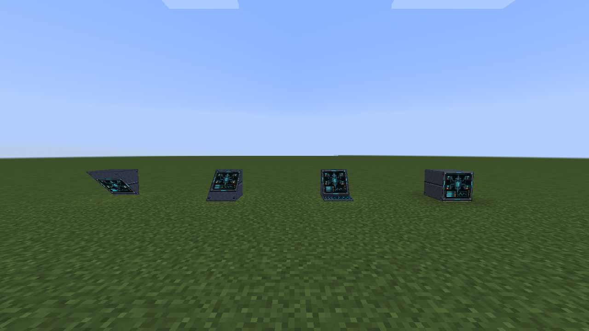
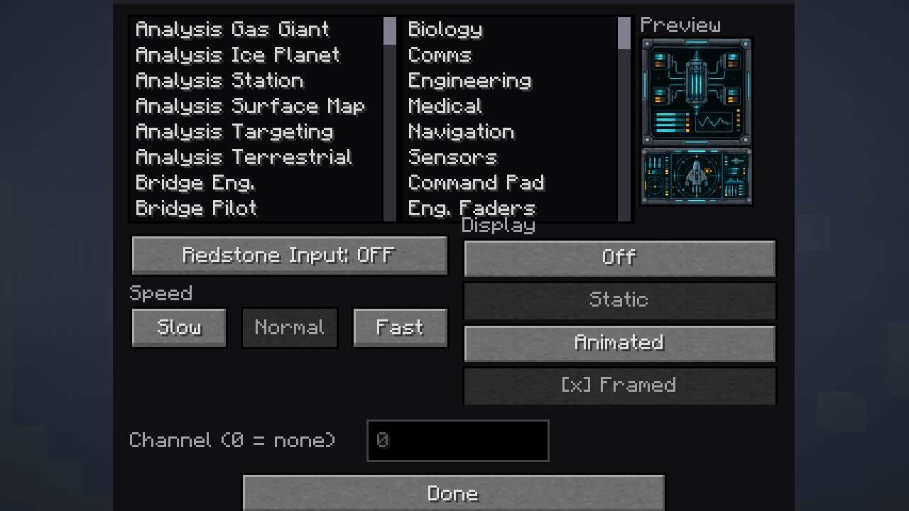
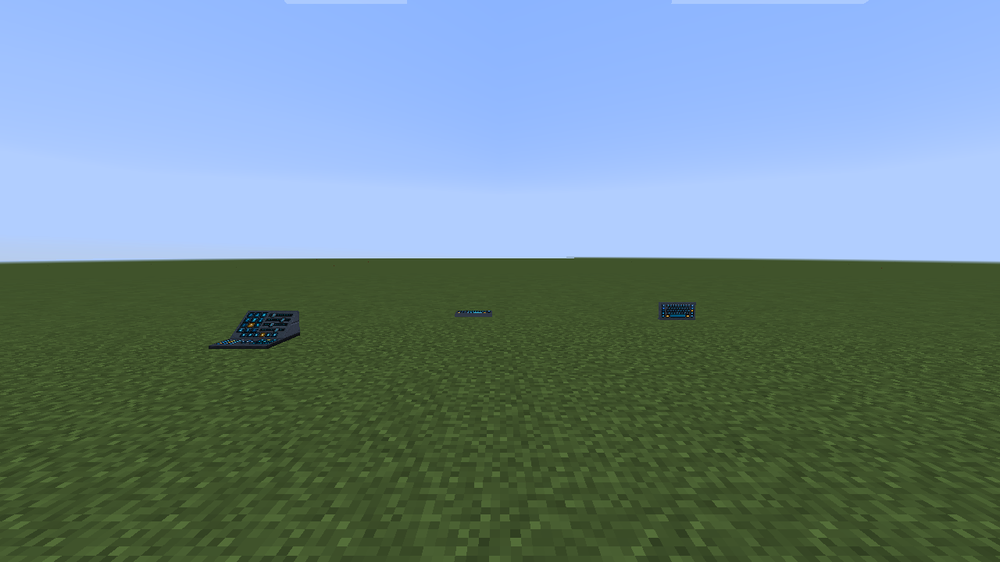
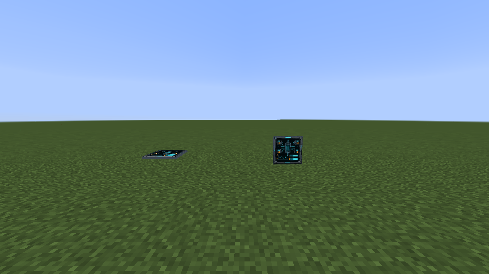
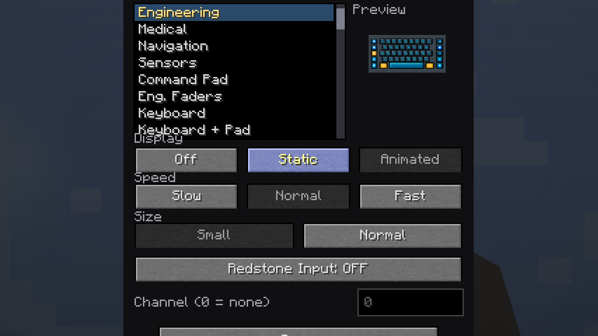
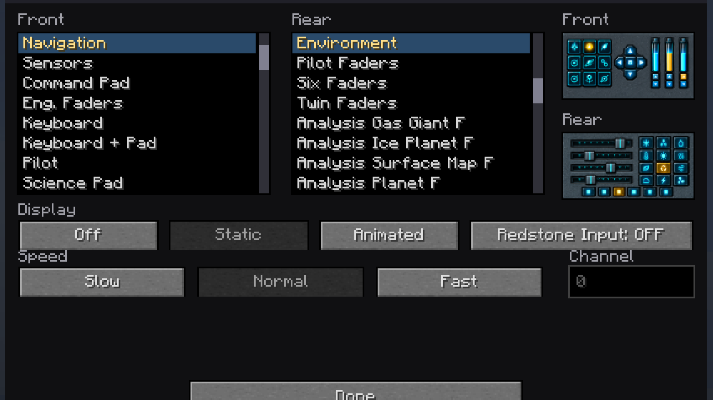
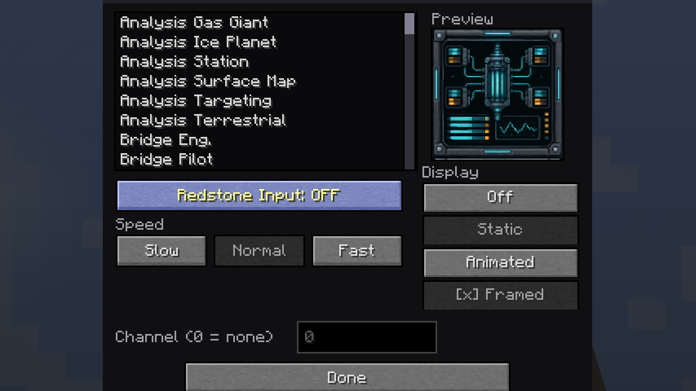

# Programmable displays and consoles

All programmable blocks share selectable screen content, Off/Static/Animated
modes, animation speed, redstone behavior, and persistent configuration. The
images below use the Engineering display so the examples focus on block shape
and function rather than the alignment of multi-block ship artwork.

## Programmable Viewscreen

The full-face selector can show any registered screen, including animated and
multi-block artwork.

The grounded catalog shows the full-face viewscreen, inclined console, and both
diagonal-screen placements.

## Programmable Console

The console combines an inclined configurable display with a separately
selectable keyboard or control surface. Its GUI provides scrollable screen and
input-panel lists.

## Programmable Diagonal Screen

This stair-shaped display supports both rising and descending placement while
keeping the screen on the sloped face.

Both placements are included in the display catalog above.

## Programmable Input family

The wall, attached-keyboard, half-console, and full-input forms select their
front and rear control art independently. Wall position and compact/full sizing
are configurable where applicable.

Configuration interfaces:

| Programmable Input | Half Console | Full Input |
| --- | --- | --- |
|  |  |  |
