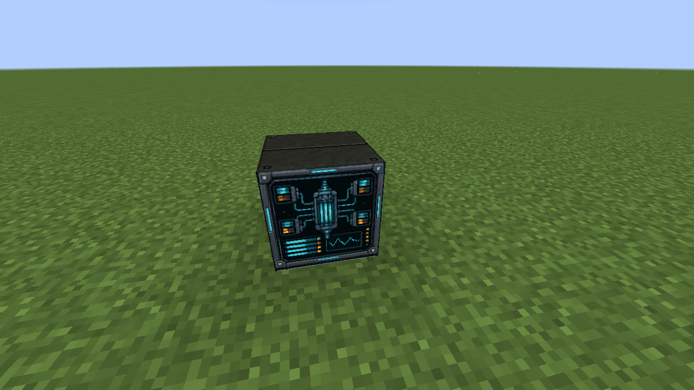
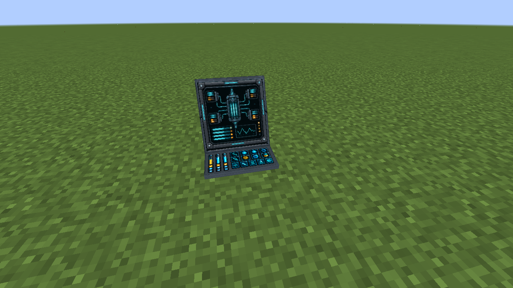
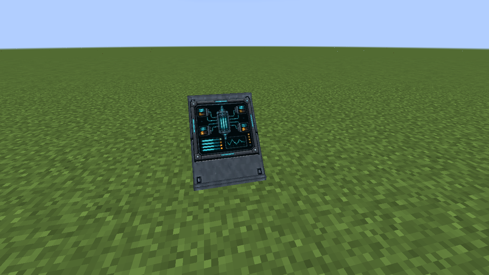
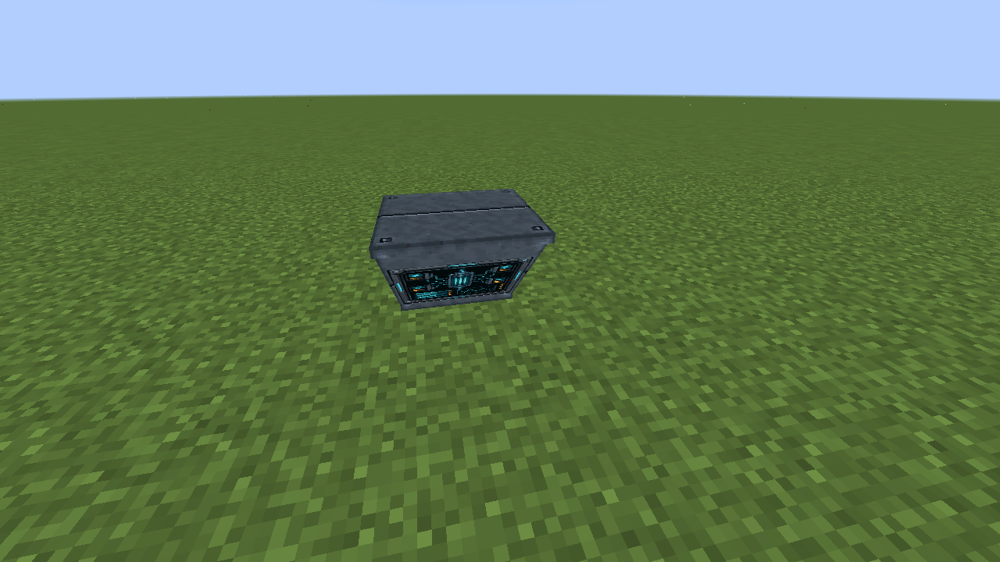
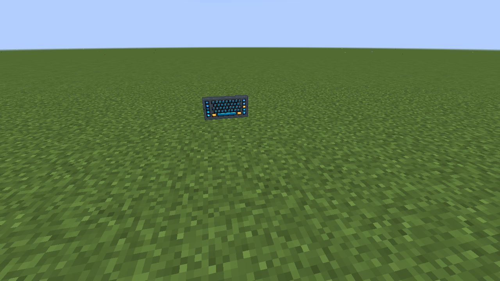
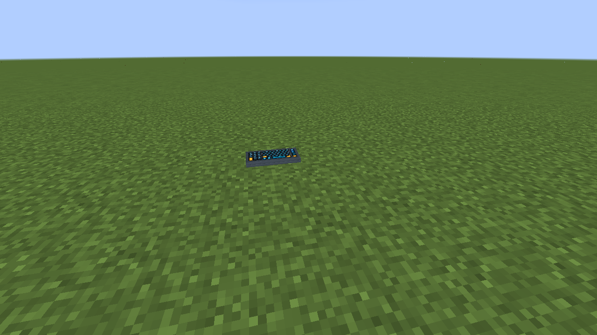
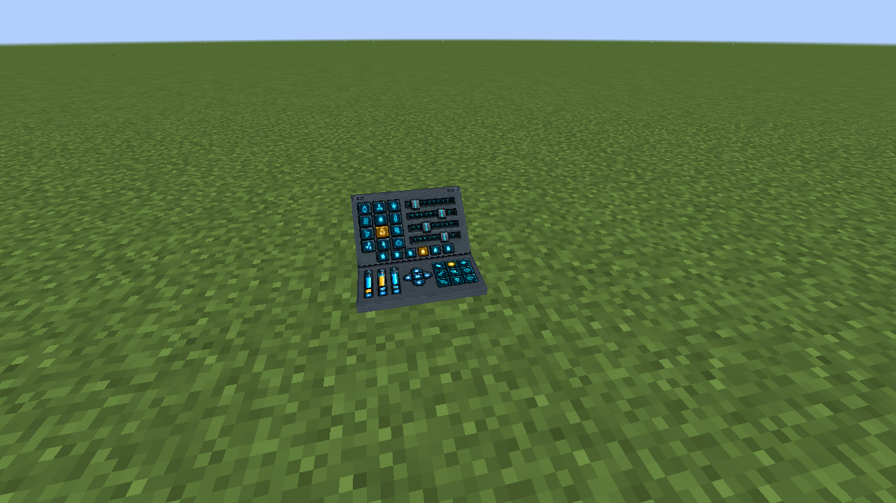
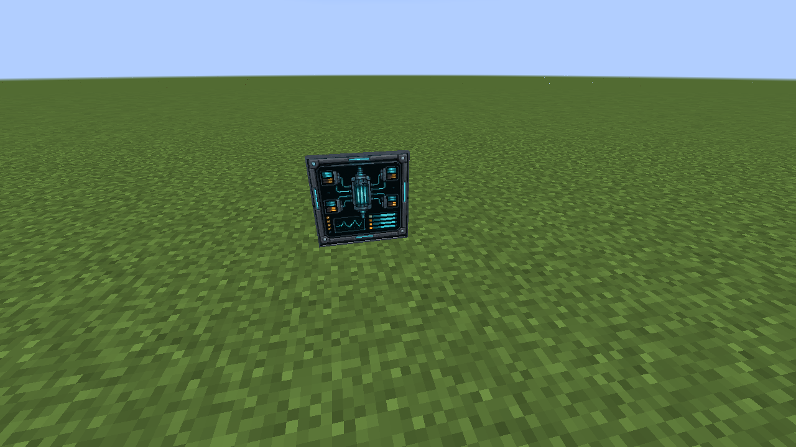
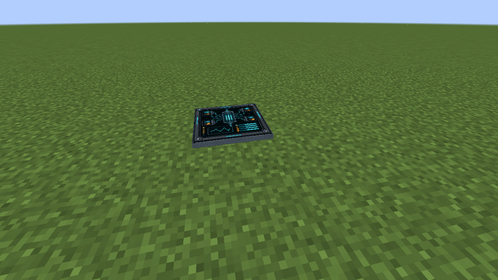
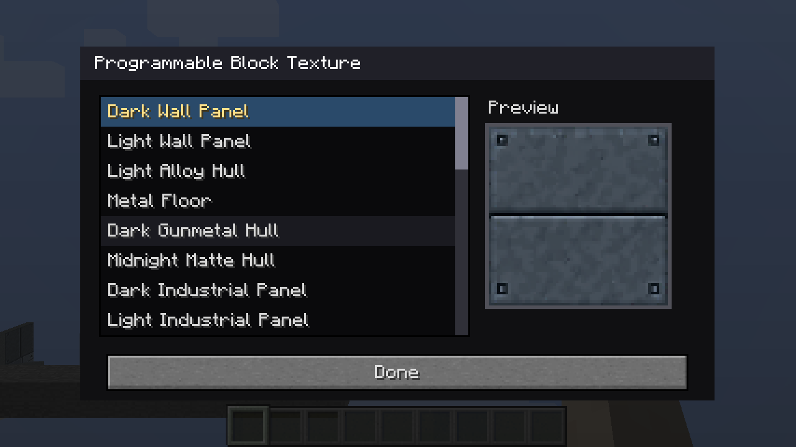

# Programmable displays and consoles

Programmable displays let you choose the visible artwork and how it behaves. Their settings persist with the block. Screen-capable blocks can choose **Off**, **Static**, or **Animated** display, animation speed, and redstone behavior. Many also offer a separate wall or side texture so the housing can match nearby construction.

In Creative mode, shift-right-click a block to open its configuration. Lists scroll to show all available choices; a valid change applies immediately. The [Configurizer](../CONFIGURIZER.md) provides another way to open settings, and the [Duplifier](../DUPLIFIER.md) can copy compatible settings to another block.

## Viewscreen and inclined console

| Programmable Viewscreen | Programmable Console |
| --- | --- |
|  |  |

The Viewscreen shows the selected screen across its forward face. It can use registered still, animated, or multi-block artwork. The Console presents a sloped screen and a separately selected keyboard or control surface.

## Diagonal screen

The stair-shaped screen can rise or descend from the mounting surface while keeping the selected artwork on its sloped face.

| Rising | Descending |
| --- | --- |
|  |  |

## Input and console family

| Form | Close-up | What it does |
| --- | --- | --- |
| Wall Input |  | A compact wall-mounted control panel. |
| Attached Keyboard |  | A projecting keyboard panel. |
| Half Console |  | A small console surface. |
| Full Input, wall |  | A larger upright input face. |
| Full Input, floor |  | The full input in its floor position. |

Front and rear control art can be chosen independently where the block supports both sides. Wall position and compact/full sizing depend on the form.

| Input | Half Console | Full Input |
| --- | --- | --- |
|  |  |  |

## Wall and side finishes

The wall texture menu changes the material around a screen; it does not replace its primary screen artwork. Programmable Block and Wall use a finish as their main visible texture, while screen forms can choose it separately from the displayed image. The current dialogs include the side or housing finish where that block supports it.

See [building finishes](building.md) for examples of hull, padding, and pipe textures.
