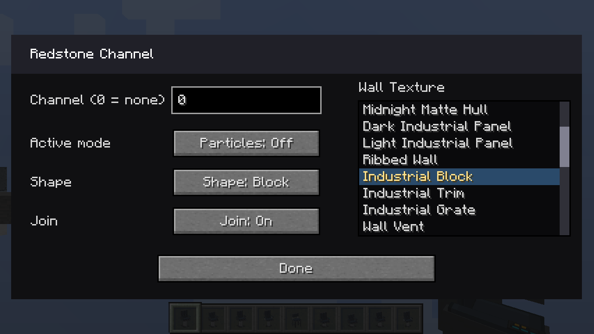
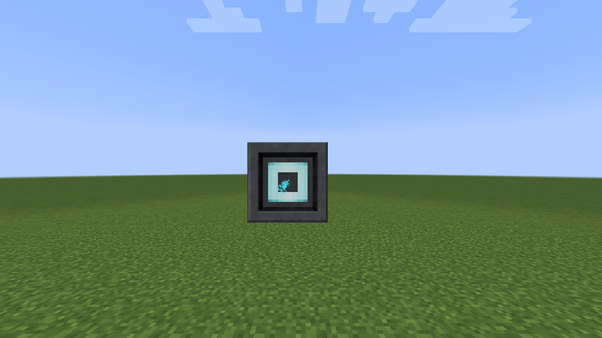

# Propulsion and hover systems

The four programmable thruster families each offer **Block**, **Hexagon**, and **Wedge** shapes. Choose the shape in the Creative-mode shift-right-click dialog. Placement still sets the facing and, for wedges, the clicked corner. Change **Shape** first; the **Join** option updates immediately to show the choices available for that shape.

| Family | Shape examples and behavior |
| --- | --- |
| [Rocket Thruster](rocket-thruster.md) | Block, hexagon, and wedge close-ups. |
| [Ion Drive](ion-drive.md) | Block, hexagon, and wedge close-ups. |
| [Plasma Vent](plasma-vent.md) | Block, hexagon, and wedge close-ups. |
| [Impulse Engine](impulse-engine.md) | Block, hexagon, and wedge close-ups. |

Each family supports **Off**, **On**, and **On + Particle Stream**. The stream uses that family's particle appearance, and the emitter face becomes brighter. Normal right-click changes the manual state. The settings dialog controls redstone activation, channel, whether redstone selects the stream, and Join. Join merges eligible neighboring members of the same family into a continuous visible face. Block-shaped thrusters support isolated, coplanar square assemblies from 2×2 to 8×8; partial, rectangular, or oversized groups remain separate.

The Antigravity, Repulsor, and Vertical Hover blocks have their own configurable Join behavior. They also emit light, use manual or redstone activation, and can select a particle stream.
