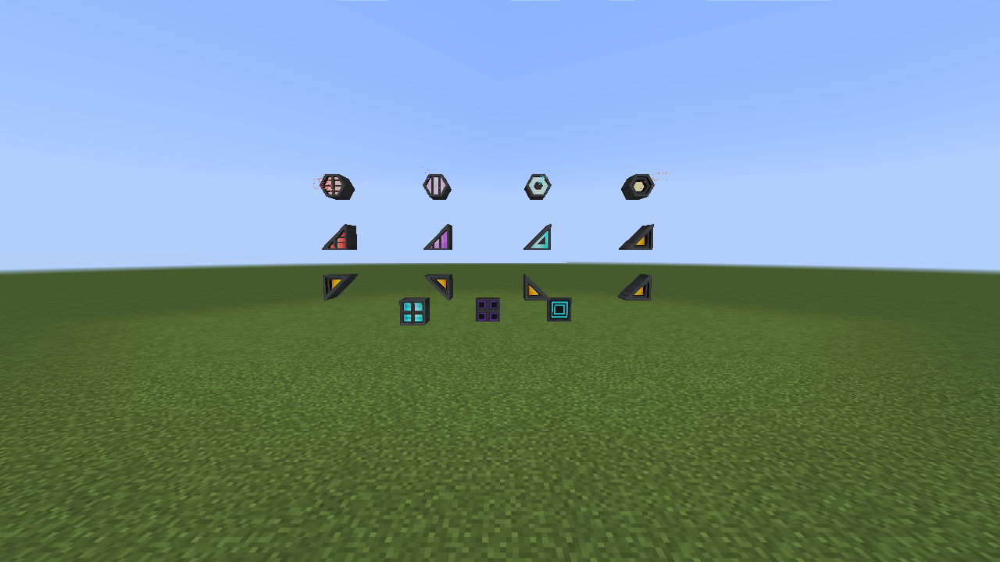

# Propulsion and hover systems

Every thruster emits light and supports three modes: Off, On, and On + Particle
Stream. The stream mode uses a brighter emitter face and family-specific
particles, density, color, and speed. Sneak-right-click opens the redstone
channel settings, including whether channel activation should enable particles.

## Shape catalog

Rocket, Ion, Plasma, and Impulse engines are each available as square,
true-hexagonal, and click-positioned triangular blocks. The catalog also
includes antigravity, repulsor, and vertical-hover fixtures.

Triangular engines select their corner from the exact quadrant clicked and can
be placed on walls, floors, or ceilings. Hexagonal and triangular engines share
the same modes, light output, controls, and particle-mode brightness boost as
their square counterparts.

## Connected square thrusters

Isolated coplanar squares from 2x2 through 8x8 merge into one continuous
thruster face. Right-clicking any member changes the complete assembly, and its
particle stream is concentrated at the assembly center with density scaled to
its area.

Incomplete rectangles, mixed engine families, and assemblies larger than 8x8
remain individual blocks so their appearance and interaction stay predictable.
