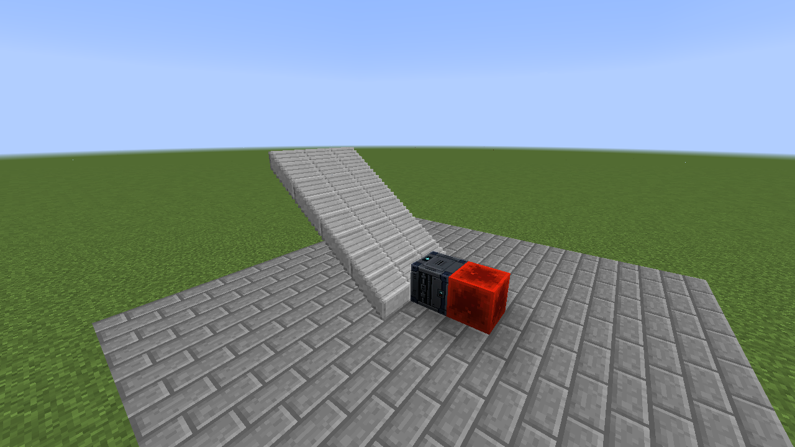
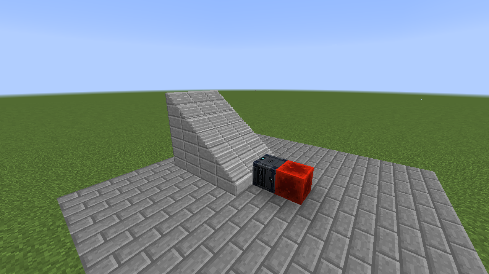
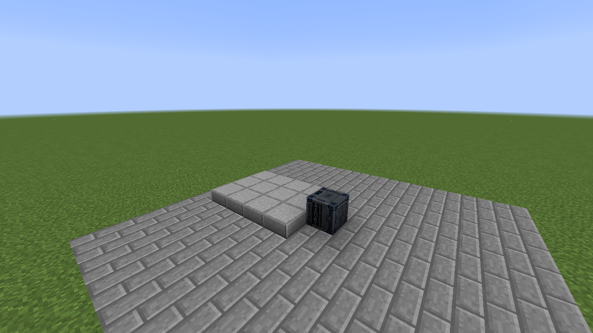
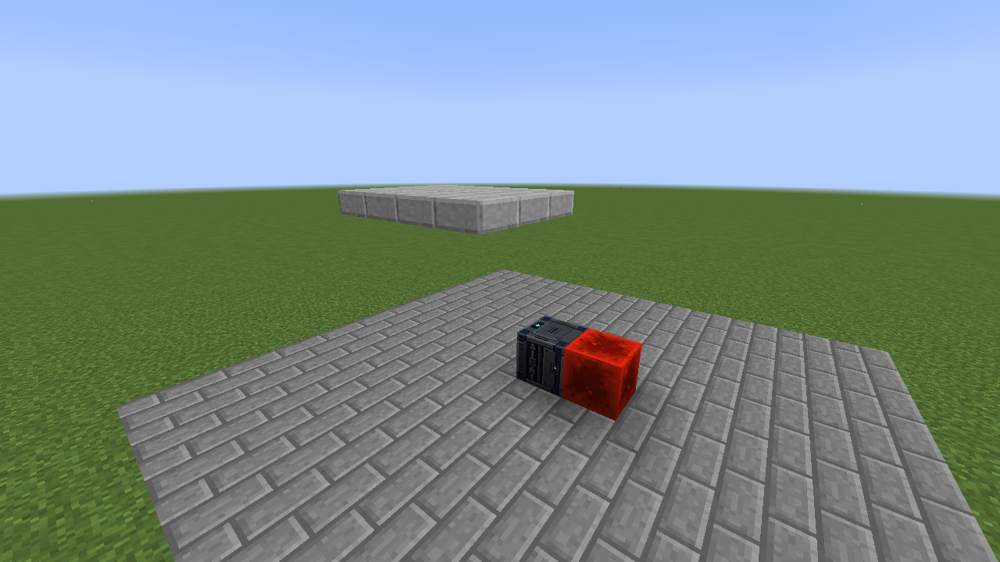
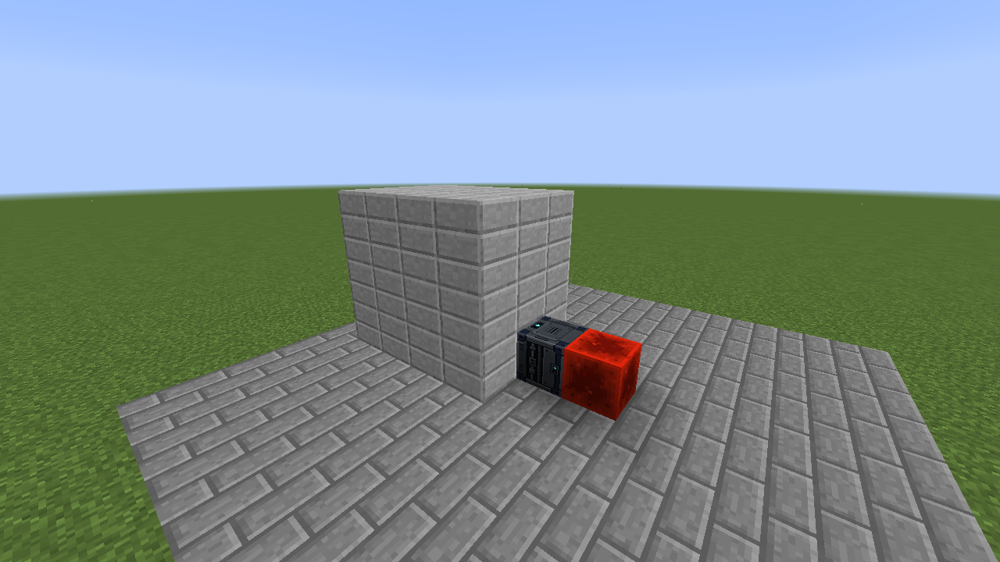

# Programmable Ramp

The Programmable Ramp controls a platform of matching slabs or solid blocks. It can form a slope, fill the space beneath that slope, lift the whole platform, or extend it into a solid run. The images show each mode in its off and on positions.

| Mode | Off | On |
| --- | --- | --- |
| Ramp |  |  |
| Filled ramp |  |  |
| Lift |  |  |
| Extend |  |  |

**Ramp** moves successive treads by different amounts. **Filled ramp** follows the same slope and fills from each tread's starting point. **Lift** moves the whole platform together. **Extend** moves the leading surface and fills the space behind it. Ramp and lift carry standing entities; filled ramp and extend are intended as changing structure.

## Craft and place

Place a piston in the center of a crafting grid and surround it with eight Programmable Matter Ingots. Place the controller beside a flat platform and point its top arrow toward the first slab or block. It selects face-connected blocks of the same type and complete block state on that level. Diagonal contact does not count; gaps remain gaps. Different slab halves and material variants stay separate.

The platform can be up to **8 blocks wide and 16 blocks long**. Its length follows the Ramp direction setting, independent of the controller arrow. The controller protects moving cells and restores the source blocks when it retracts or is removed.

## Configure motion

Right-click the controller to open its settings. Valid changes apply immediately.

1. Choose **Ramp**, **Filled Ramp**, **Lift**, or **Extend**.
2. Choose **Up/Down** or **Left/Right** travel. Left and right are relative to the selected ramp direction.
3. Set **Start / off offset** and **End / on offset** from `-8` to `+8` blocks. Positive vertical offsets rise; negative ones descend. Positive horizontal offsets move right. Opposite endpoints can create a 16-block stroke.
4. Choose whether redstone **On** or **Off** deploys the platform. Physical power and virtual redstone channels are supported.
5. Choose **Fast**, **Medium**, or **Slow**. Ramp and Filled Ramp offer **1, 2, 4, 8, or 16 pixel** treads. Lift and Extend have no treads.

The off endpoint can be displaced too: Start `2`, End `-3` moves from two blocks above the original platform to three below it. Equal endpoints are valid. An edit first resets the previous platform, then evaluates the current signal with the new settings.

## Direction and tread size

Ramp direction can be north, east, south, or west. Small treads make a smoother slope; large treads form visible steps.

| Direction | Smooth, 2 px | Stairs, 8 px |
| --- | --- | --- |
| Up |  |  |
| Down |  |  |

## Troubleshooting

The source and travel space must be clear, loaded, and within world height. Chests, machines, unbreakable blocks, and non-cuboid shapes cannot be selected. An obstruction stops motion without replacing the obstructing block. Remove it, then change a setting or toggle the signal to retry. The dialog retains validation errors. Breaking the controller restores its saved source blocks.

For exact selection, timing, rider, and persistence rules, see the [Programmable Ramp reference](../landing-ramps.md).
