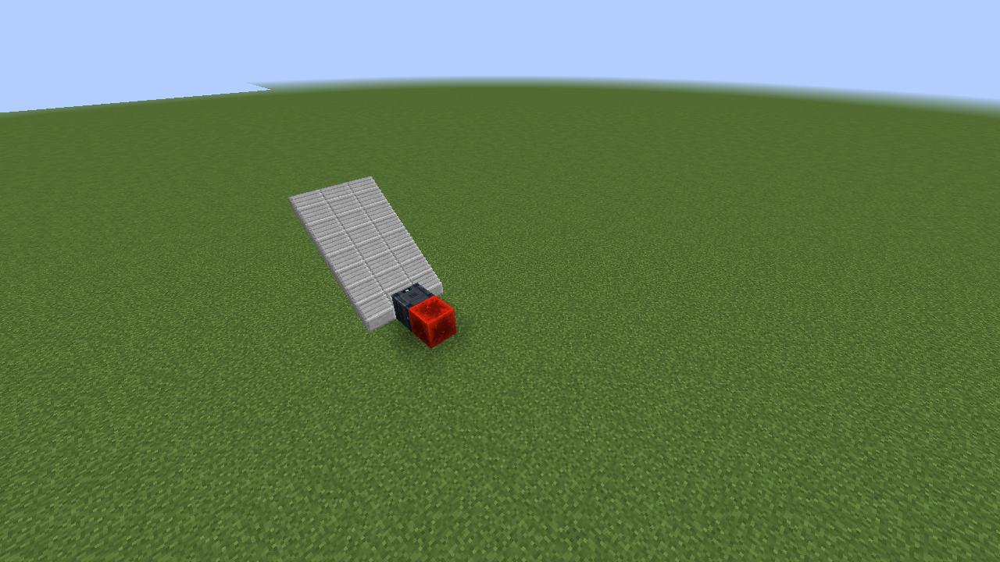
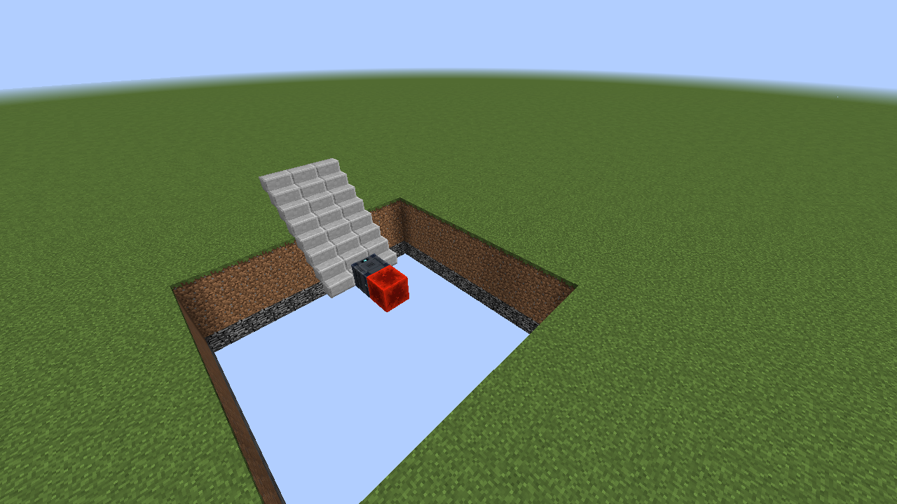
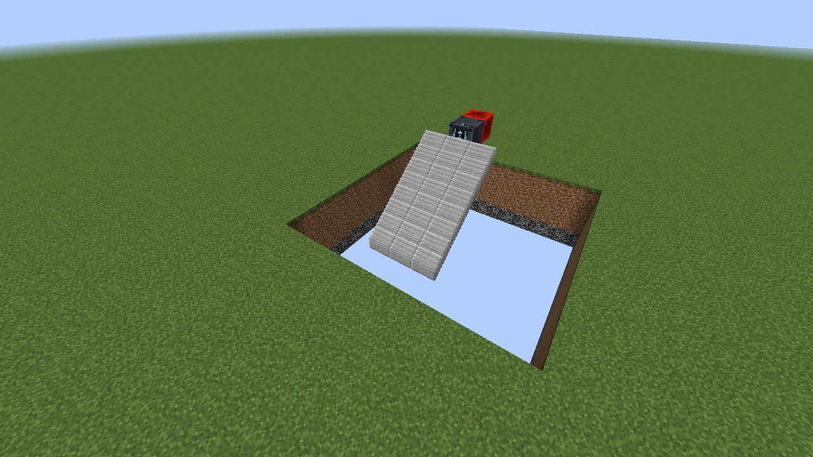
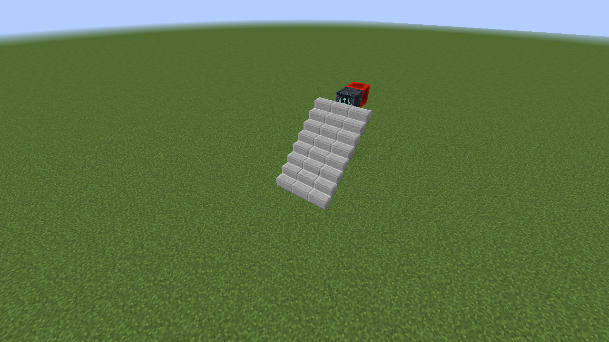
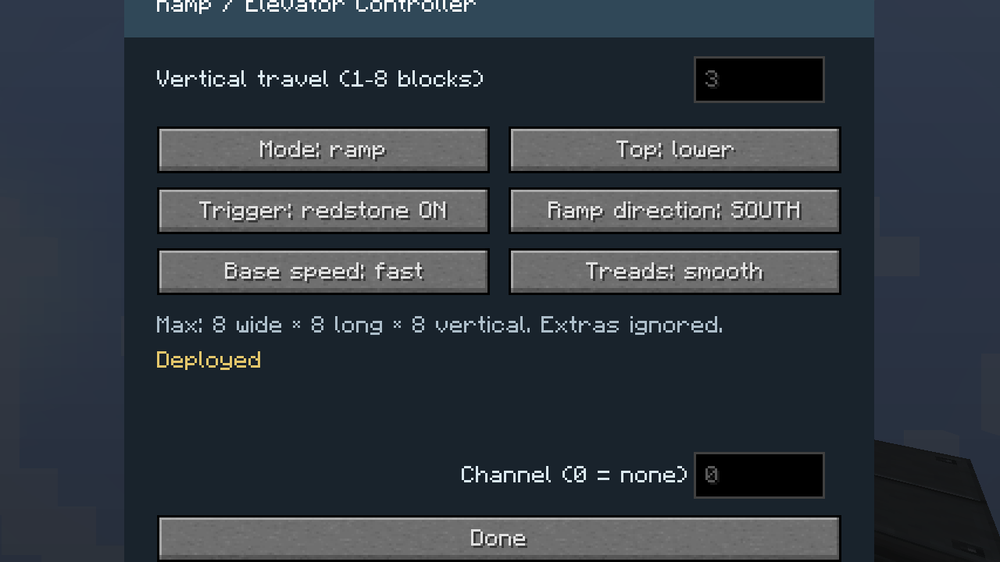

# Programmable Ramp

Craft one Programmable Ramp with a piston surrounded by eight Programmable
Matter Ingots in a 3×3 crafting grid. The protected moving platform cells have
no separate recipe.

The controller discovers an adjacent rectangular platform made from matching
slabs or ordinary full blocks. It replaces that platform with protected moving
cells while deployed, animates it as a ramp, filled ramp, lift, or extension, and restores the exact
source blocks when retracted.

## Ramp direction and tread style

Ramp mode can move a lower platform upward or lower an upper platform downward.
The smooth setting divides the travel into eight shallow tread segments;
stairs uses two larger segments. These four screenshots are live deployments
created through the real controller transaction rather than hand-built props.

| Direction | Smooth | Stairs |
| --- | --- | --- |
| Up from a lower platform |  |  |
| Down from an upper platform |  |  |

## Configuration

The interface controls up/down or left/right travel, ramp/filled ramp/lift/extend mode,
signed start and end offsets, physical or virtual redstone activation,
fast/medium/slow movement, ramp direction, and tread size.

Platform width is capped at eight blocks, length at sixteen, and each signed
travel endpoint at eight blocks. Matching
blocks outside the selected connected platform are ignored, and occupied or
obstructed travel space prevents deployment rather than overwriting blocks.
For implementation details and placement rules, see
[Programmable Ramp details](../landing-ramps.md).
