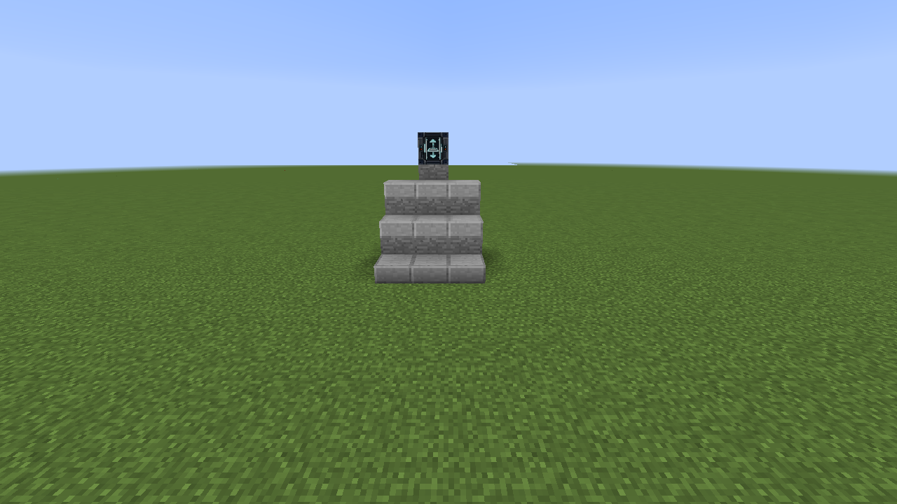

# Controls, lighting, ramps, furniture, and building blocks

## Lighting and controls

The lightbar, light column, porthole, window lamp, and slatted lamp have authored
lit and unlit states. Rocker switches, wall buttons, and throw levers provide
local redstone power; all supported devices can also participate in virtual
redstone channels.

## Ramp and elevator controller

The controller discovers a matching platform, animates it as a ramp or lift,
locks its travel space, and restores the source blocks when retracted. Its GUI
configures travel, direction, speed, redstone polarity, and platform selection.

## Bridge furniture

Command, Companion, Operator, Conference, and Mess Hall chairs are sittable;
right-click mounts the chair and sneaking dismounts it.

## Structure, glass, and materials

Hull panels, wall ribs, vents, pipes, trims, transparent glass, and the full
chair-material palette are available as ordinary buildable blocks.

