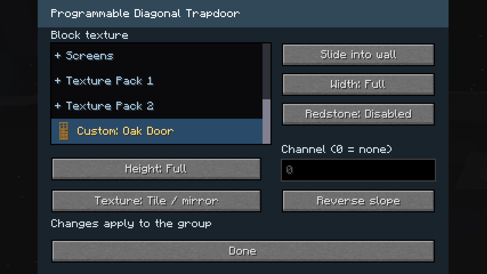
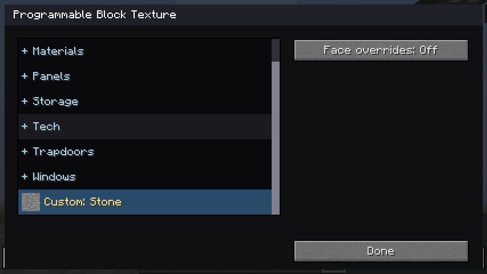
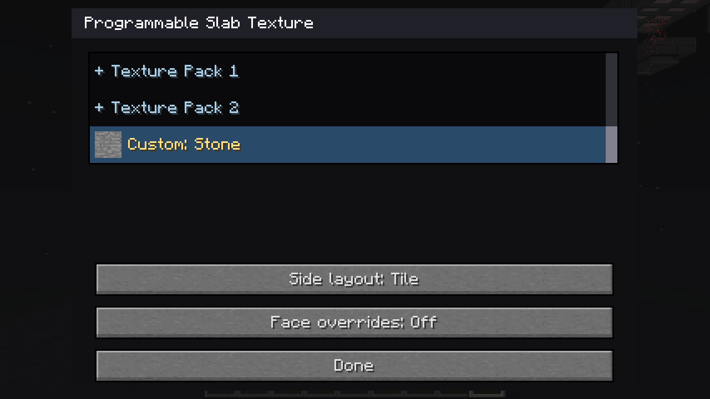
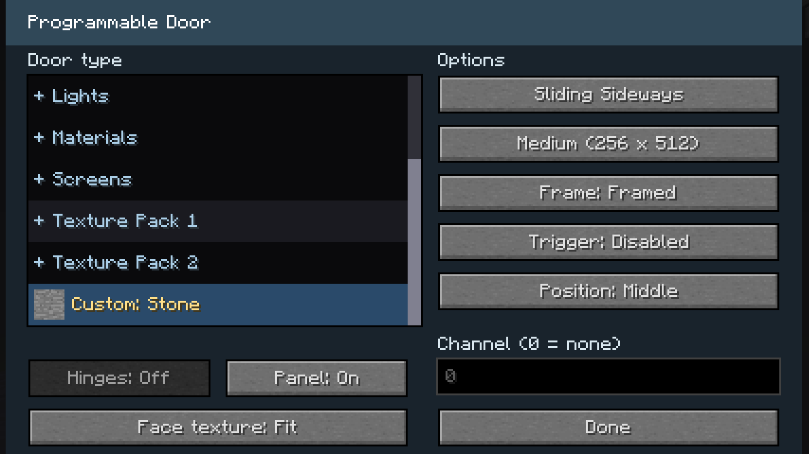
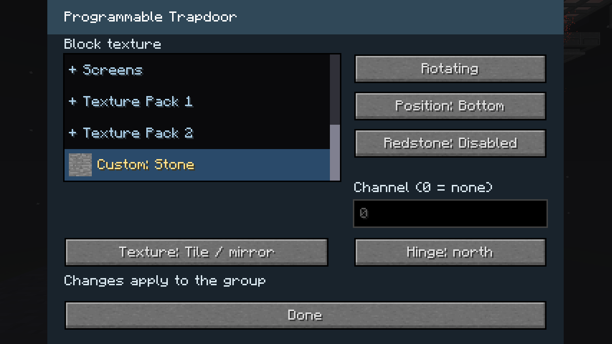
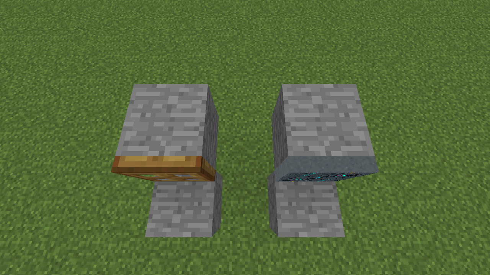
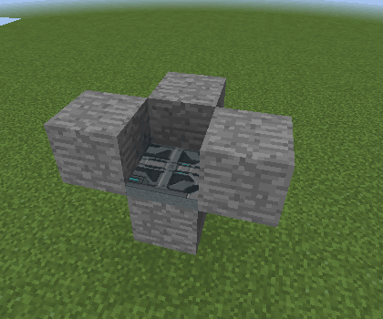
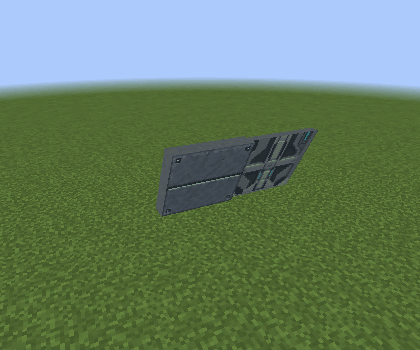

# Programmable block improvements

These captures show the programmable blocks, material pickers and connected trapdoors in the live Forge test world.

## Connected trapdoors

Rotating and sliding groups support rectangles up to eight cells on each axis,
opposite-slope diagonal rows, and staggered diagonal panels in all three shape modes. Their
membership and configuration survive saving and copying. Half-width and half-height diagonal leaves also support connected partial patches, including three-leaf corners.

| Assembly | Opening and closing |
| --- | --- |
| Flat 2×4, rotating |  |
| Diagonal 5×2, sliding |  |
| Opposite slopes, rotating |  |
| Full-width / full-height staggered panels, sliding |  |
| Half-width / full-height staggered panels, sliding |  |
| Full-width / half-height staggered panels, rotating |  |

Opposite-slope rows move toward the convex outside of their bend for both movements. Rotating retains the inset and hinge animation; Sliding clears that outside face before separating sideways. Reversed rows that continue the same plane share an outside face.

| Assembly | Rotating | Slide over wall |
| --- | --- | --- |
| Opposite-slope bend |  |  |
| Reversed coplanar rows |  |  |

See the [normal](programmable-trapdoor.md) and
[diagonal](programmable-diagonal-trapdoor.md) trapdoor guides for placement.

## Landing gear covers

Four independent Next-block mounts close the 2×2 opening from its west and east
edges. Extending the gear rotates the leaves upright into their mounting cells. Sliding remains a separate movement choice. They
stay open until retraction finishes.

| Retracted and covered | Extended and clear |
| --- | --- |
|  |  |

Follow the [gear alignment and cover setup](../landing-gear-covers.md).

## Shared materials

The same categorized picker offers built-in finishes, door artwork, lights,
static screens, filesystem PNGs and a Custom block or door sample. The additional material pack adds 33 finishes across the shared categories. New normal and diagonal trapdoors use Armored Hatch by default. Custom
selection uses the sampled block's texture while keeping the programmable
block's shape.

See [material selection](../unified-materials.md) and
[filesystem texture setup](../filesystem-textures.md). Texture transparency
does not generate geometry or collision holes; that follow-up is documented
in the material guide.

## Door material proportions

Ordinary programmable blocks use the lower square half of a door image.
Door leaves keep the complete image and their native edge textures. A sampled
block image can fit once across the leaf or tile at one-block scale.

| Door image on a block | Block image fitted to a door | Block image tiled on a door |
| --- | --- | --- |
|  |  |  |

The categorized lists use large, aspect-preserving thumbnails, alphabetic categories and entries, and a category heading that stays visible while scrolling. Native screens keep their animation controls. Programmable Light lists show the On artwork and switch to Off automatically with the light state.

## Trapdoor door artwork and controls

Tile / mirror keeps door artwork one block wide and two blocks long/high, with alternating columns mirrored. Fit stretches one image over the connected surface. Custom vanilla and mod `BlockDoor` items retain their upper/lower sprites. Both layouts keep the standard artwork on the four thin edges.

| Surface | Built-in door, Tile / mirror | Custom oak door, Tile / mirror | Built-in door, Fit |
| --- | --- | --- | --- |
| Flat 2×2 |  |  |  |
| Diagonal 2×2 |  |  |  |

The diagonal dialog separates width and height, so Full/Half width updates a tall group together. The normal dialog folds next-block placement into Movement and offers hinge direction for every individual rotating/sliding choice.

| Normal controls | Diagonal controls |
| --- | --- |
|  |  |

## Partial diagonal groups and sliding choices

Half-width tall and full-width half-height trapdoors join connected partial patches. These examples contain three leaves at `(X,Y,Z)`, `(X,Y,Z+1)`, and `(X+1,Y,Z+1)`. Using any member opens all three, including mixed ordinary/staggered neighbors.

| Half-width patch, rotating |
| --- |
|  |

| Half-height patch, rotating |
| --- |
|  |

**Slide over wall** retains the lifted animation. **Slide into wall** moves sideways directly without the lift. Both choices synchronize across the group and survive saves and copying.

| Slide over wall | Slide into wall |
| --- | --- |
|  |  |

## Custom textures when reopening a dialog

The current Custom material is highlighted and automatically scrolled into view on reopening, with its sample artwork shown in the row.

| Programmable Block | Programmable Slab |
| --- | --- |
|  |  |

| Programmable Door | Programmable Trapdoor |
| --- | --- |
|  |  |

## Motion clearance and next-block placement

Rotating normal leaves align with vanilla trapdoors at the mounting edge when open, with only a tiny anti-z-fighting inset. Sliding diagonal leaves lift clear of the continuation wall before moving sideways. Rotate into next block places the untriggered leaf across the neighboring cell with a one-pixel overhang beyond its far edge, then folds it upright into its own mount. Slide into next block instead overlaps the owning mounting cell by one pixel while closed, then retracts horizontally into that cell. Normal and diagonal leaf edges use the standard programmable door’s metal side artwork.

The vanilla oak leaf (left) and default programmable leaf (right) share the same open alignment against their supporting blocks.

| Rotating beside blocks | Sliding over a diagonal wall |
| --- | --- |
|  |  |

| Rotate into next block |
| --- |
|  |

| Slide into next block |
| --- |
|  |

Matching-height next-block covers on opposite sides of a two-block opening omit the standalone one-pixel protrusion. They meet without overlapping and remain independently controlled. Configured next-block items place open, showing which cell owns the leaf. Open rotating covers use only a tiny clearance from the covered block, rather than a one-pixel gap.

| Opposing next-block covers |
| --- |
|  |

## Flush floor and ceiling mounts

Closed Bottom and Top leaves sit flush visually against their support, with only a 1/64-pixel inset to prevent coplanar faces. Rotating leaves retain clearance from their supporting floor or ceiling throughout opening.

| Floor mount | Ceiling mount |
| --- | --- |
|  |  |

## Next-block selection and joined-group protection

Individual Next block mounts can be selected at the leaf's actual position after changing the hinge. Collision follows the shifted leaf in both open and closed states. Clicking the visible leaf operates its owning trapdoor.

| Closed offset leaf and selection outline | Rotating open leaf and selection outline |
| --- | --- |
|  |  |

Joined trapdoors offer Rotating, Sliding and Slide over surface in Movement, with hinges fixed at their outer edges. Server configuration and Duplifier copies preserve the group if they request next-block movement.

For an assembly split by an older version, follow the recovery instructions in the [trapdoor guide](programmable-trapdoor.md).

These are software-rendered Forge regression captures. Hardware shader appearance still needs verification in the target client.
