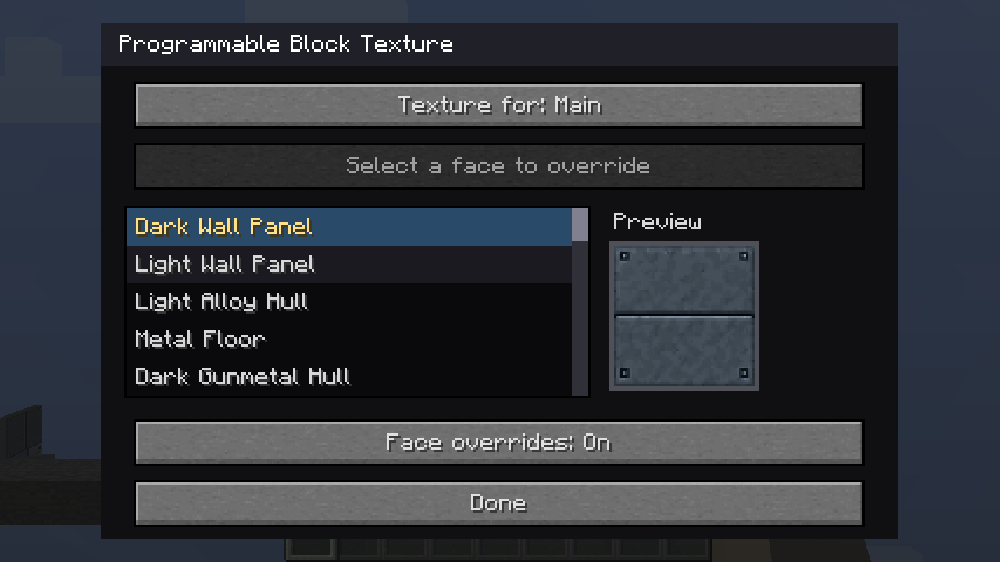
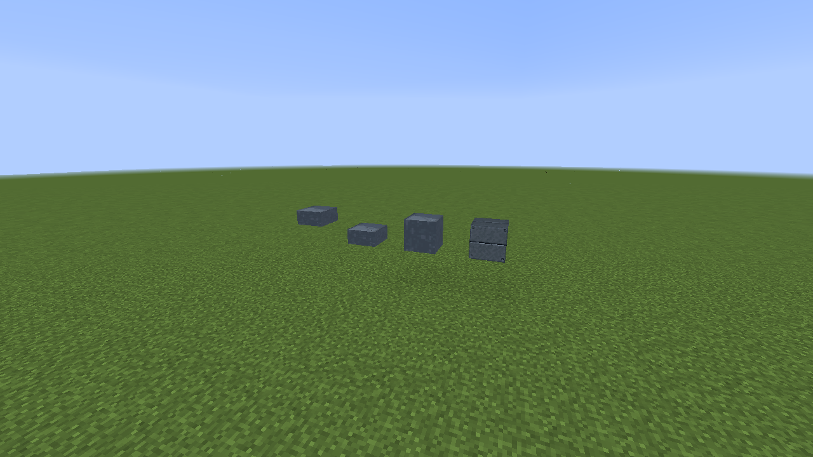
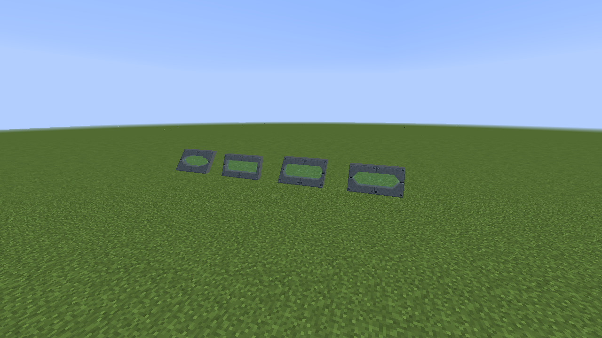
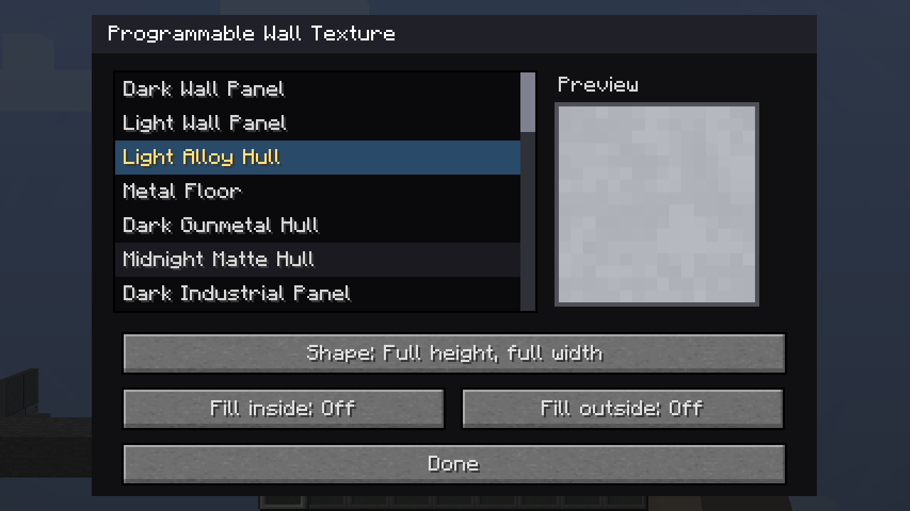
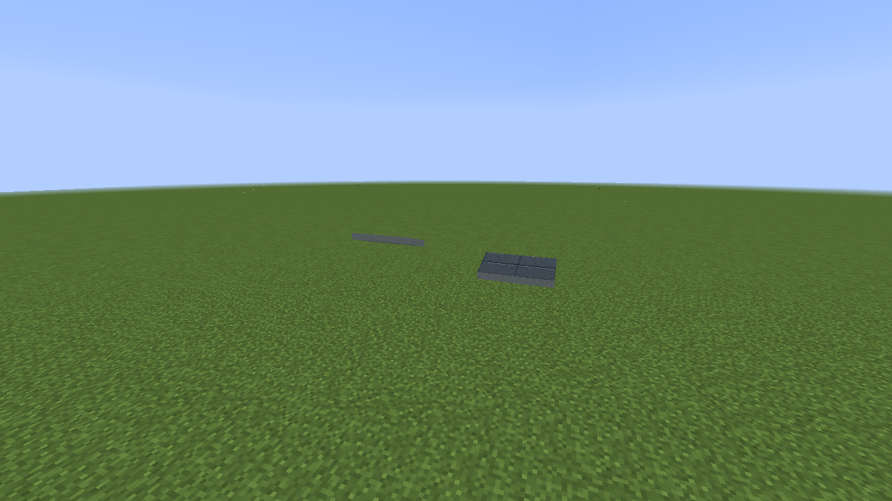
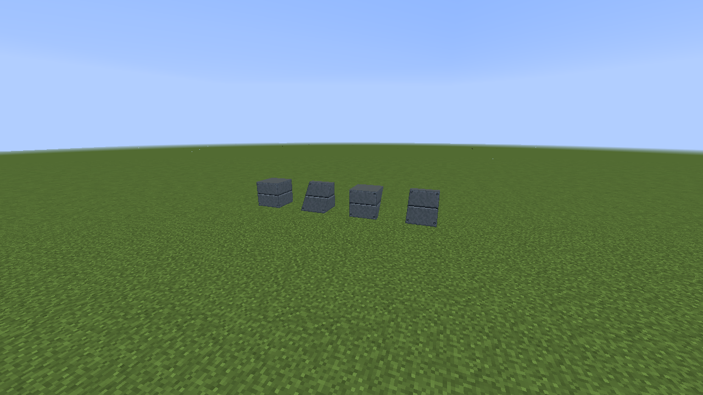
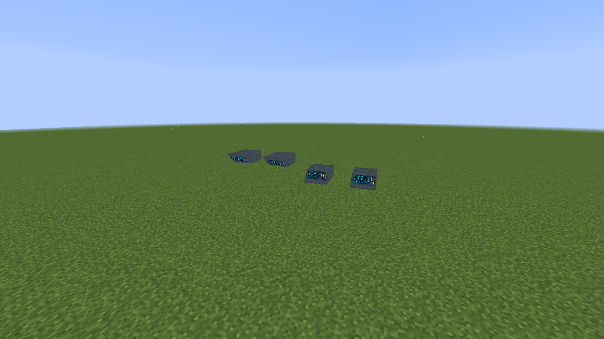
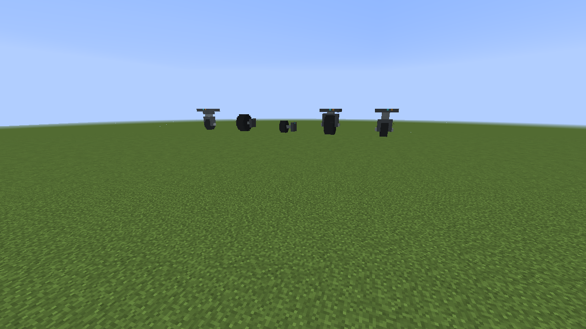
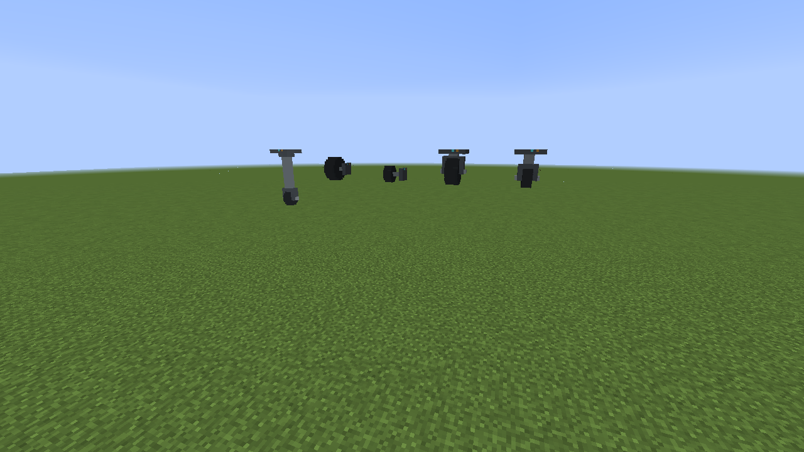
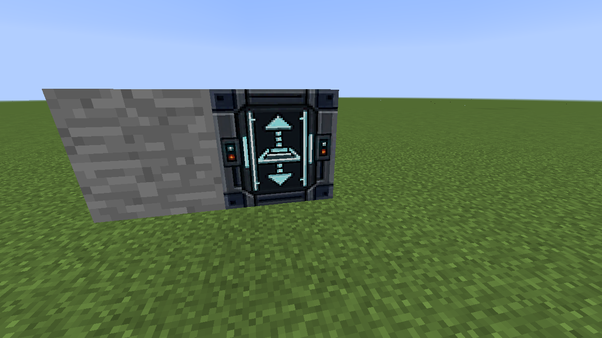

# New in 1.2

[Back to the block guide](README.md)

Open programmable configuration dialogs with **shift-right-click in creative
mode**, or use the Configurizer.

## Per-face textures

Programmable Block and Programmable Slab start with **Face overrides: Off**.
Turn it on to reveal **Texture for**, choose a face, and select its texture.
**Use main texture** removes that face's override. Main remains the default
for all unassigned faces. Front/back/left/right follow the block's facing.
Turning overrides off preserves the choices for later use.

The texture list also includes **Glass Frame Interior** and **Door Interior**,
the darker surface used inside the door. The existing door-frame finish remains
available. These choices add no block IDs for face combinations.

The [Duplifier](../DUPLIFIER.md) copies face overrides separately from the main
texture. Copying a disabled source disables overrides on the target and leaves
its stored face choices intact. A configured Duplifier plus programmable block
items now forms a shapeless recipe; shift-click its output to process a stack.
The tool is retained.

## Diagonal building blocks

**Programmable Diagonal Porthole** offers hexagonal, square, octagonal and round
openings, half/full width, glass shade and joining. Matching neighbors join
sideways along the same plane. Width, slope, facing and opening shape must
match; vertically adjacent slopes do not form a coplanar window.

**Programmable Diagonal Wall** adds a full-depth, half-height option, with
matching straight runs in lower or upper positions. It also offers independent
inside and outside fill options. Collision follows the configured shape.

**Programmable Diagonal Half Console** is a separate block, half a block tall
and deep. Side placement against a slab matches its upper/lower half, with the
slope inverted for the upper position. It uses programmable input artwork.

WorldEdit flips now transform diagonal facing and slope together. Include both
cells when copying any two-cell fixture. See [copy compatibility](../copy-compatibility.md).

## Connected seating

Luxury and military seats join automatically into single seats, ends and
middle sections when placed side by side with matching style and facing.
Right-click to sit; sneak to dismount. They reserve the cell above for their
backrests, so place them with clear headroom.

## Landing gear

There are small and large top-mounted and side-mounted designs. The small
**telescopic** top-mounted gear extends/retracts on right-click or a redstone
signal change. Travel takes one second. Extension requires clear space below;
that cell remains reserved until retraction finishes. Breaking either occupied
cell removes the fixture.

## Placement and compatibility fixes

- Half Input side placement now matches the supporting slab's half.
- Programmable Doors accept Programmable Slabs as support.
- Legacy Space Door entries are hidden from creative search; existing placed
  doors keep their registrations.
- The Ramp controller's transparent texture-edge pixels are filled during
  texture loading, closing the reported seam beside another block.
- Custom door sprites use mutable frame lists so TextureFix can release their
  image data. Both supplied crash reports show this same failure on 1.1.
  The isolated client verifies sprite cleanup; the full external modpack has
  not been tested here.

## Render distance

Full Programmable Blocks and Slabs already use terrain meshes. Diagonals and
some other programmable shapes still use a renderer with a 64-block cutoff.
The [render-distance report](../performance/render-distance-1.2.md) describes
moving static geometry into terrain meshes and the cost of increasing the
current renderer's range. This release leaves that broader change for later.
