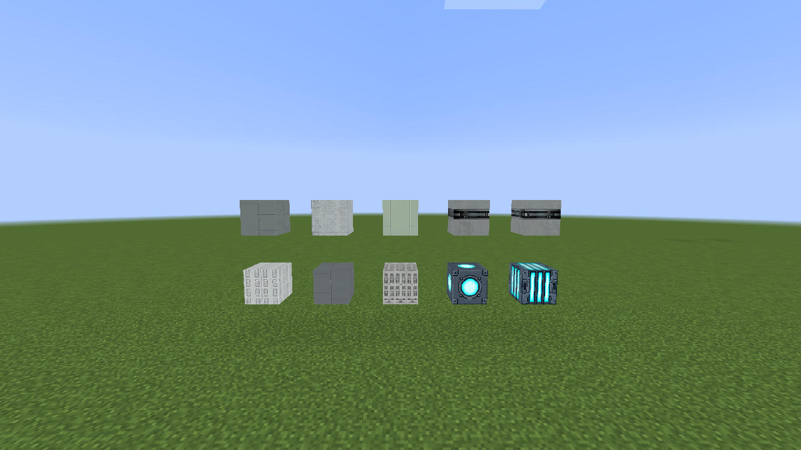

# Version 1.2

## Housing finishes

The shared finish menu now has 78 choices for Programmable Blocks and compatible shapes: 28 original finishes, 16 selected finishes from the first texture pack with shorter `T1` names, 23 selected finishes from the second pack with descriptive `T2` names and 64×64 artwork, and 11 new finishes named Hull Plating 1–11.

The [Programmable Block finish overview](building.md#programmable-block-finishes) shows every choice on a full block, with up to ten blocks per screenshot and names in the same left-to-right order. Removed pack finishes have no save remaps, so an older saved finish number may now show different artwork.

## Ramp Controller offsets

The start and end offset sliders move in half-block steps from -16 to 16 blocks. The displayed values describe the retracted and deployed positions. Shift-right-click the controller in creative mode to open its menu.

## Programmable Light shapes

The Programmable Light Frame is a one-pixel-deep panel that faces the side it is placed against. The Programmable Light Slab occupies the upper or lower half of a block. Both use the Programmable Light menu for artwork, brightness, housing finish, Join, redstone trigger and channel. Open the menu with shift-right-click in creative mode.

## Ceiling-mounted Inputs

Place Programmable Input or Programmable Half-Input against the underside of a block to put its artwork on the downward-facing side. Click near, at the middle, or far across the underside to choose its position. Programmable Half-Consoles use the same three ceiling positions.

## Extra Large Landing Gear

Extra Large doubles Large's model dimensions. The root remains centered while its parts reserve a three-by-three footprint, including the cells reached during extension. Configure extension from 0–4 blocks as with the other sizes; the larger wheel can reach one block below that distance.

## Propulsion wall textures

Rocket Thrusters, Ion Drives, Plasma Vents, Impulse Engines and the hover fixtures now apply the selected wall texture to the outer housing on every side and to the recessed front surface. Their trim and active emitter keep their own textures. The configuration dialog previews the selected wall texture.

## Building and placement fixes

New Programmable Slabs default to the Tile side layout. Their outer faces also support attachments such as Mekanism Glow Panels. Filled, full-height Diagonal Walls support Programmable Doors above them, and their face normals keep shader lighting stable as the camera moves.

Framed Programmable Doors align with a block's edge. Frameless doors retain one pixel of inset so a sliding leaf clears the adjacent block. Ceiling-mounted inputs and half consoles use near, middle and far positions across the underside, as shown above.

## Dynmap and chunk loading

Dynmap now shows Programmable Slab halves, door orientation and open state, propulsion emitter faces, and the clipped shapes and saved main finish of blocks moved by a Programmable Ramp. Programmable blocks and walls have fallback map geometry.

Interactive blocks defer load-sensitive updates until their chunk tiles are ready. Redstone checks use loaded neighboring chunks without loading another chunk. See the [1.2 changelog](../../CHANGELOG.md#12) for the full list of fixes.
