# New in 1.2

[Back to the block guide](README.md)

Open programmable configuration dialogs with **shift-right-click in creative
mode**, or use the Configurizer.

## Per-face textures

Programmable Block, Programmable Slab and Programmable Stairs start with **Face overrides: Off**.
Turn it on to reveal **Texture for**, choose a face, and select its texture.
**Use main texture** removes that face's override. Main remains the default
for all unassigned faces. Front/back/left/right follow the block's facing.
Turning overrides off preserves the choices for later use.

The texture list also includes **Glass Frame Interior** and **Door Interior**,
the darker surface used inside the door. The existing door-frame finish remains
available. These choices add no block IDs for face combinations.

The [Duplifier](../DUPLIFIER.md) copies face overrides separately from the main
texture. Copying a disabled source disables overrides on the target and leaves
its stored face choices intact. A configured Duplifier plus programmable block
items now forms a shapeless recipe; shift-click its output to process a stack.
The tool is retained.

## Diagonal building blocks

**Programmable Diagonal Porthole** offers hexagonal, square, octagonal and round
openings, half/full width, half-height/full-width geometry, glass shade and joining. Matching neighbors join along the same plane. A half-width lower piece can
join a reversed, inverted upper piece directly above it, producing one tall
opening. Use the same opening shape and enable joining on both. Other
arrangements only join when their actual surfaces align.

**Programmable Diagonal Wall** adds a full-depth, half-height option, with
matching straight runs in lower or upper positions. It also offers independent
inside and outside fill options. Collision follows the configured shape.

**Programmable Diagonal Half Console** is a separate block, half a block tall
and deep. Side placement against a slab matches its upper/lower half, with the
slope inverted for the upper position. It uses programmable input artwork.

WorldEdit flips now transform diagonal facing and slope together. Include both
cells when copying any two-cell fixture. See [copy compatibility](../copy-compatibility.md).

## Connected seating

Luxury and Military Seats join automatically when style, facing and height
match and both have Join enabled. Their default legs are one pixel taller.
Creative shift-right-click opens Join On/Off and Low/Default/High height controls;
Low and High are two pixels below/above the new default. Collision, rider height,
mining drops and pick-block follow the chosen height.

Right-click to sit; sneak to dismount. Leave the cell above clear for the backrest.

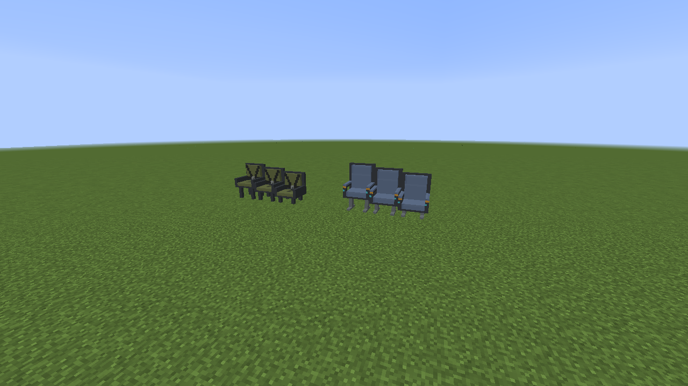
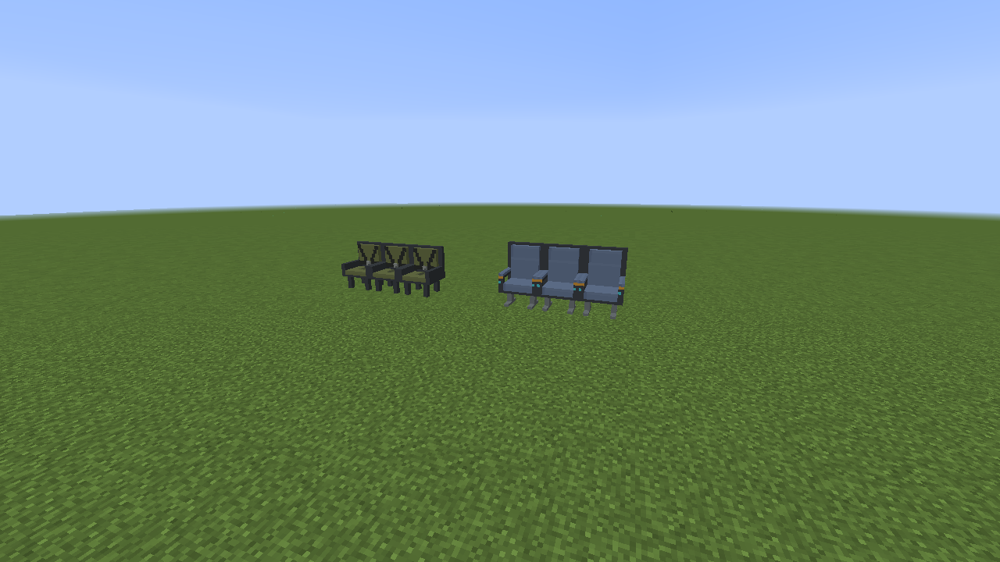
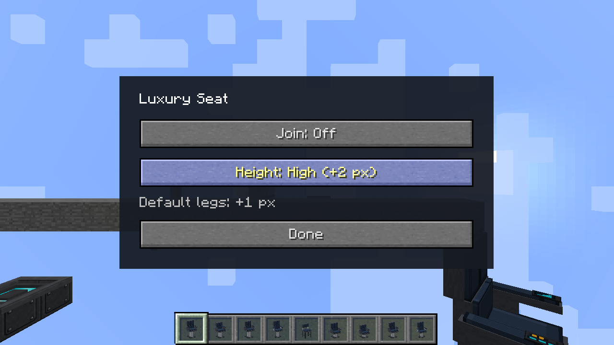

Seat inventory icons fit their slots at all three configured heights.

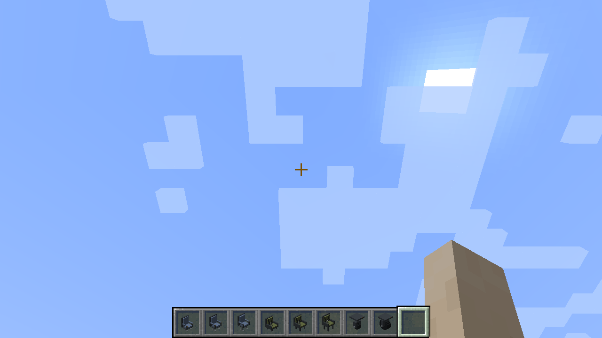

## Landing gear

**Small Landing Gear** (`small_landing_gear`) and **Large Landing Gear**
(`large_landing_gear`) are both telescopic top-mounted designs. They replace all
five previous gear IDs, without remaps. Right-click to extend or retract.

Creative shift-right-click opens these settings:

- **Redstone Disabled:** move manually with right-click.
- **Redstone On** (default): extend with power and retract when power stops.
- **Redstone Off:** extend without power and retract with power.
- **Channel:** share a signal with other loaded members in the same dimension;
  zero uses local power only.
- **Extended length:** 0–4 blocks in half-block steps, default one block. This is
  the travel below the retracted pose, not the total height including the mount.
  Length changes apply while dragging; extended gear moves immediately toward
  the new length. Redstone mode/channel changes apply with Done.

Both directions animate at one block per second at normal tick speed. The
mount keeps its motion state when direction changes. Extension requires air
below; occupied cells remain reserved until the piston and wheel clear them.
Breaking any occupied part removes the fixture. Saved settings survive mining
and pick-block. Dynmap shows the default retracted model.

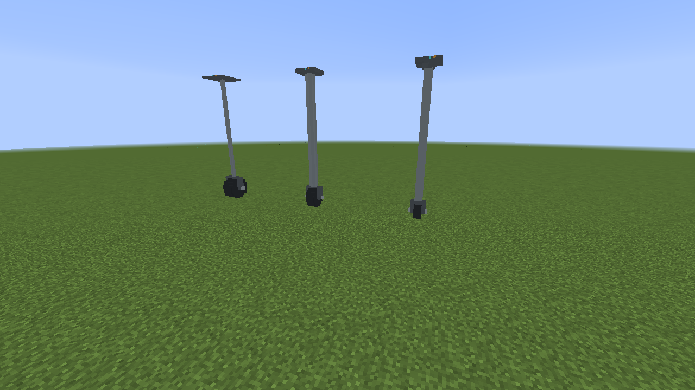
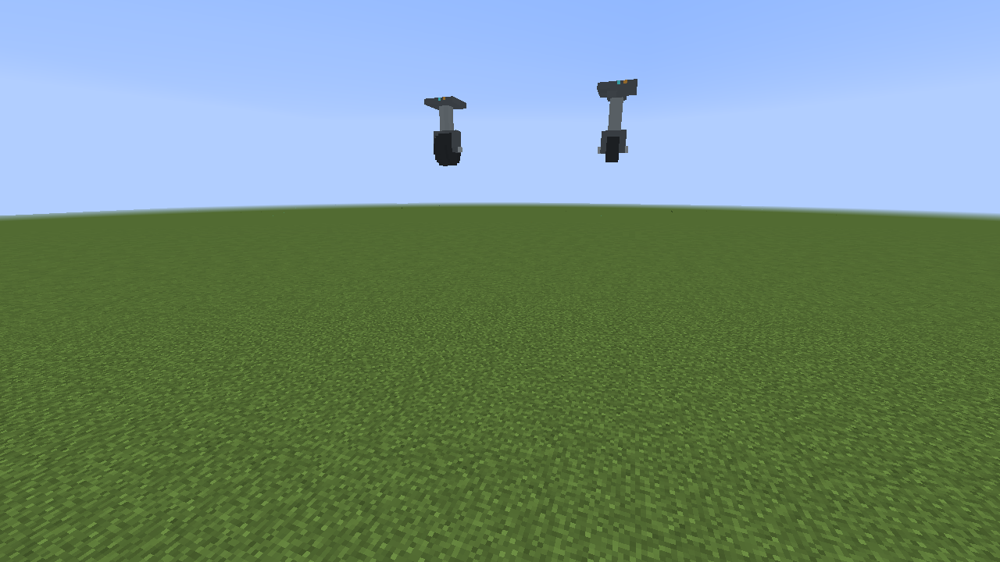
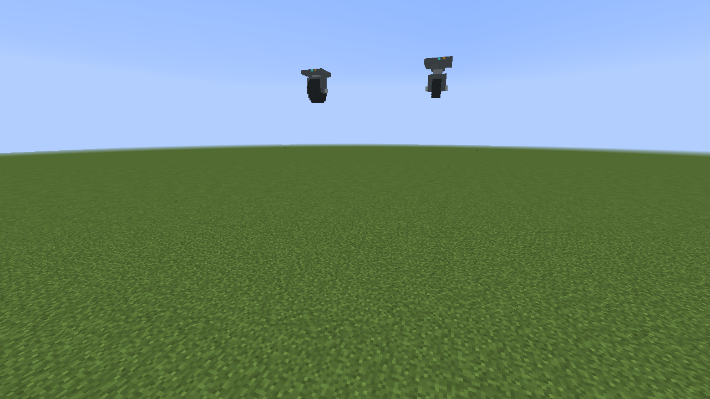
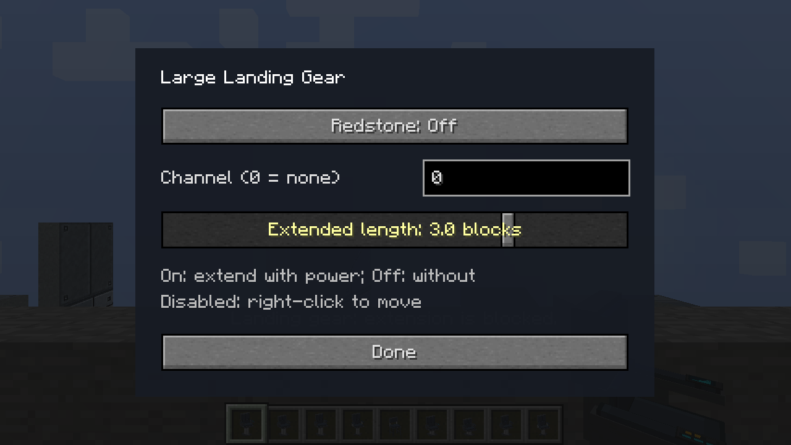

## Placement and compatibility fixes

- Half Input side placement now matches the supporting slab's half.
- Programmable Doors accept Programmable Slabs as support.
- Legacy Space Door entries are hidden from creative search; existing placed
  doors keep their registrations.
- The Ramp controller's transparent texture-edge pixels are filled during
  texture loading, closing the reported seam beside another block.
- Custom door sprites use mutable frame lists so TextureFix can release their
  image data. Both supplied crash reports show this same failure on 1.1.
  The isolated client verifies sprite cleanup; the full external modpack has
  not been tested here.

## Render distance

Full Programmable Blocks and Slabs already use terrain meshes. Diagonals and
some other programmable shapes still use a renderer with a 64-block cutoff.
The [render-distance report](../performance/render-distance-1.2.md) describes
moving static geometry into terrain meshes and the cost of increasing the
current renderer's range. This release leaves that broader change for later.

## Follow-up additions

### Programmable Stairs and slab combining

Programmable Stairs use vanilla placement and inside/outside corner joining,
including upside-down stairs. They offer a main finish, optional face overrides,
and Fit/Tile side layout. Front means the low riser, facing the player when
placed. The Duplifier, crafting with copied settings, pick-block and mining
preserve the configuration. Craft four stairs from six Programmable Blocks
arranged in a stair pattern.

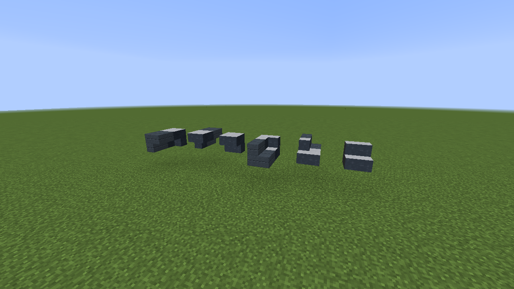

Place a second Programmable Slab into the empty half of an existing slab to
make a Programmable Block. It keeps the placed slab's settings, including its
stored face overrides. Survival placement consumes one additional slab.

### More diagonal porthole shapes

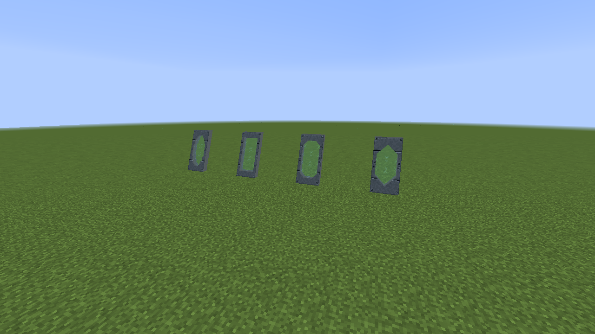
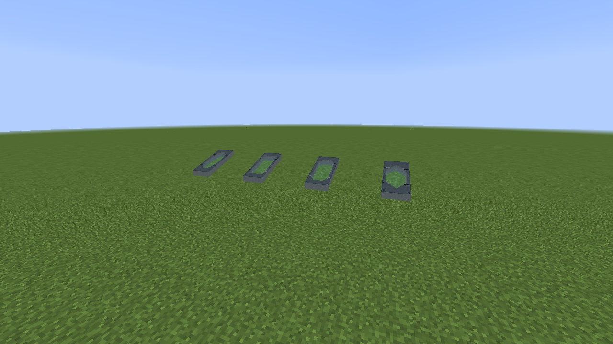

Inside/outside fill now retains the diagonal corner's connecting arm and stays
within the corner span. A filled wall can still connect to an unfilled neighbor.

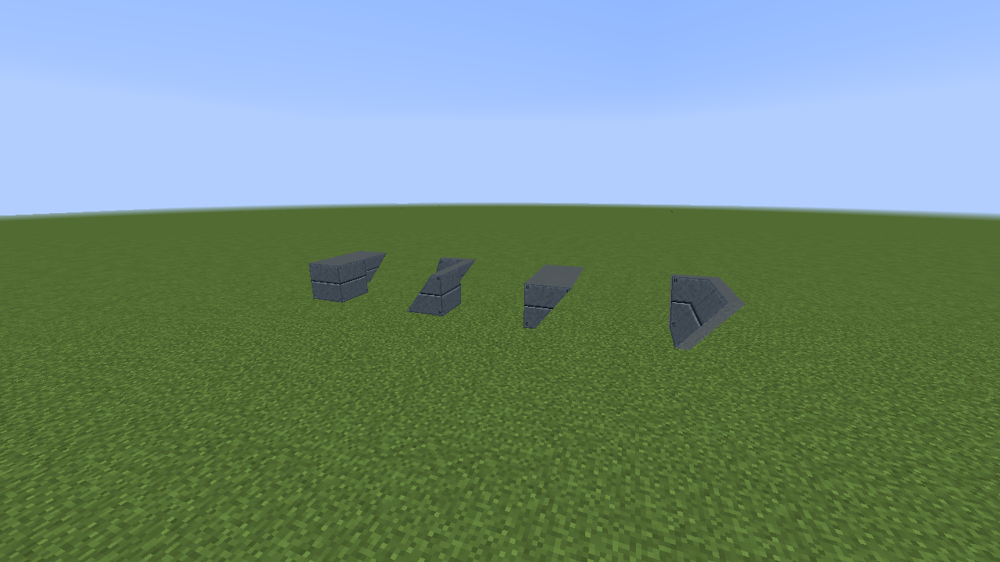
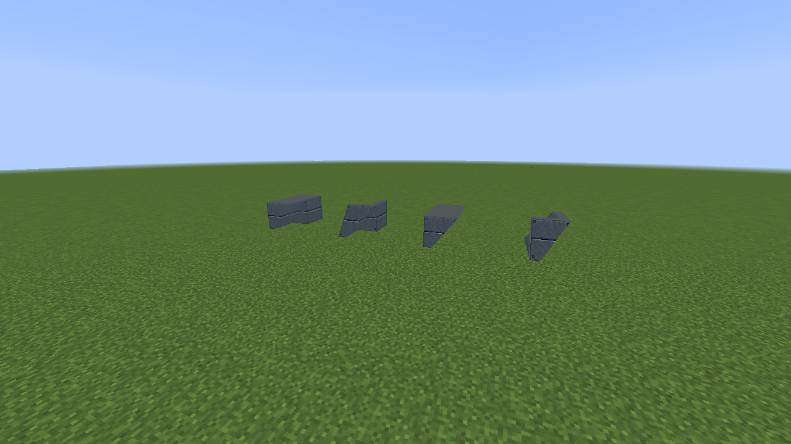

### Slow servers and compatibility

Door motion now uses a steady client clock after the server reports the new
open/closed state. Server lag can still delay the response to a click, but time
corrections no longer stall the visual transition. This changes animation timing;
it does not reduce the cost of drawing door models. Ramps retain server-timed
motion because their moving collision and passengers must stay synchronized.

Ramp discovery now compares effective textures on all six faces and stored side layout.
Different finishes stop the flood fill; disabled face choices do not split an
otherwise matching platform. Moving programmable platforms also render their
face overrides. Immersive Engineering's regular and scaffold slabs are accepted,
with their upper/lower/double slab settings saved and restored.

New Better Builder's Wands operations record the restored block states for
`/wandOops`, so fixing diagonal orientation no longer prevents undo. Mixed-state
operations are grouped for BBW's normal removal and refund logic. Undo skips
unloaded or protected positions and cannot run in another dimension. Old undo
records created before this fix do not contain the restored-state information.
