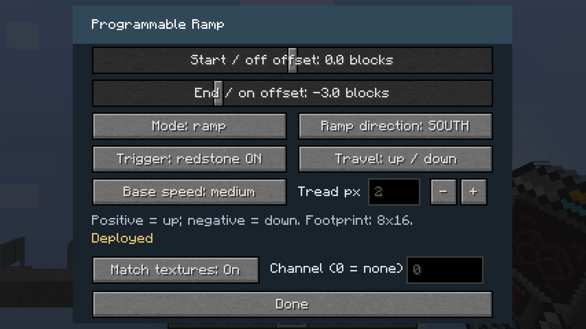
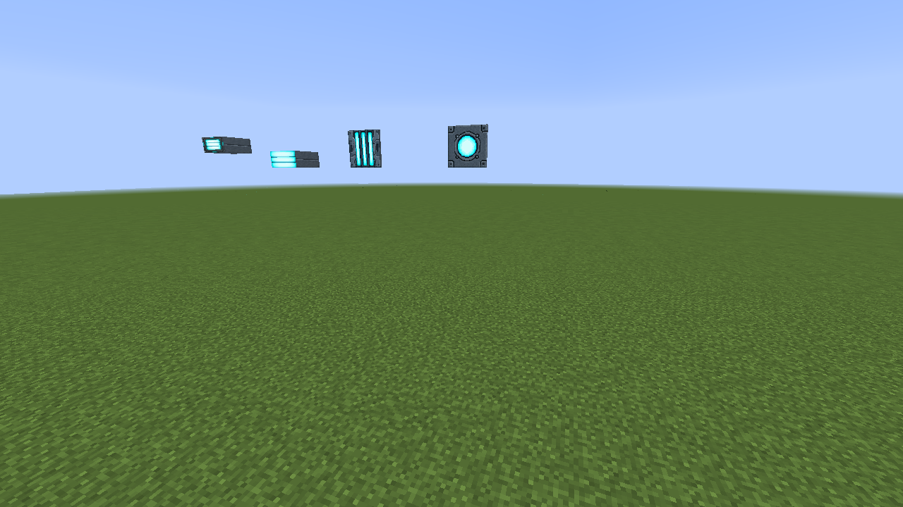
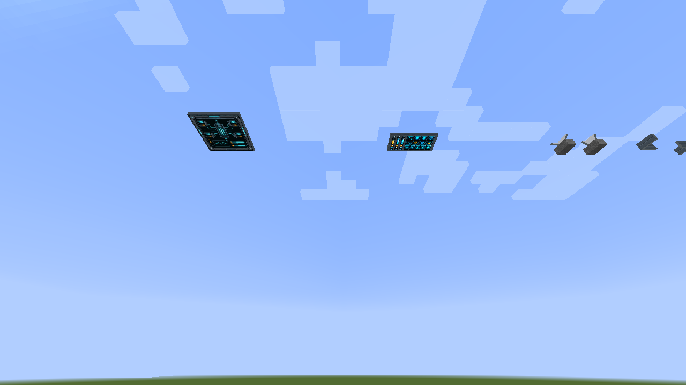
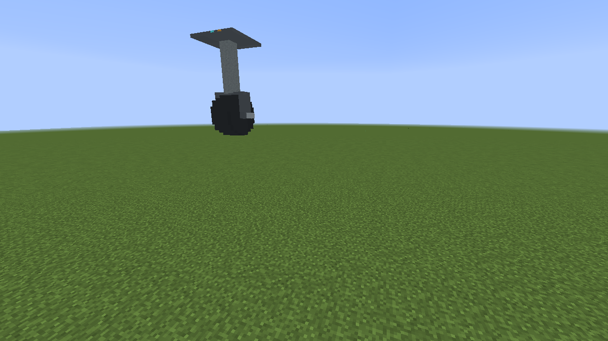
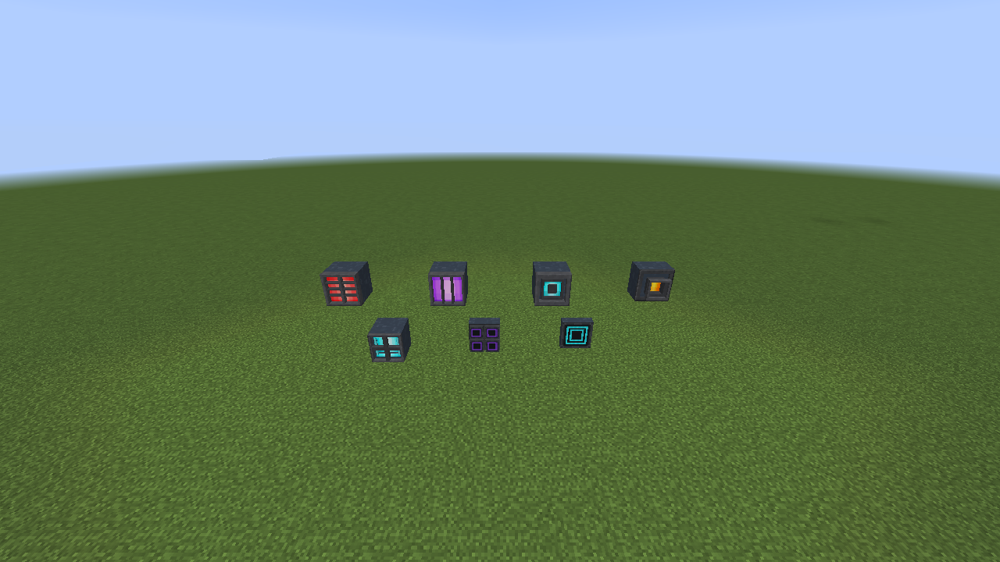
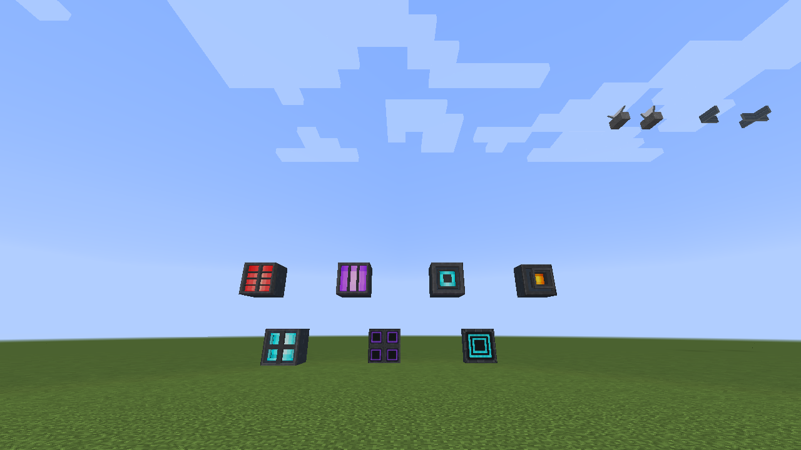
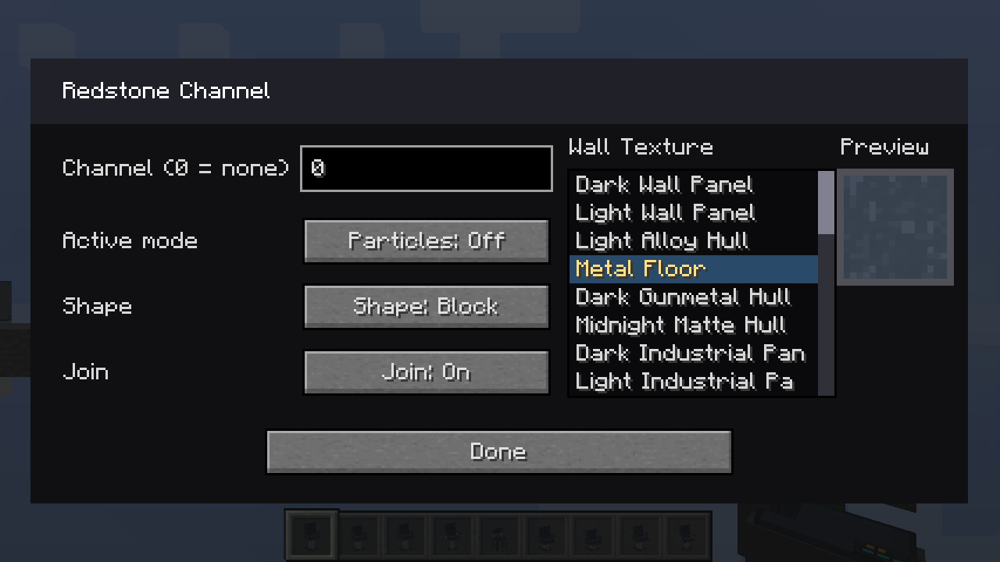

# Version 1.2 additions

## Ramp Controller offsets

The start and end offset sliders move in half-block steps from -8 to 8 blocks. The displayed values describe the retracted and deployed positions. Shift-right-click the controller in creative mode to open its menu.

## Programmable Light shapes

The Programmable Light Frame is a one-pixel-deep panel that faces the side it is placed against. The Programmable Light Slab occupies the upper or lower half of a block. Both use the Programmable Light menu for artwork, brightness, housing finish, Join, redstone trigger and channel. Open the menu with shift-right-click in creative mode.

## Ceiling-mounted Inputs

Place Programmable Input or Programmable Half Input against the underside of a block to put its artwork on the downward-facing side.

## Extra Large Landing Gear

Extra Large doubles Large's model dimensions. The root remains centered while its parts reserve a three-by-three footprint, including the cells reached during extension. Configure extension from 0–4 blocks as with the other sizes; the larger wheel can reach one block below that distance.

## Propulsion wall textures

Rocket Thrusters, Ion Drives, Plasma Vents, Impulse Engines and the hover fixtures now apply the selected wall texture to the outer housing on every side and to the recessed front surface. Their trim and active emitter keep their own textures. The configuration dialog previews the selected wall texture.

