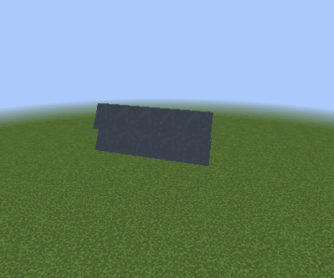
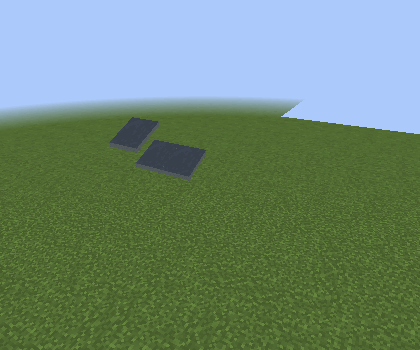
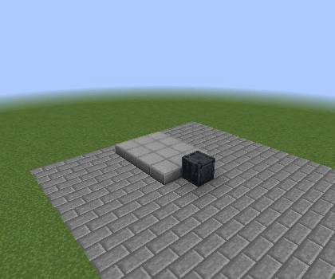

# Version 1.3

New since 1.2, including the latest improvements on the 1.3 branch: moving hatches, more connected surfaces, a shared material catalog, programmable storage and smoother rendering in builds with many programmable blocks.

## Trapdoors that fit your ship

**Programmable Trapdoors** can rotate, slide sideways or lift clear of a surface before sliding. Set Bottom, Middle or Top placement, choose manual or redstone operation, and join matching leaves into rectangles through 8×8. Connected halves share their outer hinges and open together.

**Rotate into next block** and **Slide into next block** keep the mount outside the opening they cover. Opposing mounts meet across a two-block opening without overlapping. These individual mounts also make landing-gear covers, which remain open until the gear finishes retracting.

The eight dedicated finishes now have short names: Armored Hatch, Slit Hatch, Utility Hatch, Viewport Hatch, Industrial Hatch, Service Hatch, Twin-Window Hatch and Reinforced Hatch. Armored Hatch is the default; existing texture IDs and saved choices are preserved. See the [trapdoor guide](programmable-trapdoor.md) for all five movements and placement rules.

## Hatches for diagonal walls

**Programmable Diagonal Trapdoors** match half-width tall, full-width tall and full-width shallow walls. Rotate outward, lift and slide over the wall, or slide directly into it. The inset leaf and thin metal edges keep the wall opening neat.

| Slide over wall | Slide into wall |
| --- | --- |
|  |  |

Connected panels support rectangular and staggered surfaces, opposite slopes and reversed coplanar rows. Half-width and shallow leaves also connect across incomplete patches, including three-leaf corners. Using any member opens the loaded group; settings and links survive saving.

The [diagonal trapdoor guide](programmable-diagonal-trapdoor.md) illustrates every shape and movement, including partial patches. Groups and redstone channels use loaded chunks without forcing distant chunks to load.

## One material catalog across programmable shapes

Categorized lists with thumbnails bring hull finishes, panels, glass, light artwork, door designs and static screen/control images into compatible programmable dialogs. Choose an ordinary block or door in the **Custom** sample slot to reuse its artwork without consuming the item. Add your own PNGs under `config/vandorlabs/textures` to create filesystem categories.

**Fit** stretches an image across the chosen surface; **Tile** keeps block-scale repetition. Trapdoors can tile and mirror complete door artwork across a connected hatch, including separate upper/lower sprites from sampled doors. Replacement Programmable Door faces retain the native thin edges and selected hinges. Slabs and portholes offer independent side finishes. Programmable Block, Slab and Storage can use optional per-face overrides.

The pickers now use taller lists, simpler labels and a separate Small/Medium/Large choice for door artwork. Reopening a Custom choice brings its selected row and sample back into view. See [material selection](../unified-materials.md) and [filesystem textures](../filesystem-textures.md).

## Programmable Storage

A new **27-slot storage block** combines a chest's contents with programmable appearance. Craft it from a chest and Programmable Block. It supports hoppers, item handlers and comparator output, and has fourteen matching front/side/top storage sets, including four overhead-bin combinations.

Use per-face overrides when a cabinet needs different trim on one side. The Duplifier copies appearance while preserving the destination's inventory; mining drops stored items separately. See the [Storage guide](../programmable-storage.md).

## Lights, gear and connected copying

- Programmable Light Frames offer centered Small/Full sizing. Light Slabs have Fit/Tile side artwork, and both mount against their supporting surface.
- Blue Hex and Amber Hex lights have paired on/off artwork. The picker shows the On finish and switches artwork automatically with the light state.
- Extra Large **2×2** landing gear has matching alignment, reservations and saved/copied size settings. Next-block trapdoors can cover its shaft; see [gear and cover setup](../landing-gear-covers.md).
- Connected Duplifier matching now reaches compatible face, edge and corner neighbors, including vertically adjacent slab halves. Matching, edit permissions, size limits and loaded-chunk boundaries still apply.

## Better rendering and placement

Static diagonal-wall meshes and door material surfaces are cached, and reapplying identical settings avoids unnecessary appearance rebuilds. These changes reduce rendering CPU work and allocation in dense scenes; the [performance report](../performance/COMMON_BLOCK_OPTIMIZATION.md) records the checks and benchmark limits.

Diagonal walls, landing gear and ramp-controlled blocks now remain visible at the same distance, subject to loaded terrain and the camera's view. The Diagonal Screen hotbar icon matches its solid wedge housing. Landing gear preserves manual extension across reloads when its redstone input is unchanged, and unloading a channel member no longer resets its saved extension.

Configured block/stair placement predicts the saved appearance on the client. Diagonal surfaces use consistent winding, normals and lightmap data, while connected walls and open trapdoor selection follow their geometry.

## Motion guides for doors and ramps

The documentation now shows complete motion at 70% of the original GIF dimensions: **420×350**. Standard doors demonstrate rotation and sideways/up/down sliding.

All four existing Programmable Ramp modes have deployment/retraction clips, with separate upward/downward smooth and stair examples. Clearance respects source slab thickness so slabs can meet floors or ceilings without accepting real obstructions.

| Lift | Extend |
| --- | --- |
|  |  |

See [all door motions](doors.md), [all ramp examples](ramp-controller.md), and the [animation capture guide](../animated-documentation.md). These images are real Forge runtime captures. They document motion; hardware shader appearance remains a separate validation task.
