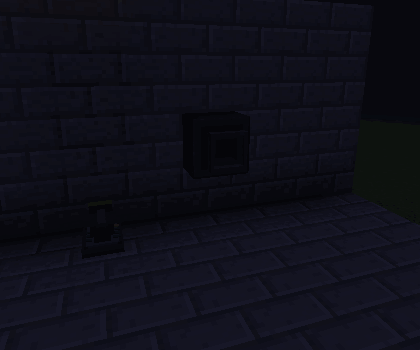
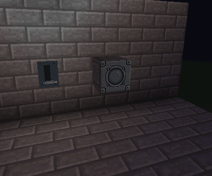

# Version 1.6

Version 1.6 carries redstone signal levels through channels, lights, propulsion
blocks and screen controls. It also adds four-position levers, sliders and
aircraft throttles with configurable output limits.

## Configuration buttons

In configuration dialogs, left-click an option button to select the next value;
right-click selects the previous value, wrapping at either end. This also applies
to Low/High limits, light modes, particle thresholds and door settings.

## Doors and trapdoors

Door and trapdoor movement, placement and pairing retain their version 1.5
behavior. The experimental 1.6 Slide Left/Right and Split Horizontal/Vertical
choices, and the extra split choices for regular doors and trapdoors, were
reverted. Large Programmable Doors retain their existing **Sliding X** mode.
Without a frame, Sliding X leaves one Minecraft pixel (1/16 block) of each
panel visible inside the opening so it can be clicked to close the door.
See the [door guide](doors.md), [trapdoor guide](programmable-trapdoor.md) and
[diagonal trapdoor guide](programmable-diagonal-trapdoor.md) for the available
movement choices.

Double Doors artwork now uses the same dark edge texture as the other
programmable doors and trapdoors. Front and back artwork is unchanged.
White Glass and Dark Glass leaf designs remain available for ordinary
Programmable Doors, but are omitted from flat and diagonal trapdoor pickers.

Open large doors and regular rotating doors remain clickable on the portions
that extend into neighbouring blocks. Their selection outlines and collisions
follow the moved panels.

## Signal levels and channels

Channels carry values from **0 to 15**, with 0 unpowered. Independent sources
combine by taking the strongest signal, like vanilla redstone: sources at 5 and
12 produce 12; removing the stronger source leaves 5. A consumer listening to
several channels uses their strongest level together with its physical redstone
input. Channels preserve the level without distance attenuation.

Linked switches, sliders and levers share a latched setting. Changing one
updates the linked controls because they edit the same setting. Existing on/off controls still select 0 or 15.
Only loaded chunks participate, and channels do not load chunks.

## Four-position controls

| Block | ID | Model |
| --- | --- | --- |
| Thruster Lever | `vandorlabs:thruster_lever` | Single lever |
| Wall Slider | `vandorlabs:wall_slider` | Sliding grip |
| Airliner Throttle | `vandorlabs:airliner_throttle` | Paired handles moving together |
| Fighter Throttle | `vandorlabs:fighter_throttle` | Broad grip with decorative buttons |

All four use detailed 32px models, have crafting recipes, and mount on walls,
floors and ceilings. The clicked support face determines attachment; horizontal
mounts follow the player's facing. A floor-mounted Wall Slider places **Off
nearest the player**, with High at the far end. Item icons retain padding around
the model.

Normal right-click cycles **Off → Low → Medium → High → Off**. In Creative mode,
shift-right-click opens the channel dialog and **Low/High** limits. The defaults
are **0, 5, 10 and 15**. Medium is the rounded midpoint between Low and High; Off
always outputs 0. Low must be at least 1, High at most 15, and High must be at
least two levels above Low to keep four distinct positions.

The selected level drives physical redstone and every configured channel. When
a channel supplies an intermediate value, the model shows its nearest positive
position while preserving the actual output level. Changing the channel list
also preserves an active intermediate output. Creative pick-block copies limits
and channels; the Duplifier supports limits and the selected state.

The Simple variants and Thruster Control Block have been removed. The remaining
IDs have no detail suffix, and the earlier suffixed IDs have no migration mapping.

### Lever controlling a thruster

The lever and Rocket Thruster share a channel. The clip cycles **0 → 5 → 10 →
15 → 0**. The thruster follows signal brightness, and its Medium-density particle
stream starts at level **10**. The four handle positions are discrete; the GIF
records their real in-game changes and the resulting thruster state.

## Signal-driven lights

Programmable Light, Light Slab and Light Frame offer **Brightness: Signal +
offset**. Their brightness becomes the incoming level plus the signed slider
offset, clamped to 0–15. For example, signal 7 with offset +2 emits level 9;
signal 2 with offset −3 emits 0. A positive offset can keep a light dimly lit
even when the input is 0. Manual slider brightness remains available.

Joined lights use the strongest signal received by a loaded member of the
joined group. Signal settings, offsets and channel lists survive saving and
configuration copying.

### Slider controlling a light

The Wall Slider and Programmable Light share a channel. **Signal + offset** is
enabled with offset 0, so the light follows **0, 5, 10 and 15** directly. This
example uses Porthole artwork; the light's face and surrounding block lighting
respond to the selected level.

## Propulsion brightness and particles

Propulsion blocks retain their manual Off, On and particle choices. Enable
**Signal brightness** to drive emitted light and emitter-texture brightness from
the incoming 0–15 level. Level 0 is Off; positive levels progressively brighten
the emitter.

Choose the **particle threshold** separately. A selected Light, Medium or Heavy
stream appears when the signal meets or exceeds that threshold. The default
threshold is 8; choosing 10, as in the lever example, starts particles at Medium
and High with the default control limits. Particle density remains independently
configurable.

## Slider rows on screens and inputs

The **Redstone...** artwork on programmable displays, inputs and consoles can
use slider rows as well as on/off toggles. The row editor places **Add / Remove**
first, then **Up / Down**, **Label**, **Channels**, **Control**, and **Low / High**.
Choose Slider and assign its channel list.

Each slider has **four bordered settings**, matching the Thruster Lever:
**Off**, **Low**, **Medium**, **High**. Off outputs 0; Low and High use the
configured limits, and Medium uses their midpoint rounded upward. The default
outputs are **0, 5, 10, 15**. Low must be positive and High at least two levels
above it, up to 15, so the three powered settings stay distinct.

The selected Off setting glows **amber**; Low, Medium and High glow **cyan**.
The indicators have no numbers. Slider labels have room for three more normal
letters, with up to eleven narrow characters when they fit; the four controls
still occupy most of the row. Clicking a setting sends its value to all
of the row's channels. Incoming channel levels highlight the nearest powered
setting, with zero reserved for Off, just like the levers.

Row order, channels, mode and limits survive saving, configured items and
Duplifier copying. Existing range settings migrate to valid four-step limits;
old ranges starting at zero use the default Low where their High allows it.

## Programmable Trigger

Programmable Trigger blocks can require an **exact signal level** from 0 to 15.
Other levels use the Off texture. Level 0 can therefore represent a trigger that
matches an unpowered input.

The optional four-band artwork uses **Off (0), Low (1–5), Medium (6–10) and High
(11–15)** textures. With ordinary Off/On artwork, an exact match uses the On/High
texture. Use the Duplifier's **Signal Levels** option to copy Trigger settings,
light offsets and propulsion thresholds.

## Validation

The standard Java 8 build and focused live-client checks cover signal levels,
channel updates, settings submission and reopening, saving, copying, support
removal, all control model states, placement and selection. The control suite
captures all floor/ceiling slider rotations and checks visible padding on all
four inventory icons. Dynmap loads the updated definitions for 101 block types.

Both GIFs come from a real Forge client. Their recorded control and consumer
levels are checked together at 0, 5, 10 and 15, including the thruster's particle
threshold. They use a fixed camera and ordinary game lighting. See the
[animated documentation guide](../animated-documentation.md) for capture details.
