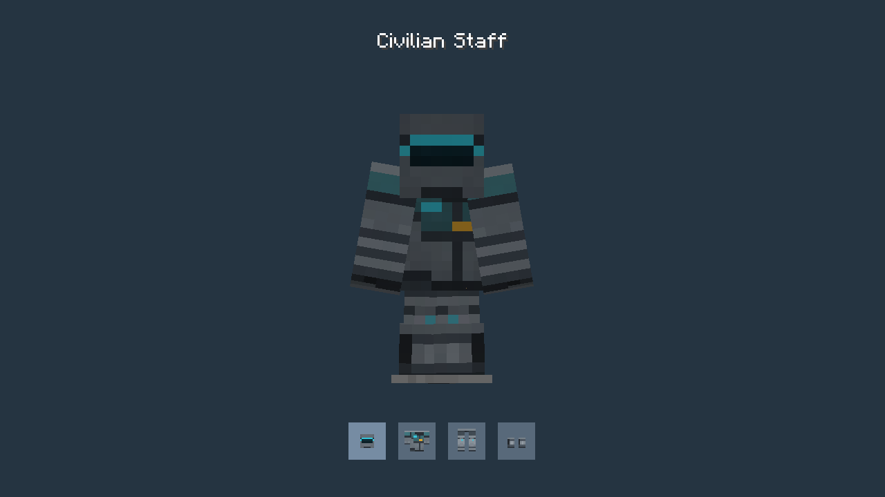
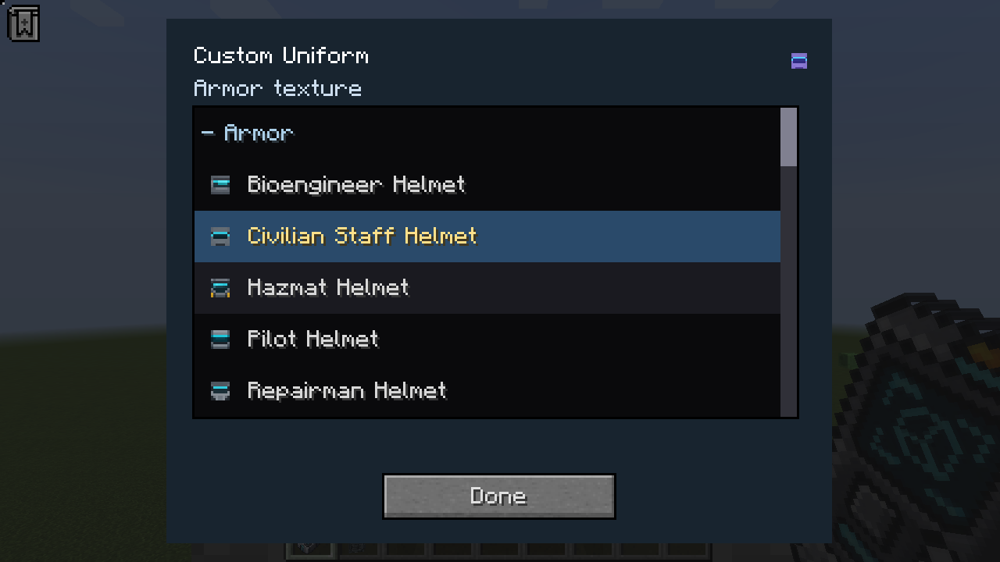
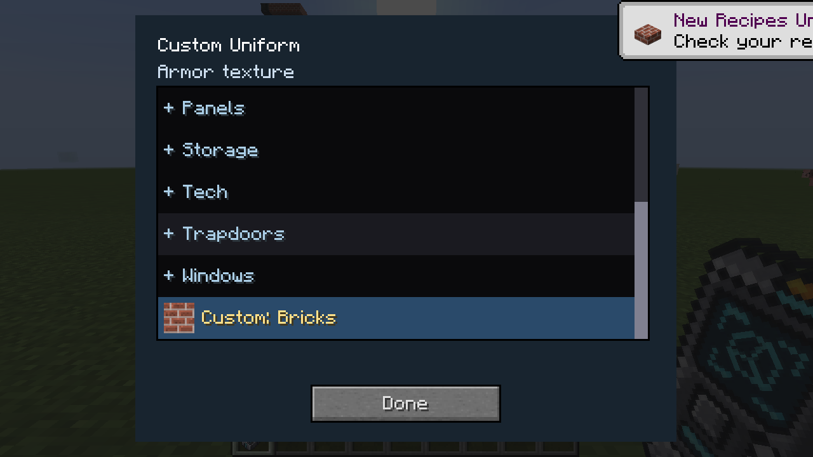
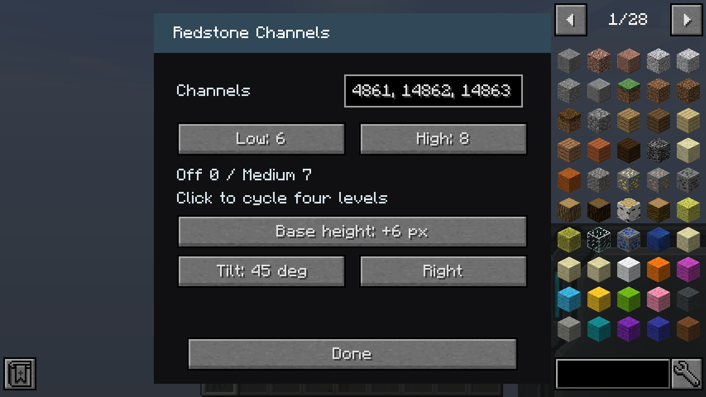
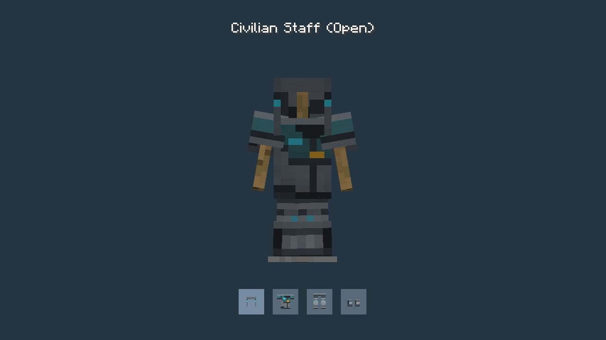

# Version 1.7

Programmable Helmet, Chestplate, Leggings and Boots have vanilla diamond armor stats. Craft them with Programmable Matter Ingots in the vanilla patterns: 5 for a helmet, 8 for a chestplate, 7 for leggings and 4 for boots. All pieces start with Civilian Staff.

Choose among eight matching role designs, or any default block material. The [armor gallery](armor.md) shows every full role set on an armor stand with its matching icons.

Shift-right-click a block face while holding armor to copy its displayed texture. Sampling works directly in creative and survival, including programmable face overrides and storage top/side/front artwork. Block images are centered on each visible armor face while keeping vanilla armor cutouts. Samples, damage, enchantments and names survive inventory moves and saving.

To open the categorized picker, aim into the air and shift-right-click. Creative players can hold the armor directly; survival players hold a Configurizer in the main hand and armor in the offhand. Picking another material replaces a sampled texture. Ordinary right-click equips the armor.

See the [armor guide](../programmable-armor.md), [current block materials](building.md#programmable-block-finishes), [door artwork](doors.md) and [shared texture guide](../unified-materials.md).

## Design armor on a stand

You can design your armor with the **Configurizer while it is mounted on an armor stand**. Hold the Configurizer in your main hand and right-click the mounted helmet, chestplate, leggings or boots to open that piece’s texture menu. Choose a role design, a block material, or static **On**/**Off** artwork from **Lights**. The armor stays on the stand and updates as you select textures. This works in creative and survival, with normal and small armor stands. Aim at the head, torso, legs or feet to select the corresponding piece.

World sampling also resolves the selected Programmable Door leaf design or custom leaf texture, and a Programmable Light’s current face artwork or housing material.

## Copy armor designs with the Duplifier

Shift-right-click a mounted piece with the Duplifier to copy its appearance, then right-click another mounted piece to apply it. A role design follows the destination piece: Hazmat leggings copied onto a helmet become the Hazmat helmet texture. Generic materials, light artwork and sampled world textures copy unchanged. Both pieces keep their damage, names and enchantments.

This also works with armor in the offhand, using the Duplifier in the main hand and aiming into the air. A loaded Duplifier can apply the texture through crafting, too. The **Armor Texture** switch in the tool’s **Common** options controls applications. See the [Duplifier guide](../DUPLIFIER.md#armor-textures).

## Custom block textures on armor

The armor picker now includes **Custom...**, using the same non-consuming inventory sample dialog as Programmable Blocks. Drag a block or door item into the sample slot to use its texture. Configured programmable items use their selected material or door design. Custom selections persist when reopening the picker and can be copied with the Duplifier.

## Throttle base height and tilt

Thruster Lever, Airliner Throttle and Fighter Throttle now offer **Standard**,
**+2 px**, **+4 px** and **+6 px** base heights in their configuration dialog. Standard is
the original minimum height. The mounting plate extends while the panel and
handles move upward together, or outward from a wall/ceiling support.

Choose **Flat**, **15 deg**, **30 deg** or **45 deg** and a direction to tilt the
whole control, including its base. Directions follow the control’s mounting
orientation. A solid wedge fills underneath a tilted base, and the base, panel
and handles block movement. Selection outlines follow the transformed model. Shift-right-click
the control to open the dialog, or use the Configurizer in survival; click
**Done** to apply. Saved worlds, configured drops and pick-block retain the
settings, and the Duplifier copies them through **Signal Levels**. See the
[controls guide](controls.md#throttle-base-height-and-tilt).

## Open helmets and short sleeves

All eight roles now offer an **Open** helmet and a **Short Sleeves** chestplate
in the Armor list, adding 16 choices. Each appears only for its corresponding
piece. The original full designs and Civilian Staff defaults remain available.
The [armor gallery](armor.md#open-helmets-and-short-sleeves) shows every alternate
set on an armor stand. Duplifier copies match Open helmets with Short Sleeves
chestplates; leggings and boots use the role’s standard artwork.

