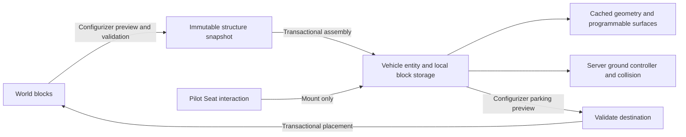

# Pilot Seat ground vehicle implementation analysis

Use the Configurizer to assemble a connected craft into one persistent vehicle entity, and to park it back as blocks. Sitting in the Pilot Seat only mounts the player; it never assembles or disassembles the craft. Ground movement is translation only: the craft keeps its original orientation permanently. Support a single driver, preserved programmable appearances, and safe placement back into the world. Engines and fuel are outside the current scope.

The Pilot Seat itself is a separate, single-cell sittable block. Vehicle assembly and movement described below are proposed work, not features of the seat-only implementation.

## Recommended architecture

Own the vehicle data, assembly transaction, programmable rendering adapters and ground controller in Vandor Labs. Store blocks in vehicle-local coordinates and move one entity, rather than moving world blocks every tick or creating one entity per block. This keeps ordinary driving independent of block count except for collision, rendering and explicitly supported active components.

MovingWorld is the strongest candidate for a short integration experiment because it already separates mobile block storage, assembly, rendering and disassembly. Do not adopt it as a required dependency until a programmable hull, multi-cell landing gear, reload and collision experiment passes. A narrow implementation owned by Vandor Labs is the recommended default for the limited ground-driving scope; generic ticking machines and walkable moving interiors would make a mature moving-world framework more attractive.

## Lessons from the installed reference mods

These findings concern the installed 1.12.2 artifacts and their class bytecode. Upstream links identify the projects; their default branches can differ from these versions. None of these comparisons establishes performance on Vandor Labs structures.

| Reference | Verified implementation detail | Useful lesson and limitation |
| --- | --- | --- |
| AdvancedRocketry `1.12.2-2.0.0-257`, with LibVulpes `0.4.2-88` | `StorageChunk` implements `IBlockAccess`, holds block metadata and tile entities, exposes `copyWorldBB`, `cutWorldBB`, `pasteInWorld`, NBT and network serialization, and a `WorldDummy`. `EntityRocket` and `RendererRocket` consume the stored structure. The renderer contains display-list compilation. | Separate captured structure from entity motion. A bounding-box copy can include unrelated blocks and is not a substitute for connectivity detection. Rocket flight and renderer choices are not a ready-made ground controller. |
| MovingWorld `1.12-6.353` | `ChunkAssembler` has bounded recursive and iterative assembly paths and an assembly interactor. `MobileChunk` implements `IBlockAccess` and exposes a `FakeWorld`. `MobileChunkRenderer` has legacy/VBO render paths, dirty marking, block rendering through the fake world, and tile rendering. `ChunkDisassembler` handles restoration. | Closest structural reference. Prefer bounded iterative discovery and reusable geometry. A fake world is a compatibility layer, not proof that arbitrary Vandor tile callbacks are safe. |
| Davinci's Vessels `1.12-6.355` | `EntityShip` is layered over the installed MovingWorld implementation. | Ship-specific behavior is separate from the reusable moving-block layer. Study the latter first; buoyancy and flight are unnecessary here. |
| MrCrayfish's Vehicle Mod `0.44.1-1.12.2` | `EntityPoweredVehicle.onClientUpdate` obtains acceleration and turn intent and sends dedicated messages when those values change. `EntityLandVehicle` implements ground motion, speed-dependent turning, wheel animation and drift behavior. | Borrow input responsiveness and acceleration/braking patterns. Its turning, axle and drift behavior is outside this design; it also does not solve arbitrary block capture or programmable rendering. |

Project references: [Advanced Rocketry](https://github.com/Advanced-Rocketry/AdvancedRocketry), [MovingWorld](https://github.com/TridentMC/MovingWorld), [MrCrayfish's Vehicle Mod](https://github.com/MrCrayfish/MrCrayfishVehicleMod). Pin the exact compatible source revision and check its license before reusing implementation code. No dependency on these mods is necessary merely to reproduce the interaction pattern.

## Configurizer interaction

Right-click a placed Pilot Seat with the Configurizer to inspect the connected craft. Present block count, dimensions, included gear, unsupported components and a highlighted assembly preview. An explicit Assemble action commits that preview after server revalidation. Ordinary seat interaction continues to sit down.

On an assembled craft, Configurizer interaction targets the vehicle entity and opens a Park as blocks preview. Require near-zero speed and a clear destination; preview the snapped location with the original orientation unchanged. A failed placement leaves the vehicle intact. Do not make dismounting, logout or an occupied seat automatically place blocks.

`ItemConfigurizer` currently handles block interaction and configuration GUIs, plus a separate armor-stand interaction. Add the Pilot Seat case before tile-type dispatch, because the seat has no settings tile. Add a separate vehicle entity interaction path without consuming unrelated configuration actions. The server validates held tool, reach, permissions, vehicle identity, driver/occupant state and structure revision. Never trust a client-supplied block list or transform.

## Finding exactly the craft

Interpret connected as six face-adjacent occupied cells, starting at the Pilot Seat. Corner and edge contact alone do not connect a craft. Run discovery only on assembly requests or explicit refresh, not every tick or every mount.

Landing gear is a terminal component: include the gear and its owned cells, but do not traverse from it into external neighbors, particularly the ground. Finding one gear ends that branch, not the whole search. Continue other queued hull branches so all wings, tail sections and other gear are included.

This rule cannot distinguish a hull panel from an identical hangar panel touching it. Gear does not form a closed boundary. Require a detached craft except at gear contacts, provide an exclusion/separator mechanism, and show the selection before conversion. Reject a reached unsupported solid block rather than silently cutting off a possibly attached structure. Reaching configured limits is an error, never a partially assembled craft. Identical allowed blocks attached to a building still require player separation or explicit exclusions; an allowlist alone cannot infer ownership.

Use an iterative queue and visited set of packed coordinates. Abort at unloaded chunks rather than loading terrain to finish the search. Bound accepted blocks, visited candidates, dimensions, allocated volume, total tile NBT bytes and elapsed work. For example, start evaluation with a 2,048-block limit and a 64-block maximum axis; these are tuning candidates, not measured safe limits. Add a separate count/byte budget for animated and unusually complex blocks.

Treat multi-cell components as indivisible:

- Fixed gear uses `BlockLandingGear`; telescopic gear uses `BlockTelescopicLandingGear` and `TileEntityLandingGear`. Lower/footprint cells point to an owner. Normalize these to the root, include every valid reserved cell, and suppress terrain traversal for the entire component. Reject orphaned or partial ownership.
- Doors, connected seats, canopies and ship-system assemblies need explicit component adapters. Geometry can extend outside a block's cell, so connectivity, ownership and collision must remain distinct concepts.
- Require exactly one active Pilot Seat initially. Freeze gear configuration and movable doors/ramps during capture. Reject a component crossing an exclusion or unloaded boundary.

## Data transfer and persistence

Create a versioned `VehicleStructure` with a stable UUID, local origin, palette of registry names and block properties, sparse occupied cells, complete persistent tile NBT, component ownership, seat position/facing, gear contact points, collision data and a content revision. Runtime numeric registry IDs are unsuitable as the sole persisted identity.

All coordinates are local while assembled. Adapters must translate tile positions and any absolute owner/group references. Preserve relative gear owner offsets and every block's existing directional state unchanged; only absolute positions need translation. Do not assume changing NBT `x/y/z` handles every block. Keep derived neighbor state out of durable storage and recompute it from the captured neighbors.

Assembly must be a recoverable transfer, not a loop that destroys blocks before it knows the entity can spawn:

1. Discover and snapshot on the server thread, or in bounded server-thread slices. Revalidate states, NBT revisions, permissions, loaded chunks and occupants before committing. Prevent simultaneous overlapping assembly requests.
2. Persist a transaction record identifying the snapshot and its authoritative owner before removal. Design recovery around independently saved chunks and entity data; an in-memory rollback is insufficient after a crash.
3. Remove source blocks through controlled adapters that suppress inventory drops and cascading multi-cell break behavior while still unregistering tile/channel state correctly.
4. Spawn and persist the vehicle. Commit ownership once; on failure restore from the snapshot without duplicating inventories. Recovery reconciles partial source removal and entity creation by transaction UUID.

Parking reverses this process. Snap the vehicle origin to integer coordinates, preserving all block facing and local-face material data. Validate every occupied destination cell and the short alignment translation, then place base states, restore tiles, and finally release neighbor notifications. No rotation or directional remapping is needed. Failure or a crash must leave exactly one recoverable copy. Do not overwrite even replaceable blocks without an explicit placement policy.

Persist stationary and moving entities across chunk unload, save/restart and driver logout. Disconnect removes throttle and applies braking. Initially stop before unloaded terrain, forbid dimension/portal transfer, and avoid unlimited chunk tickets. A long craft needs checks across its complete swept bounds, not only the chunk containing its center.

## Preserving every programmable appearance

Saving block ID and metadata loses the appearance. `TileEntityAnimatedScreenSelector.writeToNBT` includes housing, side and per-face materials, screen/input choices, animation settings, glass shade, shape flags and redstone display data. Subclasses add their own settings. Copy full persistent tile data through a tested codec; an item stack, pick-block result or a subset of update fields is not a reliable structure snapshot.

There are three material sources to preserve: built-in catalog choices, filesystem artwork (`FilesystemTextures` stable path-derived keys), and Custom textures derived from another block's registry name and metadata (`CustomBlockMaterials` / `CustomBlockTextures`). Keep existing saved identifiers and migration rules. Reuse `ScreenHousingTextures`, component texture lookup and atlas registration instead of flattening everything to the default housing texture.

An identifier does not transfer image pixels. Multiplayer clients still need matching resource packs/custom artwork. Detect missing material keys, retain their original persisted values, and render a documented fallback; do not permanently replace missing artwork with a fallback ID on save. A manifest/hash check is preferable to transmitting image files with every craft. Automatic custom asset distribution would be a separate feature.

Build a vehicle-local `IBlockAccess` for baked models. `ProgrammableHousingState.extend` reads the tile and neighbors to derive material, face visibility and light. Supply actual state, extended state and neighbors from the captured craft, then use the normal block model pipeline. A panel formerly touching a hangar wall must regain its exposed face after assembly.

An `IBlockAccess` alone is insufficient for all renderers. `TEAnimatedScreenSelector` reads a `World`, block state, time and neighbor groups; its porthole/light caches are keyed by world and position. Either adapt these renderers to a read-only vehicle render context or provide a deliberately constrained fake-world facade. Key caches by vehicle UUID plus local position and revision so two crafts cannot share group state accidentally.

Split static housing from animated screens, emissive surfaces, moving gear and doors. Cache static geometry in vertex buffers, batch compatible surfaces, and share animation texture decoding. Transparent glass needs a separate pass and camera-dependent ordering. Resource reload must invalidate sprites, UV-dependent meshes and texture caches. Sample world lighting at transformed locations with a bounded refresh policy; do not bake the original hangar lighting forever. Emissive appearance does not automatically illuminate surrounding world blocks.

Initial support should preserve and render all Vandor programmable appearances, while freezing machinery/redstone behavior during travel. `RedstoneChannels` is scoped by `World`, and tile loading can schedule registration or world changes. Do not tick reconstructed real-world tiles indiscriminately. A later vehicle-local channel network can activate selected features. Persist storage inventory without permitting moving hopper automation initially; reject unsupported third-party tile entities until an adapter exists.

## Driving and collision

Use ordinary remappable movement bindings: forward/backward move along the Pilot Seat's fixed facing, and left/right translate sideways. Opposite input brakes before reversing that component of movement; releasing input slows the craft to a stop. Normalize diagonal input so moving on two axes does not increase maximum speed. The normal sneak binding dismounts. Borrow MrCrayfish's responsive acceleration/braking feel, without its turning behavior.

Store horizontal velocity and vertical velocity on the server. The vehicle never changes yaw, pitch or roll, including while parking. Player camera movement does not change the craft's orientation or movement axes. There are no steering angles, wheelbase calculations, engines or fuel systems. Gear contact probes establish ground support; allow gravity and bounded step climbing, with no lift or flight. Treat gear as support points rather than simulating individual wheels.

Build local collision boxes from supported block/component geometry, merge adjacent compatible boxes and index them spatially. With a fixed orientation, these remain axis-aligned and need only a position offset during movement. One enclosing AABB is useful for broad rejection, but must not make empty space between wings solid. Test the smaller boxes against nearby terrain and include out-of-cell geometry and the gear footprint. Use swept translation or bounded substeps to prevent tunnelling; stop conservatively if the collision budget is exhausted. This removes the need for rotating hull tests and wing-tip rotation sweeps.

Initially carry only mounted passengers; defer walking on moving decks and unrestricted block interaction while driving. Exclude riders from hull contact response, handle other entities conservatively, and find a safe world-space dismount location. A low canopy needs a separate rider/camera clearance check: fitting the seat mesh does not prove the player's head fits.

## Networking and performance

The server owns assembly, occupancy and motion. Clients send bounded input intent with sequence numbers, never desired positions. Validate that the sender is the current driver, clamp values, expire stale input and rate-limit messages. Send inputs on change with a modest heartbeat. Reconcile predicted driver motion against acknowledged server state; interpolate remote vehicles. This work is necessary for responsive multiplayer driving.

Send a palette-compressed structure snapshot only when tracking begins or contents change. Use bounded fragments, content revision/checksum, cancellation and decompressed size limits; do not put the entire craft in ordinary spawn data or resend NBT every movement tick. New observers must receive all fragments before rendering the craft. Thereafter send position/velocity and small supported state changes. Reuse mesh and content caches by revision, with memory limits and cleanup on despawn or resource reload.

| Work | Performance approach | What to measure |
| --- | --- | --- |
| Discovery | Iterative O(N) traversal over a fixed number of neighbors; budgeted server slices | Candidate count, duration, worst tick and NBT bytes |
| Ordinary simulation | One entity plus bounded gear probes; no whole-structure scan | Median/p95/p99 server time per craft and for the fleet |
| Collision | Merged shapes, spatial index, broad then narrow checks, swept motion | Candidate pairs, substeps, worst narrow-phase time |
| Rendering | Static local VBOs, internal-face culling, separate dynamic batches | CPU frame time, draw calls, vertices, rebuild stalls and GPU time where available |
| Lighting and glass | Coarse/revision-based light updates; sort only translucent geometry as needed | Dirty sections and sorting/light update time |
| Networking | One bounded initial snapshot, then compact position and deltas | Join burst, bytes/second, latency correction and packet loss recovery |
| Persistence | Dirty/revision-based snapshots with recoverable transactions | Save size, save spikes, crash recovery and duplicate prevention |

Avoid allocating vectors, block positions and collections in inner collision loops. Build geometry/collision plans from immutable snapshots off-thread only where the underlying model code is thread-safe; world access stays on the server thread and GL uploads on the render thread. Break large client uploads into a frame budget. Sparse storage matters for large hollow craft: both block count and bounding volume need limits.

Benchmark solid and hollow craft at 128, 512 and 2,048 blocks, with increasingly dense programmable surfaces, then fleets of 1, 5 and 10 craft. Compare against the same stationary world structures. A 20 TPS server has 50 ms for its entire tick; establish a vehicle share from measurements rather than assuming all of that time is available. No timing or capacity figures above are demonstrated performance results.

## Delivery stages and acceptance

| Stage | Work | Exit condition |
| --- | --- | --- |
| 1 | Configurizer inspection, bounded discovery, gear and component adapters | Preview identifies detached craft; ground/wall attachment, orphan components, unloaded chunks and limits fail clearly |
| 2 | Versioned snapshot, transactions, persistence and parked restoration | Repeated assemble/park/reload cycles preserve blocks, materials, inventory and ownership; injected failures never duplicate or lose data |
| 3 | Vehicle-local rendering and programmable adapters | All material sources, per-face choices, joined shapes, glass, screens and resource reload match stationary references |
| 4 | Ground controller, compound collision, mount/dismount and networking | Forward/backward/sideways translation, diagonal speed limits, braking, fixed orientation, obstacles and remote tracking pass on a dedicated server |
| 5 | Optimization and supported active components | Profiled budgets hold across test fleet sizes; only explicitly supported machinery becomes active |

Stages 2–4 are substantial subsystem work. Treat this as a multi-week feature rather than a chair behavior change. The first technical experiment should combine a small textured craft, telescopic gear and one round-trip conversion; it will expose the most consequential storage/render-context assumptions before a large vehicle controller is built.

Run the existing non-rendering checks and live client suite for implementation changes, extending them with assembly boundaries, all gear sizes/footprints, complete multi-cell ownership, full NBT round trips, unchanged orientation through parking for craft built facing each cardinal direction, missing custom assets, model reload, occupied-seat safety, dedicated-server classloading, malicious/stale input, overlapping conversions, join-in-progress, chunk boundaries and crash injection between transaction phases. Include low and high latency driving, narrow passages, wide hulls passing corners, partial blocks, slopes and safe recovery at unloaded terrain.

Keep the initial scope explicit: no rotation, no engines or fuel, no flight, no generic mod-machine ticking, no editable hull during travel, no automatic conversion on sitting, and no implied compatibility with every installed mod. Ground movement will remain translation-only; expanding other features requires a separate scope decision.
