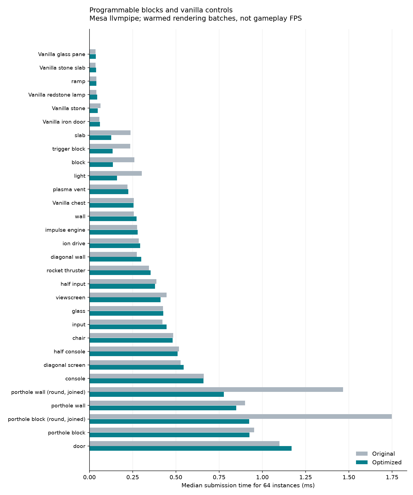

# Programmable block performance review

2026-09-26. Original production code: `a3962677`. Tests and the first measurement
harness were committed before optimizations (`71819719`). The tested production
changes and final diagnostic harness are in `3cbec41c`.

## Results

The largest verified improvements are:

- **Opaque programmable solids:** cubes, trigger blocks, slabs and lights now
  use Forge's shared tile-renderer buffer. The measured submission time for
  64 instances fell by roughly **43–54%**.
- **Round joined portholes:** bounded caches reuse the clipped frame and glass
  geometry. Submission time fell by about **47%** for 64 cells. Small isolated
  hexagonal portholes changed little; their remaining cost is mostly drawing.
- **Joined-light redstone:** one channel notification previously rediscovered
  the same group for every recipient. Coalescing that work reduced a 256-member
  on/off pulse pair from about **69 ms to 1.24 ms**. All receivers still settle
  synchronously before the input update returns.

These are measured rendering submission and synchronous update costs on this
machine, **not gameplay FPS gains**. The renderer is Mesa llvmpipe, running on
CPU. See [environment](environment.txt), [all rendering measurements](MEASUREMENTS.md),
[before CSV](before.csv), [after CSV](after.csv), and
[redstone before](redstone-before.csv)/[after](redstone-after.csv).



## Comparison with vanilla

The benchmark covers every programmable family, including the four engine
families, their hexagon/wedge variants, and joined square-engine assemblies.
Defaults use 16 and 64 separated instances. It also checks joined lights,
joined/unjoined round portholes, six solid-block/light/slab orientations, and
tiled upper slabs. Doors include both halves; chair fixtures include their upper
reserved cell. An inactive ramp controller is measured; a moving platform is
an additional workload.

| Rendering path | Programmable families | Comparison |
| --- | --- | --- |
| Cached chunk geometry | Chair, inactive Ramp, Rocket Thruster, Ion Drive, Plasma Vent, Impulse Drive | Same basic path as ordinary vanilla blocks. More geometry costs more: 64 default chairs submit 32,256 baked vertices, versus 1,536 for 64 separated stone cubes. |
| Shared tile buffer, added here | Block, Trigger Block, Slab, Light | Much less submission overhead than before. They still construct vertices every frame, whereas vanilla stone/slabs/lamps keep chunk geometry on the graphics side. |
| Individual tile rendering | Viewscreen, Console, Half-Console, Input, Half-Input, Diagonal Screen | Changing screens and multiple surfaces cause repeated texture changes and draw calls. A vanilla chest is also tile-rendered and is a useful additional control. |
| Individual tile rendering | Wall, Diagonal Wall, Porthole Wall, Porthole Block | World-dependent geometry and selectable materials are currently generated/submitted by tile renderers. Porthole caching removes repeated clipping, while draw calls remain. |
| Baked frame plus tile surface | Glass | More work than vanilla glass/panes, especially with tint and multiple pane surfaces. |
| Individual tile rendering | Door | The configurable moving leaves, frame choices and controls cost more than a vanilla baked door. |

In the measured 64-instance workload, the optimized programmable cube still
costs around **2.8 times stone's submission time**, a slab around **3.2 times a
vanilla slab**, and a light around **3.6 times a redstone lamp**. The raw tables
are preferable to a single overall ranking: geometry, screen state, joining
and translucent coverage differ substantially.

**Joining engines already helps.** For example, 64 separated square Rocket
Thrusters have 21,504 baked vertices; an 8x8 joined assembly has 1,952. This
optimization existed before this work. A joined engine's particle plume is a
separate cost and is excluded from this render microbenchmark.

| Engine (64 cells) | Separated baked vertices | Joined baked vertices | Optimized separated / joined submission |
| --- | ---: | ---: | ---: |
| Rocket Thruster | 21,504 | 1,952 | 0.354 / 0.046 ms |
| Ion Drive | 16,896 | 1,728 | 0.294 / 0.043 ms |
| Plasma Vent | 12,288 | 2,240 | 0.225 / 0.054 ms |
| Impulse Drive | 15,360 | 2,512 | 0.278 / 0.059 ms |

These are different fixtures, not before/after optimization comparisons.
`baked_vertices` in the CSV counts cached block-model geometry only; it excludes
vertices generated by tile renderers. A zero there does not mean a block draws
nothing.

## Allocation and server measurements

The final paired run also records Java heap allocation on the rendering/server
thread. These values include benchmark overhead; they exclude native/driver
memory and allocations by other threads.

| Workload | Before | After |
| --- | ---: | ---: |
| Render 64 programmable cubes | 29,216 B | 11,808 B |
| Render 64 lights | 46,112 B | 11,808 B |
| Render 64 joined round porthole blocks | 2,808,976 B | 225,952 B |
| Render 64 joined round porthole walls | 2,666,720 B | 69,472 B |
| One on/off pair, 256 joined lights | 122,704,040 B | 1,697,152 B |

The last row is about **98.6% less allocation**, alongside the roughly **98%**
reduction in synchronous update time. The light fixture uses zero emission to
isolate joining work. Screen fixtures switch actual light emission: their
256-member pulse pair measured 80 ms before and 95 ms after in the final pair,
with substantial variation across runs. No screen-update improvement is claimed.
Bulk light placement/initialization also remains expensive (about 1.6 s before,
2.1 s after in that pair), because these independent updates cannot share one
channel-notification scope. The two earlier 256-light placement pairs were
2.03→2.07 s and 1.98→2.07 s; the final baseline was unusually fast across several
server workloads. This prevents attributing all the final timing differences
to the code change. These workloads remain profiling priorities.

| Joined-light group | Before pulse pair | After pulse pair |
| --- | ---: | ---: |
| 16 members | 0.468 ms | 0.227 ms |
| 64 members | 4.627 ms | 0.466 ms |
| 256 members | 69.440 ms | 1.244 ms |

Previously, each of N recipients could traverse the same N-member assembly,
producing approximately quadratic discovery work for a connected group.
The shared settlement visits each group once per notification scope. This
explains why the improvement grows with assembly size; it does not remove
Minecraft's light propagation or the cost of independent placement events.

## What changed

### Rendering

`ProgrammableSolidRenderer` emits opaque atlas-backed geometry into Forge's
batch without touching GL state. It preserves the selected texture, orientation,
slab UV policy, light artwork and the previous neighbor-light calculation.
Cube/slab meshes and material texture names are precomputed. The existing
renderer remains the fallback for direct rendering and animated surfaces.
From the rendering paths, 64 isolated cubes previously made 64 housing draw
calls; 64 lights made 128 housing/artwork calls. Their geometry now fits in one
shared Forge batch for the corresponding benchmark pass. This removes repeated
draw/state setup while retaining per-tile vertex emission and light lookup.
Vanilla baked geometry is compiled once per fixture layer and submitted from a
VBO, so it still has less Java work each frame.

`PortholeGeometryCache` stores geometry by dimensions, shape, border and cell.
It retains at most 1,024 slices and 65,536 coordinate doubles (512 KiB of
coordinate payload, plus object overhead), with a separate 32-entry outline
cache limited to dimensions of 64 or less. It stores no world, tile, texture or
OpenGL resource. Facing, placement depth, tint and lighting remain live inputs.

Light groups now bypass general rectangle partitioning when unjoined or already
rectangular. Irregular groups retain the existing deterministic partition policy.

Pixel comparisons exposed two issues during implementation, both fixed before
acceptance: raw culling calls could disagree with Minecraft's cached GL state,
and the batched vertex format takes sky/block lighting in a different order
from the direct OpenGL call. Culling now goes through `GlStateManager`, and a
packed-vertex contract checks unequal sky/block values.

### Joining, placement and redstone

- `PanelPlane` supplies shared face-local axes for lights, portholes and engines.
- `LoadedPlaneConnections` supplies bounded traversal for lights and portholes.
  It tests whether a cell is loaded before asking whether it is eligible.
- Porthole discovery and seam/rim checks now share one eligibility predicate.
- `PanelDepth` shares world-hit conversion between walls and doors.
- `PanelPlacement` shares collision-box rotation between walls and input panels.
- `SignalUpdateBatch` coalesces derived work through nested synchronous channel
  notifications. Light refreshes collect affected positions per world, then
  visit each connected group once after signals have been applied.

Each family keeps its own joining rules. Engine squares, glass edge connections,
wall corners and door pairs have different semantics. In particular, light
**signal groups ignore visible on/off state**, while visual groups can separate
on/off artwork. No chunk loading, per-tick network scan, registry changes, save
schema changes or packet format changes were introduced.

See the [architecture review](ARCHITECTURE.md) for the wider code assessment.

## Tests and reproducibility

Before changing production behavior:

1. The full live client suite passed on the original code.
2. An exact geometry fingerprint was captured for 864 porthole slices, spanning
   four shapes, two borders and six assembly sizes. Area/bounds checks complement
   the fingerprint.
3. All 512 occupancy masks of a 3x3 grid were compared with a brute-force
   rectangle-partition oracle, including tie breaking.
4. Live fixtures captured rendering and on/off propagation before optimization.
   The final baseline was rebuilt from the original code with the same corrected
   measurement harness used for the optimized build.

Added verification covers cache eviction/clearing, traversal in all six planes,
rejected/unloaded neighbors, the 4,096-cell limit, packed lighting, nested signal
batches and cleanup. **Thirty static benchmark images match within 3/255 per
channel for at least 99.99% of pixels.** The tolerance permits isolated raster
rounding at edges; animated images are excluded from this exact comparison.

Final live suite: **PASS** in `testclient/render-run.PDnsaa`, including pixel,
GUI, joining/redstone, copying, doors, chairs, items and 39,408 controller assertions.
The earlier post-render-change full suite passed in `testclient/render-run.QaXz4V`;
original baseline coverage is in `testclient/render-run.gRvrGz`.

```bash
JAVA_HOME=/usr/lib/jvm/java-8-openjdk-amd64 ./gradlew build --no-daemon
testclient/test_viewscreen.sh
testclient/benchmark_programmable.sh
python3 testclient/compare_programmable_benchmarks.py before.csv after.csv
python3 testclient/compare_programmable_images.py BEFORE_RUN_DIR AFTER_RUN_DIR
```

To use a saved baseline JAR with the benchmark, set `VANDOR_LABS_TEST_JAR`.
Final distributable: `build/libs/vandorlabs-1.0.jar`. The reference JAR stays in
`build/libs/vandorlabs-performance-baseline.jar` for comparison.

To reconstruct the original-code reference with the final harness in a separate
worktree (choose an unused path):

```bash
git worktree add --detach /tmp/vandor-reference 71819719
for file in ProgrammableRenderBenchmark ProgrammableRedstoneBenchmark BenchmarkAllocations; do
  cp "src/main/java/com/vandorlabs/client/$file.java" \
    "/tmp/vandor-reference/src/main/java/com/vandorlabs/client/$file.java"
done
JAVA_HOME=/usr/lib/jvm/java-8-openjdk-amd64 /tmp/vandor-reference/gradlew \
  -p /tmp/vandor-reference build --no-daemon
VANDOR_LABS_TEST_JAR=/tmp/vandor-reference/build/libs/vandorlabs-1.0.jar \
  testclient/benchmark_programmable.sh
```

Run the optimized benchmark separately, with the variable unset. Keep the two
clients sequential so they do not compete for CPU/GPU time.

### Recorded runs

- Final allocation-enabled pair: `render-benchmark.bawwR0` (original production
  code) and `render-benchmark.PrvD0B` (optimized). These provide the primary CSVs
  and chart: 96 rendering cases across 30 programmable registry IDs and eight
  vanilla controls. All 30 static image comparisons passed.
- Replicate 1: `render-benchmark.RcZ4PR` / `render-run.PDnsaa`; 94 cases before
  adding the vanilla iron-door control. Replicate 2: `render-benchmark.jnj40L` /
  `render-benchmark.6ygnqo`; 96 cases. Both pairs omit allocation counters. CSVs
  are retained in [replicates](replicates/). Baseline and optimized harnesses
  match within each pair. Solid and round-porthole gains repeat across pairs: cubes improve 46–48%,
  slabs 44–48%, triggers 38–47%, lights 46–47%, joined lights 52–54%, and joined
  round portholes 46–51%.
- The full live suite passed before the final diagnostic-only additions of the
  iron-door control and allocation counter. The final Java 8 build and paired
  live benchmark passed with those additions.

### Measurement limits

- Rendering uses actual block models and tile renderers, with cached VBOs for
  ordinary baked geometry. Each case has 15 warmups and 31 measured samples.
  Submission timing includes Java and driver calls; completion timing additionally
  waits for `glFinish`. These are synthetic batches, excluding normal world
  traversal, frustum/occlusion work, frame scheduling and unrelated scene content.
- Build time is a single fixture compilation and can include model warmup. It
  is reported separately from steady rendering and is not a stable percentile.
- Redstone runs on the integrated server: five warmup pairs and fifteen measured
  on/off pairs, with every receiver checked after both edges. Validation is
  outside timing. `register_ms` includes placement, configuration and initial
  lighting, rather than isolating the channel registry. The stress run executes
  many updates in one tick and can produce an expected “Can't keep up” message;
  it does not measure ordinary idle TPS.
- Unchanged controls show run-to-run variation, sometimes over 10% for small
  costs. Small shifts are not claimed as improvements. Hardware-GPU FPS,
  animated/moving doors, active ramps, thruster particles, mixed crowded scenes,
  alternative texture packs and other rendering mods need separate profiling.

## Next optimizations, in priority order

1. Move static selectable solids into cached chunk models. This could approach
   vanilla's steady rendering cost, but needs visual tests for lighting, six-way
   texture orientation, neighbor culling and resource/settings reloads.
2. Batch more atlas-backed wall geometry. Keep translucent glass and changing
   screen textures in their appropriate passes, and test mixed render ordering.
3. Profile screen lighting propagation separately. Switching many screens from
   zero light to full emission remains costly; batching joined-light discovery
   does not remove Minecraft's lighting work.
4. Consider simplifying dense chair/engine geometry after viewing-distance
   comparisons. Preserve collision and owner visual acceptance.
5. Profile active ramp cells and cache stationary deployed geometry/UV snapshots.
   Keep collision and render geometry consistent; the inactive controller timing
   does not cover a moving platform.
6. Replace tick-expiring topology caches only after adding complete invalidation
   tests for placement, removal, rotation, configuration, world/chunk unloading
   and reload. Removing the tick expiry alone could leave stale connections.

The existing redstone interfaces, screen behavior, input layouts and finite
housing meshes already provide useful shared code. A wholesale inheritance or
NBT rewrite would add migration risk without addressing the measured bottlenecks.
