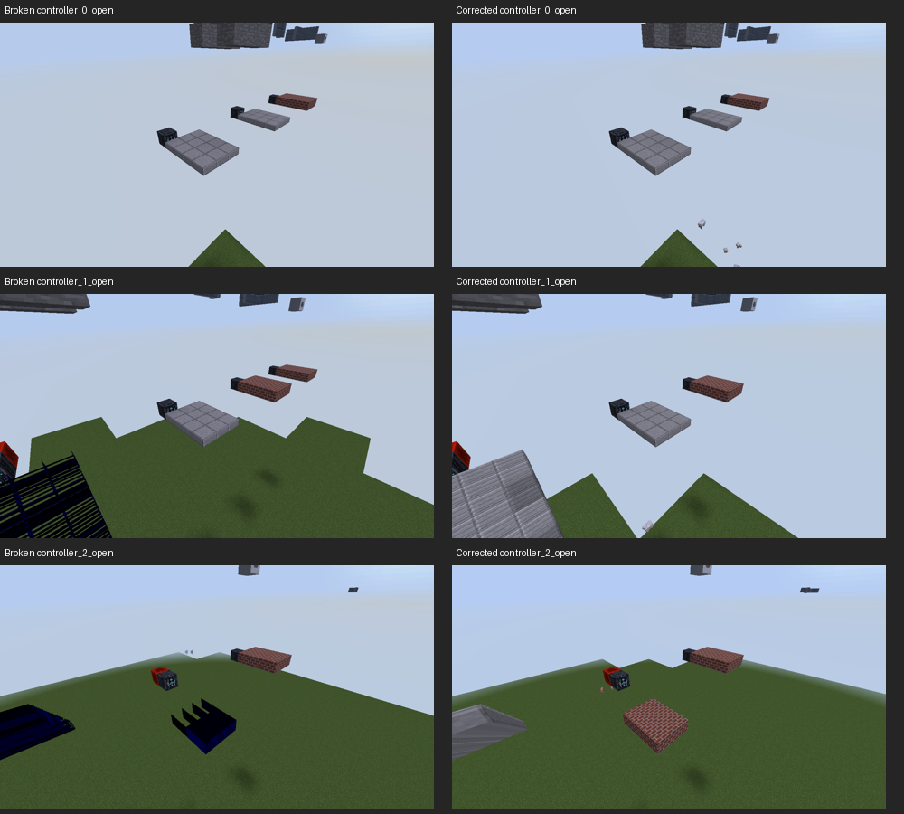

# Programmable lighting corrections and performance

The lighting audit found that Wall and Porthole Wall share the same brightness policy, but their submitted surfaces lacked explicit normals, color and vertex lightmaps and had several inward faces. These defects also affected related programmable shapes. The approved correction supplies complete surface data without introducing ambient occlusion or extra per-vertex world queries.

## Implemented corrections

- Plain walls, connected corners, all four porthole shapes, full-depth Porthole Blocks and transformed Diagonal Portholes now have outward faces and geometric normals. Half-height diagonal transformations reverse winding where required. Frame and glass meshes share the existing bounded wall cache.
- Screen, diagonal screen, console, half-console and input housings now supply normals and lightmap attributes. Ceiling-mounted diagonal half consoles bake their reflection into the vertices, preserving the old position and UV mapping while correcting reflected orientation. Artwork retains its existing emission/brightness rules.
- Shaped light housings and artwork have outward faces; their culling rule follows the corrected orientation. Full lights and Trigger Blocks retain Forge's shared buffer, with normals supplied when that buffer contains a normal attribute. The normal-free base buffer remains valid.
- Programmable Glass and porthole panes have opposing outward normals, complete lightmaps and explicit tint colors. Existing blending, pane depths and per-face tint opacity remain.
- Ramp-controlled cells have outward cube faces and explicit normals/lightmaps, retaining their current directional color shading and anchor-cell light sample. Landing-gear arms and optional door control panels use complete surface data too.

Cached Block/Slab/Storage models already have outward geometry and use Forge's geometry-derived normals. Their six-neighbor flat brightness policy, deliberately perpendicular face metadata and disabled AO/diffuse shading remain. Vanilla-style Stairs, selected Door faces, regular/diagonal Trapdoors and Diagonal Walls remain controls. The fix does not add redstone polling, chunk loading or world-light queries per vertex.

The wall cache remains bounded at 4,096 entries and 524,288 vertices (16 MiB of float vertex payload, plus bookkeeping). This limit now covers frame **and glass** geometry. Neighbors, settings, resource reloads and immutable porthole slice identity invalidate geometry; the latter catches changes elsewhere in a joined opening. Lightmaps are supplied at every draw and do not rebuild the meshes. First use or invalidation still incurs geometry construction cost. Scenes exceeding either capacity can evict meshes between frames; the 64-block benchmark does not measure that cache churn, so its benefits should not be extrapolated to arbitrarily large scenes.

## Measured rendering cost

Captured a live-client benchmark before production changes and again after the lighting/cache changes. Both runs use Java 8, Forge 14.23.5.2864 and Mesa llvmpipe; they are **relative software-renderer measurements, not hardware FPS or Complementary Unbound acceptance**. Each row below is the median submission time and median allocated bytes for rendering 64 configured blocks. Default portholes use the benchmark's default shape; separate round openings exercise the heavier geometry. Raw data also contains 16-block cases, joined openings, orientations, door materials and other vanilla controls.

| Fixture (64 blocks) | Submission before → after (ms) | Change | Allocation before → after (bytes) |
| --- | ---: | ---: | ---: |
| Stone control | 0.050 → 0.053 | +6.8% | 64 → 64 |
| Block | 0.047 → 0.043 | -9.4% | 64 → 64 |
| Wall | 0.258 → 0.246 | -4.8% | 150,560 → 42,528 |
| Porthole Wall | 0.440 → 0.439 | -0.2% | 436,768 → 40,480 |
| Porthole Wall, separate round openings | 0.791 → 0.930 | +17.6% | 1,176,096 → 40,480 |
| Porthole Block | 0.556 → 0.473 | -15.0% | 428,576 → 40,480 |
| Diagonal Porthole Wall | 0.750 → 0.539 | -28.1% | 1,378,848 → 40,480 |
| Diagonal Porthole, separate round openings | 1.324 → 0.951 | -28.2% | 3,824,160 → 40,480 |
| Diagonal Wall | 0.424 → 0.439 | +3.5% | 35,360 → 35,360 |
| Door | 1.149 → 1.156 | +0.6% | 161,312 → 158,240 |
| Diagonal Screen | 0.545 → 0.598 | +9.8% | 31,776 → 31,776 |
| Console | 0.660 → 0.769 | +16.6% | 98,336 → 98,336 |
| Half Console | 0.498 → 0.690 | +38.6% | 72,736 → 72,736 |
| Input | 0.401 → 0.472 | +17.8% | 47,648 → 47,648 |
| Half Input | 0.379 → 0.450 | +18.8% | 47,648 → 47,648 |
| Diagonal Half Console | 0.512 → 0.580 | +13.3% | 89,120 → 47,648 |
| Glass | 0.194 → 0.192 | -1.2% | 64 → 64 |

Common Wall and Door timing stayed near baseline. Wall allocation fell 72%; default Porthole Wall allocation fell 91%. Diagonal Portholes submitted about 28% faster in both listed cases, with roughly 97–99% less allocation. This removes a source of garbage-collection pressure, but the benchmark does not establish an actual reduction in gameplay stutters.

The correction has a cost for some immediate-mode housings: Diagonal Screen adds about 0.05 ms per 64, Console about 0.11 ms, Half Console about 0.19 ms, and Input/Half Input about 0.07 ms. Separate round Porthole Walls add about 0.14 ms per 64 despite their allocation reduction. Dense scenes with many such blocks may pay a material cumulative CPU cost; future improvements should cache static screen/input surfaces and investigate batching compatible housings while preserving animated artwork, shader vertex generation and render order.

Former position/texture vertices grow from 20 to 32 bytes in the base format; moving ramp vertices grow from 28 to 32 bytes. OptiFine's expanded block format is selected when present. Surface count and world-light sampling policy are unchanged. These are additional attributes and shader work, not a promise of cheaper GPU rendering. The unchanged Diagonal Wall moved 3.5% and the stone control 6.8%, illustrating run-to-run noise; small timing differences should not be treated as reliable improvements or regressions. The repeated attribute overhead in screen/control housings and the strong porthole allocation changes are the more meaningful findings.

Raw measurements: [before](shader-lighting/before.csv), [after](shader-lighting/after.csv). Benchmark run directories: `testclient/render-benchmark.FDRCvL` and `testclient/render-benchmark.bze79a`. Measurements precede the subsequent texture-package cleanup; packaged assets and atlas fallback are checked separately in the final live run.

## Retired texture cleanup

The previous category change hid artwork but still packaged it. The standard JAR now omits **16 PNGs / 70,267 uncompressed source bytes**: Wall Vent, the three padding finishes, Hull Plating 1–11, and the retired imported hull finish. Archive/default source files remain as reference assets; they are excluded during runtime resource staging. This byte count is not the compressed JAR saving and does not imply a particular reduction in atlas dimensions.

Numeric choices and stable IDs are retained for world/item persistence. Retired choices resolve to Dark Wall Panel. The staged build remaps 180 legacy configured-item model references and Dynmap texture aliases to that same material. Visible entries sharing artwork are retained, as are mandatory metal/glass surfaces, live on/off light pairs and all fourteen storage sets. A build check inspects the actual standard JAR for removed PNGs, stale model references and required retained assets; runtime checks cover all sixteen saved choices, atlas fallback and save/load.

## Validation

The standalone lighting diagnostic and `testNonRendering` pass: zero inward boundary faces for the six original failing fixtures; unit geometric normals matching emitted winding; separate block=80 / sky=192 channels; all diagonal porthole shapes/modes/inversions, reflected housings, inputs, glass and ramp faces. Wall cache tests cover exact cached/direct vertex equivalence, live light changes, joined-opening changes, resource/world cleanup and bounds. Fast batched solid checks exercise both normal-free and normal-bearing vertex formats.

The before/after software benchmark images match for static plain/diagonal walls, all porthole variants, glass and shaped lights. Animated display artwork and moving door poses differ with capture time and are not used as exact image comparisons.

During validation the owner reported disappearing deployed ramp cells and flickering black/blue strips. The lighting-format change had retained the old ramp emission order (`position → UV → color`), while the new format expects `position → color → UV → lightmap → normal`. This corrupts color/opacity and texture coordinates even though positions, normals and lightmaps remain valid. The earlier geometry-only diagnostic missed it. The production ramp emitter now uses the matching order, with a regression test that checks actual packed RGB/opacity, source UVs, normals and lightmaps for every face, white/tinted materials and four slice thicknesses. The new test fails on the broken emission order before the correction.

The live pixel check also fails on the broken build (zero brick pixels in the deployed platform region) and passes on the correction (5,790). It samples the moving platform separately from the stationary source and redstone block. Software captures confirm the corruption and recovery independently of shader appearance:



Final standard-JAR/full live-client result: pending completion on the corrected ramp build. The final run includes retired-texture persistence checks and batched lighting checks.

Reproduce:

```sh
JAVA_HOME=/usr/lib/jvm/java-8-openjdk-amd64 ./gradlew \
  -I testclient/lighting_audit.gradle auditProgrammableLighting testNonRendering build --no-daemon
bash testclient/test_viewscreen.sh --full
bash testclient/benchmark_programmable.sh
```

**Hardware shader appearance remains pending.** Complementary Unbound 5.6.1 should be checked in the owner's hardware client using the comparison matrix in the [original audit](../programmable-lighting-audit.md): matching materials, orientations, corners, joined/diagonal openings, clear/tinted glass, daylight, enclosed torch light, below-light controls, nearby ordinary programmable shapes and camera changes. The available launcher forces software rendering and has no local copy of the pack; it cannot certify the reported lighting discrepancy is visually resolved.
