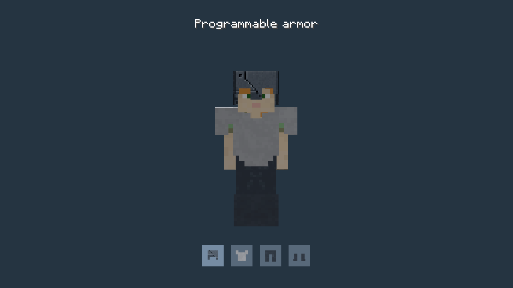

# Programmable armor

Programmable Helmet, Chestplate, Leggings and Boots use vanilla diamond armor protection, toughness, durability and enchantability. Repair with diamonds, including in an anvil. They are available in the Vandor Labs creative tab. Craft each piece with Programmable Matter Ingots in the corresponding vanilla armor pattern (5, 8, 7 or 4 ingots).

Hold a piece and **shift-right-click** to open its categorized texture dialog. Configuration is available in creative mode, or in survival by holding a Configurizer in the main hand and the armor in the off hand. Choose a role design from **Armor**, or any material in the default Programmable Block texture list, then click **Done** or press Escape. Ordinary right-click equips the armor into its matching empty slot.

Each piece remembers its own material when equipped, dropped, moved between inventories or saved. Selecting a material preserves damage, enchantments and names. Armor starts with Dark Wall Panel. The selected artwork covers the armor and the padded inventory silhouette. Block materials retain the vanilla diamond helmet’s face opening and other cutouts. Block artwork uses its first frame and is opaque on armor; this does not add light emission. Resource packs also affect armor materials.

The **Armor** category appears only for armor items. Each picker offers seven matching designs for its own piece: Bioengineer, Scientist, Hazmat, Repairman, Pilot, Civilian Staff and Spaceship Staff. A helmet lists helmet designs, a chestplate lists chestplates, and leggings and boots list their corresponding artwork. Role designs use native armor atlases, including their painted visors and transparent unused areas, and matching inventory icons. You can mix roles between pieces.

Remove equipped armor and hold it to change its material. Changes apply to that piece only.

