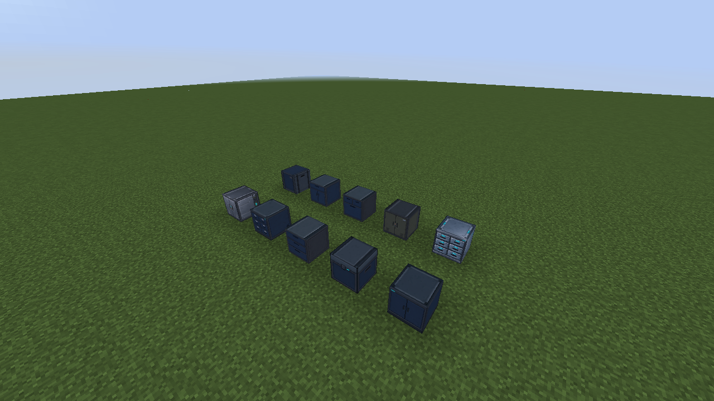
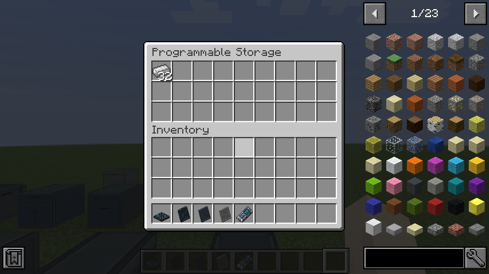
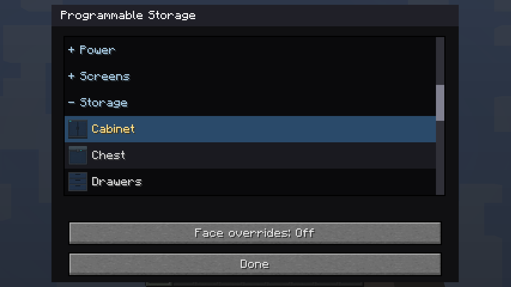
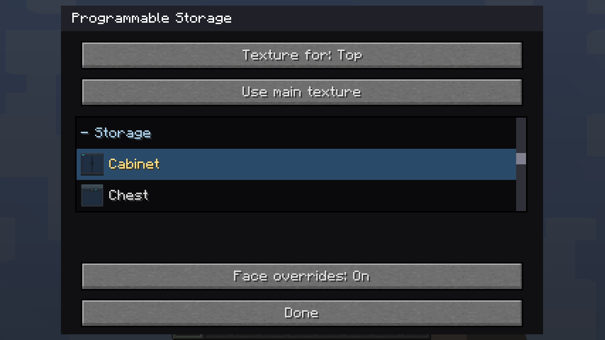
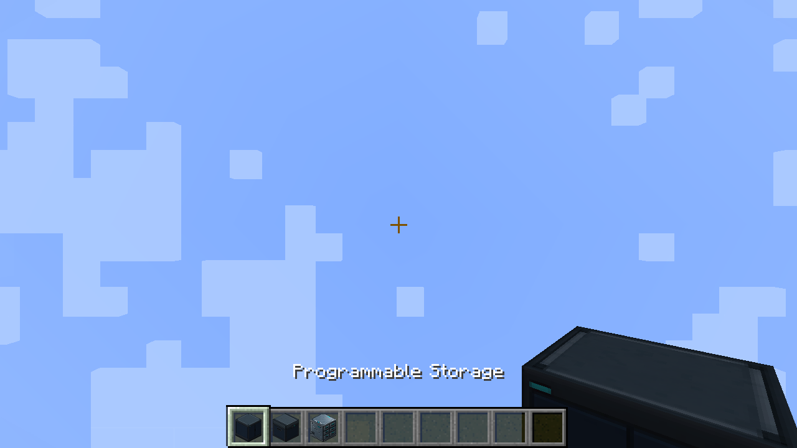

# Programmable Storage

Programmable Storage holds **27 stacks**, the same capacity as a single Minecraft
chest. Each block has its own inventory, even when placed beside another one.
Its front faces you when placed.

Craft one with a **chest + Programmable Block** in any arrangement. Right-click
to open its inventory. Shift-click transfers stacks between storage and your
inventory. Hoppers and Forge item-handler automation can insert and extract
from all sides; comparators report how full the storage is.

Shift-right-click in Creative mode, or use the Configurizer, to open the shared
[categorized texture picker](unified-materials.md). New blocks default to
**Cabinet**, the first Storage set alphabetically. The fourteen Storage choices each
have matching front, side and top artwork. The back uses the side, and the
underside uses the top. Other categories, filesystem textures and Custom block
samples apply the selected finish to all six faces.

Enable **Face overrides** to choose separate Bottom, Top, Front, Back, Left and
Right textures, just like Programmable Block. Directions are relative to the
storage block's front. Choose **Main** to change the overall finish; choose a
face to override only that surface. **Use main texture** restores that face's
normal artwork from the main set (including its matching top or side).
An explicit Storage-category override uses the selected front artwork shown in
the picker. Overrides start disabled; switching them off preserves the saved
face choices. Configured items and the Duplifier preserve these settings, while
a disabled Duplifier source leaves the destination's saved face choices intact.
Inventory contents are unaffected.

The Storage category is available in every shared material picker. Other
programmable blocks use the selected set's front artwork as their material.

Breaking storage drops its contents separately from the configured block.
Picking the block, copying its appearance with the Duplifier, or extending it
with Better Builder's Wands does not duplicate the inventory. Changing its
texture preserves the contents. Both contents and appearance survive saving.

The processed artwork consists of forty-two 140×140 PNGs. The original ten
sets came from horizontal top/side/front sheets. The four overhead-bin sets
(Blue-Gray, Metal, Square Matte and Square Charcoal) came from pre-split faces.
All use the same 70px area reduction, light sharpening and exact 2×
nearest-neighbor enlargement. Source artwork remains unchanged. Reimport the
four additional sets with:

```bash
python3 tools/import_storage_bins.py /path/to/source-bin-textures
```

Dynmap shows the default Cabinet finish and block orientation. Configured
storage finishes are rendered in Minecraft.











To refresh only these live gallery captures:

```bash
testclient/generate_gallery.sh --focus storage
```
