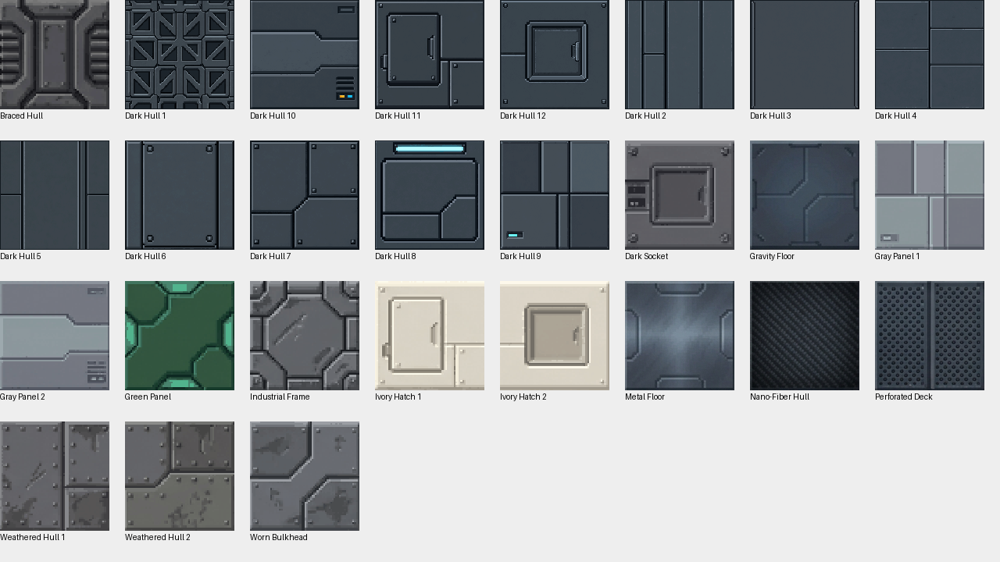
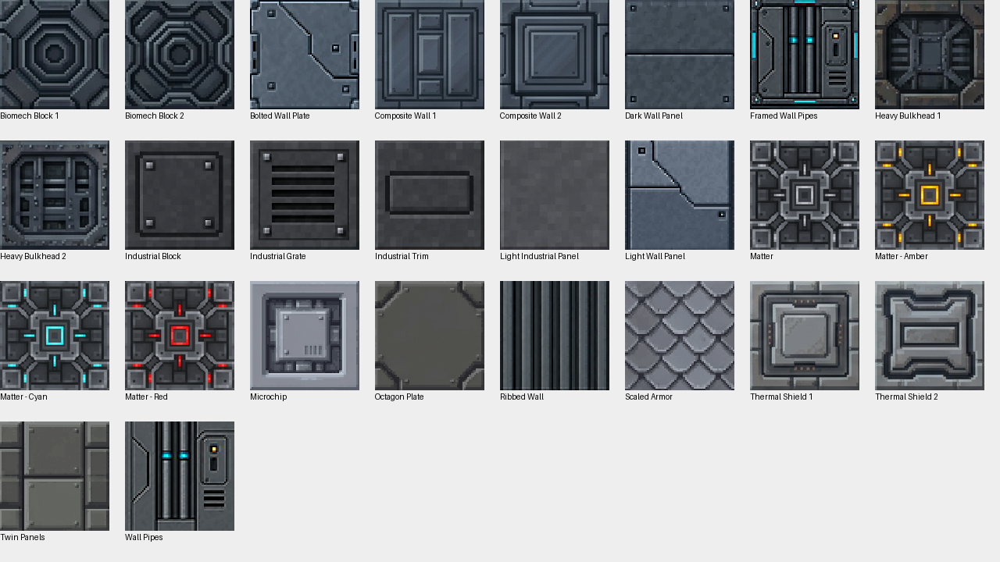
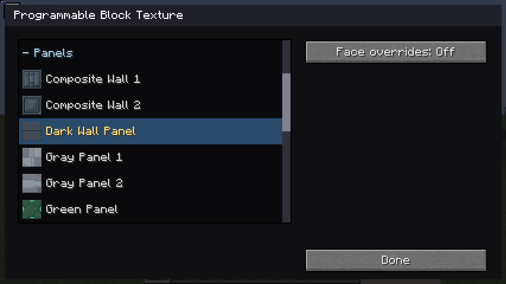

# Hull, Panels and Industrial categories

**Industrial has been added.** There are enough visibly different mechanical finishes to
make it useful: fourteen choices from the current Hull and Panels lists. This
proposal was based on inspecting all 53 actual texture images, rather than
matching their names. The owner approved the complete mapping below, and all 27 moves have been applied.

Use the categories to describe appearance; every finish can still be used on
any compatible programmable shape.

| Category | Visual rule | Choices from the previous Hull/Panels lists |
| --- | --- | --- |
| Hull | Exterior plating, armor, protective surfaces and the coherent Dark Hull collection | 21 |
| Panels | Interior wall sheets, access covers and inset decorative panels | 13 |
| Industrial (new) | Pipes, ribs, grilles, machined recesses and structural machinery | 14 |
| Tech (existing) | The Microchip and Matter node artwork | 5 |

Gray Panel 1/2, Green Panel and Ivory Hatch 1/2 look like interior wall/access
panels and belong with Panels. Scaled Armor and Thermal Shield 1/2 look like
protective cladding and belong with Hull. Braced Hull and Industrial Frame
have the mechanical depth that makes Industrial useful; Dark Socket is a
service recess, and Perforated Deck fits beside Industrial Grate.

Microchip and the four Matter choices show electronic/node details, so I
place them in the existing Tech category. Keep the Matter colors
together. Keep Dark Hull 1–12 together as a useful dark exterior palette;
its access-cover and indicator variants still match that collection.

A separate Floors/Decks category would currently contain too few distinct
surfaces to justify another heading. Industrial gives a stronger split than
light/dark categories, which would scatter matching color variants.

## Applied mapping

| Finish | Previous | Now |
| --- | --- | --- |
| Biomech Block 1 | Panels | Industrial |
| Biomech Block 2 | Panels | Industrial |
| Bolted Wall Plate | Panels | Panels |
| Braced Hull | Hull | Industrial |
| Composite Wall 1 | Panels | Panels |
| Composite Wall 2 | Panels | Panels |
| Dark Hull 1 | Hull | Hull |
| Dark Hull 10 | Hull | Hull |
| Dark Hull 11 | Hull | Hull |
| Dark Hull 12 | Hull | Hull |
| Dark Hull 2 | Hull | Hull |
| Dark Hull 3 | Hull | Hull |
| Dark Hull 4 | Hull | Hull |
| Dark Hull 5 | Hull | Hull |
| Dark Hull 6 | Hull | Hull |
| Dark Hull 7 | Hull | Hull |
| Dark Hull 8 | Hull | Hull |
| Dark Hull 9 | Hull | Hull |
| Dark Socket | Hull | Industrial |
| Dark Wall Panel | Panels | Panels |
| Framed Wall Pipes | Panels | Industrial |
| Gravity Floor | Hull | Hull |
| Gray Panel 1 | Hull | Panels |
| Gray Panel 2 | Hull | Panels |
| Green Panel | Hull | Panels |
| Heavy Bulkhead 1 | Panels | Industrial |
| Heavy Bulkhead 2 | Panels | Industrial |
| Industrial Block | Panels | Industrial |
| Industrial Frame | Hull | Industrial |
| Industrial Grate | Panels | Industrial |
| Industrial Trim | Panels | Industrial |
| Ivory Hatch 1 | Hull | Panels |
| Ivory Hatch 2 | Hull | Panels |
| Light Industrial Panel | Panels | Panels |
| Light Wall Panel | Panels | Panels |
| Matter | Panels | Tech |
| Matter - Amber | Panels | Tech |
| Matter - Cyan | Panels | Tech |
| Matter - Red | Panels | Tech |
| Metal Floor | Hull | Hull |
| Microchip | Panels | Tech |
| Nano-Fiber Hull | Hull | Hull |
| Octagon Plate | Panels | Panels |
| Perforated Deck | Hull | Industrial |
| Ribbed Wall | Panels | Industrial |
| Scaled Armor | Panels | Hull |
| Thermal Shield 1 | Panels | Hull |
| Thermal Shield 2 | Panels | Hull |
| Twin Panels | Panels | Panels |
| Wall Pipes | Panels | Industrial |
| Weathered Hull 1 | Hull | Hull |
| Weathered Hull 2 | Hull | Hull |
| Worn Bulkhead | Hull | Hull |

## Artwork used for review

Hull before the moves:

Panels before the moves:

These are menu-metadata changes only. Numeric choices, identifiers, source image paths and Dark Hull labels are preserved; existing worlds retain their artwork. The visible picker now contains Hull (21), Panels (13), Industrial (14) and Tech (22, including its seventeen existing finishes).

## Validation

Exactly 27 category fields changed. A comparison with the previous metadata confirmed that labels, IDs, visibility flags, source artwork and ordered catalog entries were unchanged. The standard JAR contains all fourteen Industrial finishes. Live shared-picker checks verify category counts and restore saved Heavy Bulkhead 1 (choice 32) with Industrial expanded automatically. The updated Panels dialog visibly includes Gray Panel 1/2 and Green Panel.

The focused live dialog suite passed with sixteen fresh dialog captures in `testclient/render-run.JbrCvG`.

